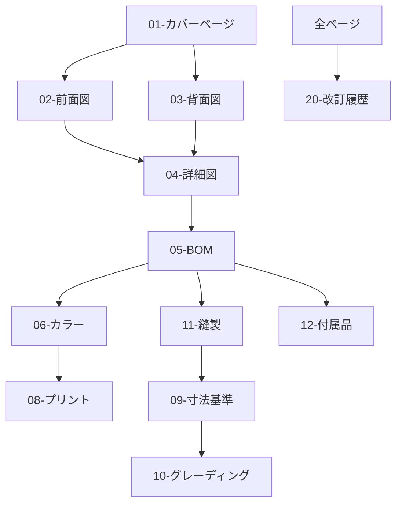

# 機能要件仕様書 - 概要

本ドキュメントは、テックパック生成アプリケーションの機能要件を定義します。
テックパックは20のセクション（01-20）で構成され、各セクションが独立した機能モジュールとして実装されます。

## 機能要件一覧

### 基本情報管理機能（01-06）
1. [01-カバーページ・スタイルサマリー機能](./01-cover-page.md) ✓
2. [02-テクニカルフラット（前面）機能](./02-technical-flat-front.md) ✓
3. [03-テクニカルフラット（背面）機能](./03-technical-flat-back.md) ✓
4. [04-技術詳細・クローズアップ機能](./04-technical-details.md) ✓
5. [05-部材表（BOM）管理機能](./05-bill-of-materials.md) ✓
6. [06-カラーウェイ管理機能](./06-colorway.md) ✓

### 仕様詳細機能（07-12）
7. [07-ラベル・タグ配置機能](./07-label-tag-placement.md) ✓
8. [08-アートワーク・プリント配置機能](./08-artwork-print.md) ✓
9. [09-寸法仕様（基準サイズ）機能](./09-measurement-base.md) ✓
10. [10-寸法仕様（グレーディング）機能](./10-measurement-graded.md) ✓
11. [11-縫製仕様機能](./11-construction-details.md) ✓
12. [12-付属品詳細機能](./12-trims-accessories.md) ✓

### 生産指示機能（13-17）
13. [13-梱包指示機能](./13-packing-instructions.md) ✓
14. [14-下げ札・バーコード機能](./14-hangtag-barcode.md) ✓
15. [15-洗濯表示機能](./15-wash-care.md) ✓
16. [16-フィットコメント・レビュー機能](./16-fit-comments.md) ✓
17. [17-生地詳細機能](./17-fabric-details.md) ✓

### 管理機能（19-20）
19. [19-原価計算機能](./19-costing-sheet.md) ✓
20. [20-改訂履歴・バージョン管理機能](./20-revision-log.md) ✓

※ セクション18は現在のテックパック構成には含まれていません。

## 共通機能要件

### データ管理機能
- マスタデータ管理（素材、サプライヤー、色、サイズ等）
- データインポート/エクスポート
- テンプレート管理
- 自動保存・復元

### コラボレーション機能
- リアルタイム共同編集
- コメント・注釈機能
- 通知・アラート
- アクセス権限管理

### 統合機能
- CADシステム連携
- 画像編集機能
- PDF生成・出力
- 多言語対応（日本語、英語、中国語）

### ワークフロー機能
- 承認フロー管理
- ステータス管理
- タスク管理
- 期限管理

## 機能間の連携

## 実装優先度

### Phase 1（MVP）
- 01-カバーページ
- 02,03-テクニカルフラット
- 05-BOM
- 09-寸法仕様
- 20-改訂履歴

### Phase 2
- 04-技術詳細
- 06-カラーウェイ
- 11-縫製仕様
- 17-生地詳細
- 19-原価計算

### Phase 3
- 07,08-ラベル・プリント配置
- 10-グレーディング
- 12-付属品
- 13,14,15-生産指示
- 16-フィットコメント
- 18-サンプル管理