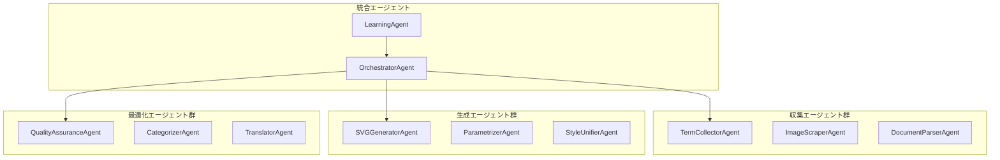

# AI/MCPエージェント仕様書

## 1. 概要

本仕様書は、テックパック用語集とSVGパーツ管理システムにおけるAIエージェントとMCP（Model Context Protocol）統合の設計を定義します。自動収集、生成、最適化を実現する複数のエージェントが協調して動作します。

## 2. エージェントアーキテクチャ

### 2.1 エージェント構成



### 2.2 エージェント定義

```typescript
interface Agent {
  id: string;
  name: string;
  type: AgentType;
  version: string;
  
  capabilities: Capability[];
  dependencies: Dependency[];
  
  configuration: {
    model: AIModelConfig;
    triggers: Trigger[];
    limits: ResourceLimits;
    permissions: Permission[];
  };
  
  state: {
    status: 'idle' | 'working' | 'paused' | 'error';
    currentTask?: Task;
    queue: Task[];
    metrics: AgentMetrics;
  };
  
  communication: {
    inputChannels: Channel[];
    outputChannels: Channel[];
    protocols: Protocol[];
  };
}
```

## 3. 収集エージェント仕様

### 3.1 用語収集エージェント（TermCollectorAgent）

```typescript
class TermCollectorAgent implements Agent {
  capabilities = [
    'text_extraction',
    'nlp_processing',
    'term_identification',
    'context_analysis'
  ];
  
  async collectTerms(source: DataSource): Promise<CollectedTerms> {
    // 1. ソースからテキスト抽出
    const text = await this.extractText(source);
    
    // 2. NLP処理
    const processed = await this.nlpPipeline.process(text, {
      language: source.language,
      domain: 'apparel',
      tasks: ['tokenization', 'pos_tagging', 'ner', 'dependency_parsing']
    });
    
    // 3. 専門用語識別
    const candidates = await this.identifyTerms(processed, {
      patterns: this.loadPatterns('apparel_terms'),
      frequency_threshold: 2,
      context_window: 50,
      confidence_threshold: 0.7
    });
    
    // 4. コンテキスト分析と分類
    const enrichedTerms = await this.analyzeContext(candidates, {
      categorization: true,
      translation_hints: true,
      usage_examples: true,
      related_terms: true
    });
    
    return {
      terms: enrichedTerms,
      metadata: {
        source: source.id,
        timestamp: new Date(),
        confidence: this.calculateConfidence(enrichedTerms),
        statistics: this.generateStatistics(enrichedTerms)
      }
    };
  }
  
  private nlpPipeline = new NLPPipeline({
    models: {
      japanese: 'mecab-unidic-bert',
      english: 'spacy-fashion-ner',
      chinese: 'jieba-apparel'
    },
    dictionaries: [
      'jis-apparel-terms',
      'fashion-glossary-en',
      'textile-dictionary'
    ]
  });
}
```

### 3.2 画像収集エージェント（ImageScraperAgent）

```typescript
class ImageScraperAgent implements Agent {
  capabilities = [
    'web_scraping',
    'image_download',
    'metadata_extraction',
    'duplicate_detection'
  ];
  
  async scrapeImages(config: ScrapeConfig): Promise<ScrapedImages> {
    const sources = this.expandSources(config.sources);
    const results: ScrapedImage[] = [];
    
    for (const source of sources) {
      // 1. ページ解析
      const pages = await this.crawler.analyze(source, {
        depth: config.depth || 2,
        follow_patterns: config.patterns,
        respect_robots: true,
        rate_limit: config.rateLimit
      });
      
      // 2. 画像抽出
      for (const page of pages) {
        const images = await this.extractImages(page, {
          min_size: { width: 200, height: 200 },
          formats: ['jpg', 'png', 'webp'],
          filter: this.createFilter(config.filter)
        });
        
        // 3. メタデータ収集
        for (const image of images) {
          const metadata = await this.extractMetadata(image, {
            extract_exif: true,
            extract_context: true,
            ocr_text: config.enableOCR
          });
          
          // 4. 重複チェック
          if (!await this.isDuplicate(image)) {
            results.push({
              url: image.url,
              metadata: metadata,
              context: this.extractContext(page, image),
              quality: this.assessQuality(image)
            });
          }
        }
      }
    }
    
    return {
      images: results,
      statistics: this.generateStatistics(results),
      errors: this.crawler.errors
    };
  }
}
```

### 3.3 ドキュメント解析エージェント（DocumentParserAgent）

```typescript
class DocumentParserAgent implements Agent {
  capabilities = [
    'pdf_parsing',
    'ocr_processing',
    'table_extraction',
    'structure_analysis'
  ];
  
  async parseDocument(document: Document): Promise<ParsedDocument> {
    const parser = this.selectParser(document.type);
    
    // 1. 構造解析
    const structure = await parser.analyzeStructure(document, {
      detect_headers: true,
      detect_tables: true,
      detect_figures: true,
      detect_lists: true
    });
    
    // 2. コンテンツ抽出
    const content = await parser.extractContent(structure, {
      preserve_formatting: true,
      extract_styles: true,
      normalize_text: true
    });
    
    // 3. テーブルデータ処理
    const tables = await this.processTabl3es(content.tables, {
      detect_headers: true,
      normalize_values: true,
      extract_units: true
    });
    
    // 4. 図表解析
    const figures = await this.analyzeFigures(content.figures, {
      extract_labels: true,
      detect_diagrams: true,
      vectorize_simple: true
    });
    
    return {
      structure: structure,
      text: content.text,
      tables: tables,
      figures: figures,
      metadata: this.extractMetadata(document)
    };
  }
}
```

## 4. 生成エージェント仕様

### 4.1 SVG生成エージェント（SVGGeneratorAgent）

```typescript
class SVGGeneratorAgent implements Agent {
  capabilities = [
    'image_to_svg',
    'sketch_to_svg',
    'parametric_generation',
    'style_application'
  ];
  
  private models = {
    objectDetection: new YOLOv8Model('apparel-parts'),
    segmentation: new SAMModel('apparel-fine'),
    vectorization: new DeepSVGModel('custom-trained'),
    styleTransfer: new StyleGANModel('svg-styles')
  };
  
  async generateSVG(input: GenerationInput): Promise<GeneratedSVG> {
    // 1. 入力タイプ判定
    const inputType = this.detectInputType(input);
    
    // 2. 前処理
    const preprocessed = await this.preprocess(input, {
      denoise: true,
      enhance: true,
      normalize: true,
      remove_background: inputType === 'photo'
    });
    
    // 3. 特徴抽出
    const features = await this.extractFeatures(preprocessed, {
      detect_parts: true,
      extract_contours: true,
      identify_patterns: true,
      analyze_structure: true
    });
    
    // 4. ベクトル化戦略選択
    const strategy = this.selectStrategy(features, {
      part_type: input.partType,
      complexity: features.complexity,
      style_requirements: input.style
    });
    
    // 5. SVG生成
    const rawSVG = await this.vectorize(preprocessed, strategy, {
      method: strategy.method,
      parameters: strategy.parameters,
      quality_target: input.qualityTarget || 0.8
    });
    
    // 6. 後処理
    const optimized = await this.postprocess(rawSVG, {
      simplify_paths: true,
      merge_similar: true,
      apply_style: input.style,
      add_metadata: true
    });
    
    return {
      svg: optimized,
      metadata: {
        method: strategy.method,
        confidence: this.calculateConfidence(features, optimized),
        quality: this.assessQuality(optimized),
        parameters: this.extractParameters(optimized)
      }
    };
  }
  
  private async vectorize(
    image: ProcessedImage,
    strategy: VectorizationStrategy,
    options: VectorizeOptions
  ): Promise<string> {
    switch (strategy.method) {
      case 'geometric':
        return this.geometricVectorization(image, options);
      
      case 'ml_based':
        return this.mlVectorization(image, options);
      
      case 'hybrid':
        return this.hybridVectorization(image, options);
      
      case 'template':
        return this.templateBasedGeneration(image, options);
      
      default:
        throw new Error(`Unknown method: ${strategy.method}`);
    }
  }
}
```

### 4.2 パラメータ化エージェント（ParametrizerAgent）

```typescript
class ParametrizerAgent implements Agent {
  capabilities = [
    'parameter_extraction',
    'constraint_generation',
    'relationship_detection',
    'animation_creation'
  ];
  
  async parametrizeSVG(svg: string, hints?: ParametrizationHints): Promise<ParametricSVG> {
    // 1. SVG解析
    const parsed = this.parseSVG(svg);
    const elements = this.analyzeElements(parsed);
    
    // 2. パラメータ候補検出
    const candidates = await this.detectParameters(elements, {
      detect_dimensions: true,
      detect_colors: true,
      detect_transforms: true,
      detect_patterns: true
    });
    
    // 3. 制約関係分析
    const constraints = await this.analyzeConstraints(candidates, {
      geometric_constraints: true,
      proportion_constraints: true,
      symmetry_constraints: true,
      dependency_constraints: true
    });
    
    // 4. パラメータ定義生成
    const parameters = this.generateParameters(candidates, constraints, {
      group_related: true,
      set_defaults: true,
      add_ranges: true,
      create_presets: true
    });
    
    // 5. アニメーション可能性検出
    const animations = this.detectAnimations(elements, parameters, {
      morph_paths: true,
      transform_elements: true,
      transition_colors: true
    });
    
    return {
      svg: this.injectParameters(svg, parameters),
      parameters: parameters,
      constraints: constraints,
      animations: animations,
      presets: this.generatePresets(parameters)
    };
  }
}
```

## 5. 最適化エージェント仕様

### 5.1 品質保証エージェント（QualityAssuranceAgent）

```typescript
class QualityAssuranceAgent implements Agent {
  capabilities = [
    'quality_assessment',
    'validation',
    'optimization',
    'repair'
  ];
  
  async assureQuality(item: QAItem): Promise<QAResult> {
    const validators = this.selectValidators(item.type);
    const issues: Issue[] = [];
    
    // 1. 構造検証
    const structureIssues = await this.validateStructure(item, {
      check_validity: true,
      check_accessibility: true,
      check_standards: true,
      check_compatibility: true
    });
    issues.push(...structureIssues);
    
    // 2. 視覚的品質評価
    const visualQuality = await this.assessVisualQuality(item, {
      sharpness: { min: 0.7 },
      smoothness: { min: 0.8 },
      consistency: { min: 0.85 },
      aesthetics: { min: 0.75 }
    });
    
    // 3. 技術的最適化
    if (item.type === 'svg') {
      const optimized = await this.optimizeSVG(item.content, {
        simplify_paths: true,
        remove_redundant: true,
        compress_styles: true,
        minify_code: true
      });
      item.content = optimized.content;
    }
    
    // 4. 自動修復
    const repaired = await this.repairIssues(item, issues, {
      fix_structure: true,
      fix_attributes: true,
      fix_paths: true,
      preserve_intent: true
    });
    
    return {
      item: repaired.item,
      quality: {
        score: this.calculateScore(visualQuality, issues),
        visual: visualQuality,
        technical: this.assessTechnicalQuality(repaired.item),
        issues: repaired.remainingIssues
      },
      improvements: repaired.improvements
    };
  }
}
```

### 5.2 分類エージェント（CategorizerAgent）

```typescript
class CategorizerAgent implements Agent {
  capabilities = [
    'multi_label_classification',
    'hierarchical_categorization',
    'similarity_detection',
    'clustering'
  ];
  
  private classifier = new MultiLabelClassifier({
    model: 'bert-apparel-categories',
    threshold: 0.5,
    max_labels: 5
  });
  
  async categorize(item: CategorizableItem): Promise<Categorization> {
    // 1. 特徴抽出
    const features = await this.extractFeatures(item, {
      text_features: true,
      visual_features: true,
      structural_features: true,
      contextual_features: true
    });
    
    // 2. 分類実行
    const predictions = await this.classifier.predict(features);
    
    // 3. 階層構造マッピング
    const hierarchical = this.mapToHierarchy(predictions, {
      taxonomy: 'apparel_taxonomy_v2',
      max_depth: 4,
      confidence_decay: 0.8
    });
    
    // 4. 類似アイテム検索
    const similar = await this.findSimilar(features, {
      method: 'cosine_similarity',
      top_k: 10,
      min_similarity: 0.7
    });
    
    // 5. タグ生成
    const tags = await this.generateTags(item, predictions, {
      extract_attributes: true,
      extract_materials: true,
      extract_techniques: true,
      language: ['ja', 'en']
    });
    
    return {
      categories: hierarchical,
      confidence: predictions.confidence,
      similar_items: similar,
      tags: tags,
      explanation: this.generateExplanation(predictions)
    };
  }
}
```

## 6. MCP統合仕様

### 6.1 MCP プロバイダー定義

```typescript
interface MCPProvider {
  id: string;
  name: string;
  type: 'fashion_db' | 'cad_system' | 'standard_org' | 'translation';
  endpoint: string;
  
  capabilities: {
    search: boolean;
    retrieve: boolean;
    translate: boolean;
    validate: boolean;
    generate: boolean;
  };
  
  authentication: {
    type: 'api_key' | 'oauth2' | 'basic';
    credentials: EncryptedCredentials;
  };
  
  rateLimit: {
    requests_per_second: number;
    daily_quota: number;
    burst_limit: number;
  };
  
  mapping: {
    request_transform: TransformFunction;
    response_transform: TransformFunction;
    error_handling: ErrorHandler;
  };
}
```

### 6.2 MCP統合エージェント

```typescript
class MCPIntegrationAgent implements Agent {
  private providers: Map<string, MCPProvider> = new Map();
  private cache: MCPCache;
  private rateLimiter: RateLimiter;
  
  async searchExternalTerms(query: SearchQuery): Promise<ExternalTerms> {
    const results: ExternalTerm[] = [];
    const providers = this.selectProviders(query.sources);
    
    // 並列検索実行
    const searches = providers.map(provider => 
      this.searchProvider(provider, query)
        .catch(err => this.handleError(provider, err))
    );
    
    const providerResults = await Promise.allSettled(searches);
    
    // 結果統合
    for (const result of providerResults) {
      if (result.status === 'fulfilled' && result.value) {
        results.push(...this.normalizeResults(result.value));
      }
    }
    
    // 重複排除と統合
    const merged = this.mergeResults(results, {
      prefer_authoritative: true,
      merge_translations: true,
      combine_definitions: true
    });
    
    return {
      terms: merged,
      sources: this.summarizeSources(providerResults),
      quality: this.assessResultQuality(merged)
    };
  }
  
  private async searchProvider(
    provider: MCPProvider,
    query: SearchQuery
  ): Promise<ProviderResult> {
    // レート制限チェック
    await this.rateLimiter.acquire(provider.id);
    
    // キャッシュ確認
    const cached = await this.cache.get(provider.id, query);
    if (cached && !query.force_refresh) {
      return cached;
    }
    
    // リクエスト変換
    const request = provider.mapping.request_transform(query);
    
    // API呼び出し
    const response = await this.callAPI(provider, request);
    
    // レスポンス変換
    const result = provider.mapping.response_transform(response);
    
    // キャッシュ保存
    await this.cache.set(provider.id, query, result);
    
    return result;
  }
}
```

## 7. 統合オーケストレーター

### 7.1 オーケストレーターエージェント

```typescript
class OrchestratorAgent implements Agent {
  private agents: Map<string, Agent> = new Map();
  private workflowEngine: WorkflowEngine;
  private scheduler: TaskScheduler;
  
  async executeWorkflow(workflow: Workflow): Promise<WorkflowResult> {
    const context = this.createContext(workflow);
    const tasks = this.planTasks(workflow, context);
    
    // タスクスケジューリング
    const scheduled = this.scheduler.schedule(tasks, {
      optimize_parallelism: true,
      respect_dependencies: true,
      balance_load: true
    });
    
    // 実行監視
    const monitor = this.createMonitor(workflow);
    
    // タスク実行
    for (const batch of scheduled.batches) {
      const batchResults = await Promise.allSettled(
        batch.map(task => this.executeTask(task, context))
      );
      
      // 結果処理
      for (let i = 0; i < batchResults.length; i++) {
        const result = batchResults[i];
        const task = batch[i];
        
        if (result.status === 'fulfilled') {
          context.results.set(task.id, result.value);
          monitor.reportSuccess(task);
        } else {
          context.errors.push({ task, error: result.reason });
          monitor.reportFailure(task, result.reason);
          
          // エラーハンドリング
          if (task.critical) {
            throw new WorkflowError('Critical task failed', task, result.reason);
          }
        }
      }
    }
    
    return {
      status: context.errors.length === 0 ? 'success' : 'partial_success',
      results: context.results,
      errors: context.errors,
      metrics: monitor.getMetrics()
    };
  }
  
  private async executeTask(task: Task, context: WorkflowContext): Promise<any> {
    const agent = this.agents.get(task.agentId);
    if (!agent) {
      throw new Error(`Agent not found: ${task.agentId}`);
    }
    
    // 入力準備
    const input = this.prepareInput(task, context);
    
    // タスク実行
    const result = await agent.execute(task.action, input);
    
    // 結果検証
    this.validateResult(result, task.expectations);
    
    return result;
  }
}
```

### 7.2 学習エージェント

```typescript
class LearningAgent implements Agent {
  private feedbackCollector: FeedbackCollector;
  private modelTrainer: ModelTrainer;
  private performanceAnalyzer: PerformanceAnalyzer;
  
  async learn(period: TimePeriod): Promise<LearningResult> {
    // 1. フィードバック収集
    const feedback = await this.feedbackCollector.collect(period, {
      user_actions: true,
      quality_scores: true,
      error_logs: true,
      performance_metrics: true
    });
    
    // 2. パフォーマンス分析
    const analysis = await this.performanceAnalyzer.analyze(feedback, {
      identify_patterns: true,
      detect_anomalies: true,
      calculate_trends: true,
      find_correlations: true
    });
    
    // 3. 改善点識別
    const improvements = this.identifyImprovements(analysis, {
      threshold_accuracy: 0.85,
      threshold_speed: 2000, // ms
      threshold_satisfaction: 4.0 // 5点満点
    });
    
    // 4. モデル再訓練
    const retraining = [];
    for (const improvement of improvements) {
      if (improvement.type === 'model_update') {
        retraining.push(
          this.modelTrainer.retrain(improvement.model, {
            additional_data: improvement.data,
            hyperparameters: improvement.params,
            validation_split: 0.2
          })
        );
      }
    }
    
    const retrainResults = await Promise.all(retraining);
    
    // 5. 設定最適化
    const optimizations = this.optimizeConfigurations(analysis, {
      parameters_to_tune: [
        'confidence_thresholds',
        'processing_limits',
        'cache_policies',
        'retry_strategies'
      ]
    });
    
    return {
      period: period,
      feedback_summary: feedback.summary,
      analysis: analysis,
      improvements_applied: {
        model_updates: retrainResults,
        config_updates: optimizations,
        workflow_updates: this.updateWorkflows(analysis)
      },
      expected_impact: this.estimateImpact(improvements)
    };
  }
}
```

## 8. エージェント間通信

### 8.1 メッセージングプロトコル

```typescript
interface AgentMessage {
  id: string;
  from: string;
  to: string | string[];
  type: MessageType;
  priority: Priority;
  
  content: {
    action: string;
    data: any;
    context?: any;
    constraints?: any;
  };
  
  routing: {
    reply_to?: string;
    correlation_id?: string;
    timeout?: number;
    retry_policy?: RetryPolicy;
  };
  
  metadata: {
    timestamp: Date;
    version: string;
    encoding: string;
    compression?: string;
  };
}
```

### 8.2 イベントバス

```typescript
class AgentEventBus {
  private subscribers: Map<string, Set<EventHandler>> = new Map();
  private messageQueue: PriorityQueue<AgentMessage>;
  
  async publish(event: AgentEvent): Promise<void> {
    const handlers = this.getHandlers(event.type);
    
    // 非同期配信
    const deliveries = Array.from(handlers).map(handler =>
      this.deliver(event, handler)
        .catch(err => this.handleDeliveryError(err, event, handler))
    );
    
    await Promise.allSettled(deliveries);
  }
  
  subscribe(eventType: string, handler: EventHandler): Subscription {
    if (!this.subscribers.has(eventType)) {
      this.subscribers.set(eventType, new Set());
    }
    
    this.subscribers.get(eventType)!.add(handler);
    
    return {
      unsubscribe: () => {
        this.subscribers.get(eventType)?.delete(handler);
      }
    };
  }
}
```

## 9. モニタリングとメトリクス

### 9.1 エージェントメトリクス

```typescript
interface AgentMetrics {
  performance: {
    tasks_completed: number;
    tasks_failed: number;
    average_duration: number;
    p95_duration: number;
    throughput: number;
  };
  
  quality: {
    accuracy: number;
    precision: number;
    recall: number;
    f1_score: number;
    user_satisfaction: number;
  };
  
  resource_usage: {
    cpu_usage: number;
    memory_usage: number;
    gpu_usage?: number;
    api_calls: number;
    cache_hit_rate: number;
  };
  
  health: {
    uptime: number;
    error_rate: number;
    latency: number;
    queue_depth: number;
  };
}
```

### 9.2 アラート設定

```yaml
alerts:
  - name: "High Error Rate"
    condition: "error_rate > 0.05"
    severity: "warning"
    notification:
      - email
      - slack
    
  - name: "Model Performance Degradation"
    condition: "accuracy < 0.8 for 5 minutes"
    severity: "critical"
    notification:
      - pagerduty
      - email
    actions:
      - rollback_model
      - increase_logging
  
  - name: "API Rate Limit Approaching"
    condition: "api_usage > 0.8 * rate_limit"
    severity: "info"
    notification:
      - dashboard
    actions:
      - throttle_requests
```