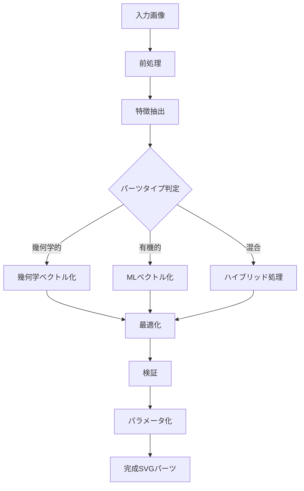

# SVGパーツ管理・生成システム設計仕様書

## 1. 概要

SVGパーツ管理・生成システムは、テックパック作成に必要な視覚的要素を管理し、画像からの自動生成、パラメトリック編集、バージョン管理を統合的に提供するシステムです。AIを活用した画像認識とベクトル化により、効率的なパーツライブラリの構築を実現します。

## 2. データモデル設計

### 2.1 SVGパーツ（SVGPart）エンティティ

```typescript
interface SVGPart {
  // 基本情報
  id: string;                    // UUID
  code: string;                  // パーツコード（例: BTN-ROUND-001）
  name: {
    ja: string;
    en: string;
    [key: string]: string;
  };
  type: PartType;                // button | stitch | pocket | collar | etc.
  status: PartStatus;            // draft | reviewing | approved | deprecated
  version: number;
  
  // SVGデータ
  svgData: {
    source: string;              // SVGコード
    viewBox: ViewBox;            // ビューボックス設定
    width?: number;              // デフォルト幅
    height?: number;             // デフォルト高さ
    preserveAspectRatio: string;
  };
  
  // パラメトリック設定
  parameters: Parameter[];       // 編集可能パラメータ
  variants: Variant[];           // バリエーション
  animations?: Animation[];      // アニメーション定義
  
  // 生成情報
  generationMethod: GenerationMethod;
  sourceImage?: string;          // 元画像（存在する場合）
  generationParams?: {
    model: string;               // 使用したAIモデル
    confidence: number;          // 信頼度スコア
    processingSteps: ProcessingStep[];
  };
  
  // 分類・タグ
  categories: string[];          // カテゴリーID配列
  tags: string[];               // 検索用タグ
  relatedParts: string[];       // 関連パーツID
  applicableItems: string[];    // 適用可能アイテム
  
  // 使用統計
  usage: {
    count: number;               // 総使用回数
    lastUsed?: Date;
    projects: number;            // 使用プロジェクト数
    rating: number;              // 平均評価（1-5）
    reviews: Review[];
  };
  
  // メタデータ
  metadata: {
    complexity: 'simple' | 'medium' | 'complex';
    fileSize: number;            // バイト数
    pathCount: number;           // パス数
    colorScheme: ColorInfo[];
    estimatedRenderTime: number; // ミリ秒
  };
  
  // ライセンス・権利
  license: License;
  attribution?: string;
  restrictions?: string[];
  
  // 監査情報
  createdBy: string;
  createdAt: Date;
  updatedBy: string;
  updatedAt: Date;
  approvedBy?: string;
  approvedAt?: Date;
}
```

### 2.2 パラメータ（Parameter）定義

```typescript
interface Parameter {
  id: string;
  name: {
    ja: string;
    en: string;
  };
  type: ParameterType;           // number | color | select | boolean | point
  path: string;                  // SVG内のターゲットパス
  attribute: string;             // 変更する属性
  
  constraints: {
    min?: number;
    max?: number;
    step?: number;
    options?: ParameterOption[];
    default: any;
    unit?: string;
  };
  
  group?: string;                // パラメータグループ
  order: number;                 // 表示順序
  visible: boolean;
  locked: boolean;               // 編集不可フラグ
  
  dependencies?: {               // 他パラメータとの依存関係
    parameter: string;
    condition: string;           // JSONLogic形式
    action: 'show' | 'hide' | 'enable' | 'disable';
  }[];
}

interface ParameterOption {
  value: any;
  label: {
    ja: string;
    en: string;
  };
  icon?: string;
}
```

### 2.3 SVG生成タスク（SVGGenerationTask）エンティティ

```typescript
interface SVGGenerationTask {
  id: string;
  type: 'image_to_svg' | 'sketch_to_svg' | 'parametric_generation';
  priority: 'low' | 'normal' | 'high' | 'urgent';
  
  input: {
    images?: UploadedImage[];
    sketches?: SketchData[];
    referencePartIds?: string[];
    termId?: string;             // 関連用語ID
    requirements?: {
      partType: PartType;
      style?: string;
      colorScheme?: string[];
      maxComplexity?: number;
    };
  };
  
  processingPipeline: {
    steps: ProcessingStep[];
    currentStep?: number;
    configuration: {
      preprocessor: PreprocessConfig;
      vectorizer: VectorizerConfig;
      optimizer: OptimizerConfig;
      validator: ValidatorConfig;
    };
  };
  
  status: TaskStatus;
  progress: {
    percentage: number;
    currentOperation: string;
    estimatedTimeRemaining?: number;
  };
  
  results?: {
    generatedParts: GeneratedPart[];
    quality: QualityMetrics;
    processingTime: number;
    resourcesUsed: ResourceUsage;
  };
  
  error?: {
    code: string;
    message: string;
    details?: any;
    recoverable: boolean;
  };
  
  metadata: {
    createdBy: string;
    createdAt: Date;
    startedAt?: Date;
    completedAt?: Date;
    attempts: number;
    lastAttemptAt?: Date;
  };
}

interface ProcessingStep {
  name: string;
  type: 'preprocess' | 'detect' | 'vectorize' | 'optimize' | 'validate';
  status: 'pending' | 'processing' | 'completed' | 'failed' | 'skipped';
  input?: any;
  output?: any;
  logs: LogEntry[];
  metrics?: {
    duration: number;
    memoryUsed: number;
    cpuUsage: number;
  };
}
```

### 2.4 画像前処理（ImagePreprocessing）エンティティ

```typescript
interface ImagePreprocessing {
  id: string;
  taskId: string;
  originalImage: {
    url: string;
    width: number;
    height: number;
    format: string;
    size: number;
  };
  
  operations: PreprocessOperation[];
  
  processedImage: {
    url: string;
    width: number;
    height: number;
    format: string;
    size: number;
    improvements: {
      noiseReduction: number;
      contrastEnhancement: number;
      sharpness: number;
    };
  };
  
  detectedFeatures: {
    edges: EdgeData[];
    shapes: ShapeData[];
    keypoints: KeyPoint[];
    regions: Region[];
    textureAreas: TextureArea[];
  };
  
  metadata: {
    processingTime: number;
    usedAlgorithms: string[];
    confidence: number;
  };
}

interface PreprocessOperation {
  type: 'denoise' | 'contrast' | 'threshold' | 'morphology' | 'edge_detect';
  parameters: Record<string, any>;
  order: number;
  applied: boolean;
  result?: {
    success: boolean;
    improvement: number;
    artifacts?: string[];
  };
}
```

### 2.5 ベクトル化結果（VectorizationResult）エンティティ

```typescript
interface VectorizationResult {
  id: string;
  taskId: string;
  method: 'potrace' | 'autotrace' | 'ml_based' | 'hybrid';
  
  rawSVG: string;                // 生成された生のSVG
  optimizedSVG: string;          // 最適化後のSVG
  
  paths: PathInfo[];
  shapes: ShapeInfo[];
  
  quality: {
    accuracy: number;            // 0-1
    smoothness: number;          // 0-1
    complexity: number;          // パス数/ノード数
    fileSize: number;
    renderTime: number;
  };
  
  optimization: {
    original: {
      pathCount: number;
      nodeCount: number;
      fileSize: number;
    };
    optimized: {
      pathCount: number;
      nodeCount: number;
      fileSize: number;
      reductionPercentage: number;
    };
    operations: OptimizationOp[];
  };
  
  validation: {
    passed: boolean;
    issues: ValidationIssue[];
    warnings: ValidationWarning[];
    score: number;               // 0-100
  };
}

interface PathInfo {
  id: string;
  d: string;                     // パスデータ
  type: 'open' | 'closed';
  length: number;
  nodeCount: number;
  boundingBox: BoundingBox;
  attributes: Record<string, any>;
}
```

### 2.6 パーツテンプレート（PartTemplate）エンティティ

```typescript
interface PartTemplate {
  id: string;
  name: {
    ja: string;
    en: string;
  };
  type: PartType;
  category: string;
  
  structure: {
    baseSVG: string;             // ベースとなるSVG構造
    slots: Slot[];               // 可変部分の定義
    constraints: Constraint[];   // 制約条件
    defaultParams: Record<string, any>;
  };
  
  generationRules: {
    minSize: Size;
    maxSize: Size;
    aspectRatio?: {
      min: number;
      max: number;
      preferred: number;
    };
    requiredElements: string[];
    optionalElements: string[];
  };
  
  variations: {
    styles: StyleVariation[];
    sizes: SizeVariation[];
    details: DetailVariation[];
  };
  
  usage: {
    guidelines: string;
    examples: Example[];
    restrictions: string[];
  };
  
  isSystem: boolean;             // システム標準テンプレート
  isPublic: boolean;             // 公開テンプレート
  tags: string[];
  rating: number;
}

interface Slot {
  id: string;
  name: string;
  type: 'shape' | 'path' | 'text' | 'image' | 'group';
  selector: string;              // CSS/XPathセレクタ
  transformable: boolean;
  replaceable: boolean;
  parameters: Parameter[];
}
```

## 3. SVG生成パイプライン

### 3.1 画像→SVG変換フロー



### 3.2 処理ステージ詳細

```typescript
interface ProcessingPipeline {
  stages: {
    // ステージ1: 前処理
    preprocessing: {
      denoise: DenoiseConfig;
      normalize: NormalizeConfig;
      segment: SegmentConfig;
      enhance: EnhanceConfig;
    };
    
    // ステージ2: 特徴抽出
    featureExtraction: {
      edgeDetection: EdgeDetectionConfig;
      shapeRecognition: ShapeRecognitionConfig;
      patternAnalysis: PatternAnalysisConfig;
      colorExtraction: ColorExtractionConfig;
    };
    
    // ステージ3: ベクトル化
    vectorization: {
      method: VectorizationMethod;
      threshold: number;
      smoothing: number;
      precision: number;
      colorHandling: 'preserve' | 'simplify' | 'monochrome';
    };
    
    // ステージ4: 最適化
    optimization: {
      pathSimplification: number;  // 0-1
      nodeMerging: boolean;
      redundancyRemoval: boolean;
      precisionReduction: number;  // 小数点以下桁数
    };
    
    // ステージ5: 品質保証
    qualityAssurance: {
      minQualityScore: number;     // 0-100
      maxFileSize: number;         // KB
      maxComplexity: number;       // ノード数
      validationRules: ValidationRule[];
    };
  };
}
```

## 4. AIモデル統合

### 4.1 使用モデル構成

```yaml
models:
  object_detection:
    name: "YOLOv8-Fashion"
    purpose: "アパレル部品検出"
    classes:
      - button
      - pocket
      - collar
      - zipper
      - stitch_line
    config:
      confidence_threshold: 0.7
      nms_threshold: 0.4
  
  segmentation:
    name: "SAM-Apparel"
    purpose: "精密セグメンテーション"
    config:
      point_per_side: 32
      pred_iou_thresh: 0.88
  
  vectorization:
    name: "DeepSVG-Custom"
    purpose: "ニューラルベクトル化"
    architecture: "VAE-GAN"
    config:
      latent_dim: 256
      max_paths: 50
      training_data: "apparel_parts_10k"
  
  style_transfer:
    name: "StyleGAN-SVG"
    purpose: "スタイル統一化"
    config:
      style_weight: 0.7
      content_weight: 0.3
```

### 4.2 モデル管理

```typescript
interface AIModel {
  id: string;
  name: string;
  version: string;
  type: 'detection' | 'segmentation' | 'vectorization' | 'classification';
  
  deployment: {
    endpoint: string;
    runtime: 'tensorflow' | 'pytorch' | 'onnx';
    hardware: 'cpu' | 'gpu' | 'tpu';
    scalingPolicy: ScalingPolicy;
  };
  
  performance: {
    accuracy: number;
    latency: number;             // ms
    throughput: number;          // requests/sec
    resourceUsage: {
      cpu: number;               // cores
      memory: number;            // GB
      gpu?: number;              // GB VRAM
    };
  };
  
  training: {
    dataset: string;
    epochs: number;
    lastTrainedAt: Date;
    metrics: TrainingMetrics;
    nextRetrainingAt?: Date;
  };
  
  monitoring: {
    health: 'healthy' | 'degraded' | 'unhealthy';
    alerts: Alert[];
    logs: string;
  };
}
```

## 5. パーツ生成ルール

### 5.1 部品タイプ別生成戦略

```typescript
const generationStrategies: Record<PartType, GenerationStrategy> = {
  button: {
    primaryMethod: 'geometric',
    preprocessing: ['denoise', 'enhance_circles'],
    detection: 'hough_circles',
    vectorization: 'parametric_circle',
    postprocessing: ['add_holes', 'apply_style'],
    validation: ['is_circular', 'has_holes', 'size_check']
  },
  
  stitch: {
    primaryMethod: 'path_based',
    preprocessing: ['enhance_lines', 'remove_texture'],
    detection: 'line_detection',
    vectorization: 'bezier_fitting',
    postprocessing: ['smooth_curves', 'apply_dash_pattern'],
    validation: ['is_continuous', 'style_consistent']
  },
  
  pocket: {
    primaryMethod: 'hybrid',
    preprocessing: ['segment', 'edge_enhance'],
    detection: 'contour_detection',
    vectorization: 'polygon_approximation',
    postprocessing: ['add_stitching', 'add_flap'],
    validation: ['is_closed_shape', 'has_opening']
  },
  
  zipper: {
    primaryMethod: 'template_based',
    preprocessing: ['align', 'normalize'],
    detection: 'template_matching',
    vectorization: 'procedural_generation',
    postprocessing: ['add_teeth', 'add_slider'],
    validation: ['has_teeth_pattern', 'is_symmetrical']
  }
};
```

### 5.2 品質基準

```typescript
interface QualityStandards {
  visual: {
    sharpness: number;           // 0-1
    smoothness: number;          // 0-1
    consistency: number;         // 0-1
    aesthetics: number;          // 0-1
  };
  
  technical: {
    fileSize: {
      max: number;               // KB
      target: number;            // KB
    };
    complexity: {
      maxPaths: number;
      maxNodes: number;
      maxDepth: number;
    };
    compatibility: {
      browsers: string[];
      software: string[];
      versions: string[];
    };
  };
  
  usability: {
    editability: number;         // 0-1
    scalability: boolean;
    parametric: boolean;
    animated: boolean;
  };
}
```

## 6. バージョン管理

### 6.1 パーツバージョニング

```typescript
interface PartVersion {
  id: string;
  partId: string;
  version: string;               // Semantic versioning
  changes: Change[];
  
  compatibility: {
    breaking: boolean;
    deprecations: string[];
    migrations: Migration[];
  };
  
  testing: {
    automated: TestResult[];
    manual: ManualTestResult[];
    coverage: number;            // 0-100
  };
  
  release: {
    notes: string;
    date: Date;
    author: string;
    reviewers: string[];
    tags: string[];
  };
}
```

## 7. パフォーマンス最適化

### 7.1 キャッシュ戦略

```yaml
caching:
  levels:
    - name: "Memory Cache"
      storage: "Redis"
      items:
        - generated_svgs: 1000     # 最新1000件
        - thumbnails: 5000
        - metadata: 10000
      ttl: 3600                    # 1時間
    
    - name: "File Cache"
      storage: "Local SSD"
      items:
        - processing_results
        - temporary_files
      ttl: 86400                   # 24時間
    
    - name: "CDN Cache"
      storage: "CloudFront"
      items:
        - public_parts
        - thumbnails
        - static_assets
      ttl: 604800                  # 7日間
```

### 7.2 処理最適化

```typescript
interface ProcessingOptimization {
  parallelization: {
    enabled: boolean;
    maxWorkers: number;
    queueSize: number;
    priorityLevels: number;
  };
  
  resourceLimits: {
    maxMemoryPerTask: number;    // MB
    maxCPUTimePerTask: number;   // 秒
    maxGPUMemory: number;        // MB
    maxConcurrentTasks: number;
  };
  
  batching: {
    enabled: boolean;
    batchSize: number;
    batchTimeout: number;        // ms
    adaptiveBatching: boolean;
  };
}
```