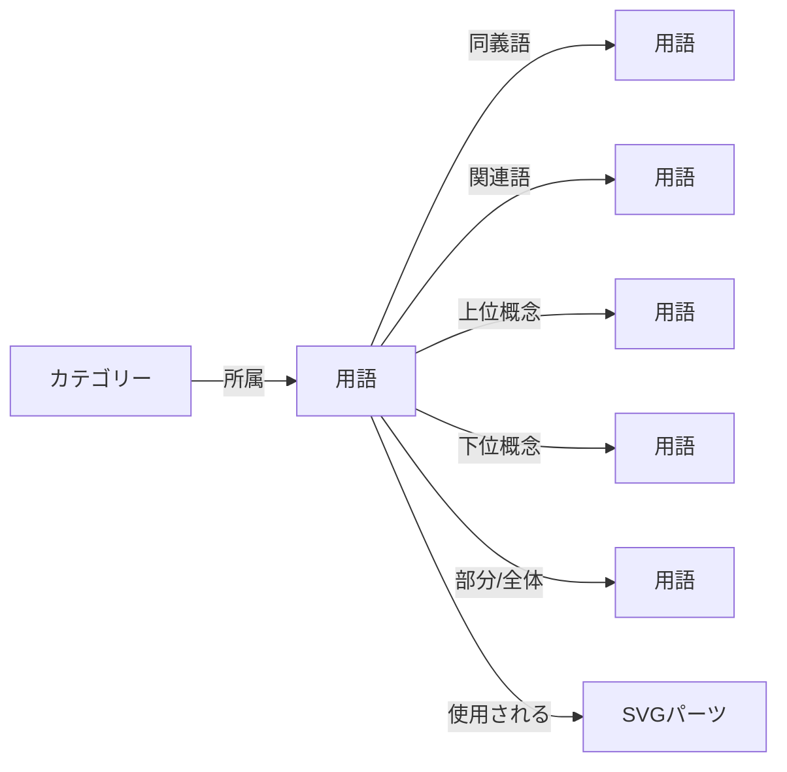

# テックパック用語集データベース設計仕様書

## 1. 概要

テックパック用語集データベースは、アパレル業界の専門用語を体系的に管理し、各用語に紐づくSVGパーツや視覚的表現を統合的に扱うシステムです。AI/機械学習を活用した自動収集・生成機能を備え、ユーザーコミュニティによる継続的な改善を可能にします。

## 2. データモデル設計

### 2.1 用語（Term）エンティティ

```typescript
interface Term {
  // 基本情報
  id: string;                    // UUID
  code: string;                  // 一意識別コード（例: COL-001）
  status: TermStatus;            // draft | approved | deprecated
  version: number;               // バージョン番号
  
  // 多言語対応
  translations: {
    ja: TermTranslation;
    en: TermTranslation;
    zh?: TermTranslation;
    [key: string]: TermTranslation;
  };
  
  // 分類・関連
  categories: Category[];        // 所属カテゴリー（複数可）
  tags: string[];               // 検索用タグ
  synonyms: string[];           // 同義語ID配列
  relatedTerms: string[];       // 関連用語ID配列
  
  // ビジュアル要素
  svgParts: SVGPartReference[]; // 紐づくSVGパーツ
  images: ImageReference[];      // 参考画像
  
  // メタデータ
  industryStandard: boolean;     // 業界標準用語フラグ
  usageFrequency: number;        // 使用頻度スコア
  metadata: {
    source: string;              // 出典
    references: string[];        // 参考資料
    notes: string;               // 備考
  };
  
  // 監査情報
  createdBy: string;             // 作成者ID
  createdAt: Date;
  updatedBy: string;
  updatedAt: Date;
  approvedBy?: string;
  approvedAt?: Date;
}

interface TermTranslation {
  name: string;                  // 用語名
  reading?: string;              // 読み方（日本語の場合）
  abbreviation?: string;         // 略語
  description: string;           // 説明
  usageExamples: string[];       // 使用例
  context?: string;              // 文脈・用途
}

interface SVGPartReference {
  partId: string;
  isPrimary: boolean;            // 主要パーツフラグ
  usageContext: string;          // 使用文脈
  parameters?: Record<string, any>; // カスタムパラメータ
}
```

### 2.2 カテゴリー（Category）エンティティ

```typescript
interface Category {
  id: string;
  code: string;                  // カテゴリーコード
  name: {
    ja: string;
    en: string;
    [key: string]: string;
  };
  parentId?: string;             // 親カテゴリーID
  level: number;                 // 階層レベル（0が最上位）
  path: string;                  // 階層パス（例: /garment/top/collar）
  sortOrder: number;
  icon?: string;                 // カテゴリーアイコン（SVG）
  color?: string;                // テーマカラー
  description?: {
    ja: string;
    en: string;
  };
  isActive: boolean;
}
```

### 2.3 用語収集タスク（TermCollectionTask）エンティティ

```typescript
interface TermCollectionTask {
  id: string;
  type: 'manual' | 'ai_extraction' | 'import' | 'crawl';
  source: {
    type: 'document' | 'website' | 'api' | 'database';
    url?: string;
    file?: string;
    credentials?: EncryptedData;
  };
  
  configuration: {
    language: string[];
    categories?: string[];
    extractionRules?: ExtractRule[];
    aiModel?: string;
    confidence_threshold?: number;
  };
  
  status: 'pending' | 'processing' | 'completed' | 'failed';
  progress: number;              // 0-100
  
  results: {
    extractedTerms: ExtractedTerm[];
    statistics: {
      total: number;
      new: number;
      updated: number;
      duplicates: number;
    };
    errors?: Error[];
  };
  
  scheduledAt?: Date;
  startedAt?: Date;
  completedAt?: Date;
  createdBy: string;
}

interface ExtractedTerm {
  tempId: string;
  termData: Partial<Term>;
  confidence: number;            // 0-1
  source: {
    location: string;            // ファイル名、URL等
    context: string;             // 抽出元の文脈
    position?: number;           // 文書内の位置
  };
  suggestedCategories: string[];
  suggestedSVGParts?: string[];
  needsReview: boolean;
}
```

### 2.4 用語使用履歴（TermUsageHistory）エンティティ

```typescript
interface TermUsageHistory {
  id: string;
  termId: string;
  userId: string;
  projectId?: string;
  action: 'view' | 'copy' | 'use_in_techpack' | 'export';
  context: {
    section?: string;            // テックパックのセクション
    element?: string;            // 具体的な使用箇所
  };
  timestamp: Date;
  sessionId: string;
}
```

## 3. データ関連性

### 3.1 用語間の関係



### 3.2 バージョン管理

```typescript
interface TermVersion {
  id: string;
  termId: string;
  version: number;
  changes: {
    field: string;
    oldValue: any;
    newValue: any;
    changedBy: string;
    changedAt: Date;
    reason?: string;
  }[];
  snapshot: Term;                // その時点の完全なデータ
  isPublished: boolean;
  publishedAt?: Date;
}
```

## 4. インデックス設計

### 4.1 主要インデックス

```sql
-- 検索用インデックス
CREATE INDEX idx_terms_name_ja ON terms USING gin(translations->'ja'->>'name' gin_trgm_ops);
CREATE INDEX idx_terms_name_en ON terms USING gin(translations->'en'->>'name' gin_trgm_ops);
CREATE INDEX idx_terms_tags ON terms USING gin(tags);
CREATE INDEX idx_terms_categories ON terms USING gin(categories);

-- パフォーマンス用インデックス
CREATE INDEX idx_terms_status_updated ON terms(status, updated_at DESC);
CREATE INDEX idx_terms_frequency ON terms(usage_frequency DESC);

-- 全文検索用インデックス
CREATE INDEX idx_terms_fulltext ON terms USING gin(
  to_tsvector('japanese', translations->'ja'->>'description') ||
  to_tsvector('english', translations->'en'->>'description')
);
```

### 4.2 キャッシュ戦略

```yaml
キャッシュレイヤー:
  Redis:
    - 頻出用語（Top 1000）: TTL 1時間
    - カテゴリーツリー: TTL 24時間
    - 検索結果: TTL 10分
    - ユーザー別最近使用: TTL 7日
  
  CDN:
    - 用語集エクスポート: TTL 24時間
    - API レスポンス: TTL 1時間
```

## 5. データ品質管理

### 5.1 バリデーションルール

```typescript
const termValidationRules = {
  code: {
    required: true,
    pattern: /^[A-Z]{3}-\d{3,5}$/,
    unique: true
  },
  translations: {
    minLanguages: 1,
    requiredFields: ['name', 'description'],
    minDescriptionLength: 20,
    maxDescriptionLength: 500
  },
  categories: {
    required: true,
    minCount: 1,
    maxCount: 5,
    mustExist: true
  },
  svgParts: {
    maxCount: 20,
    mustExist: true
  }
};
```

### 5.2 データクレンジング

```typescript
interface DataCleansingRule {
  id: string;
  name: string;
  type: 'normalize' | 'deduplicate' | 'validate' | 'enrich';
  target: 'term' | 'category' | 'all';
  condition: string;              // JSONLogic形式
  action: {
    type: 'update' | 'merge' | 'flag' | 'delete';
    parameters: Record<string, any>;
  };
  schedule?: CronExpression;
  isActive: boolean;
}
```

## 6. セキュリティ設計

### 6.1 アクセス制御

```typescript
enum TermPermission {
  VIEW = 'term:view',
  CREATE = 'term:create',
  UPDATE = 'term:update',
  DELETE = 'term:delete',
  APPROVE = 'term:approve',
  EXPORT = 'term:export',
  BULK_IMPORT = 'term:bulk_import'
}

interface TermAccessPolicy {
  role: string;
  permissions: TermPermission[];
  conditions?: {
    ownOnly?: boolean;           // 自分が作成したもののみ
    categories?: string[];       // 特定カテゴリーのみ
    status?: TermStatus[];       // 特定ステータスのみ
  };
}
```

### 6.2 監査ログ

```typescript
interface TermAuditLog {
  id: string;
  timestamp: Date;
  userId: string;
  action: string;
  termId?: string;
  details: {
    ip: string;
    userAgent: string;
    changes?: any;
    reason?: string;
  };
  severity: 'info' | 'warning' | 'critical';
}
```

## 7. 統合ポイント

### 7.1 SVGパーツシステムとの連携

- 用語作成時の自動SVGパーツ提案
- SVGパーツからの逆引き用語検索
- 使用統計の相互参照

### 7.2 テックパックシステムとの連携

- セクション別用語フィルタリング
- コンテキストベースの用語推奨
- 使用履歴に基づく最適化

### 7.3 外部システム連携

- 業界標準データベースとの同期
- 翻訳サービスとの統合
- CAD/PLMシステムとのメタデータ交換