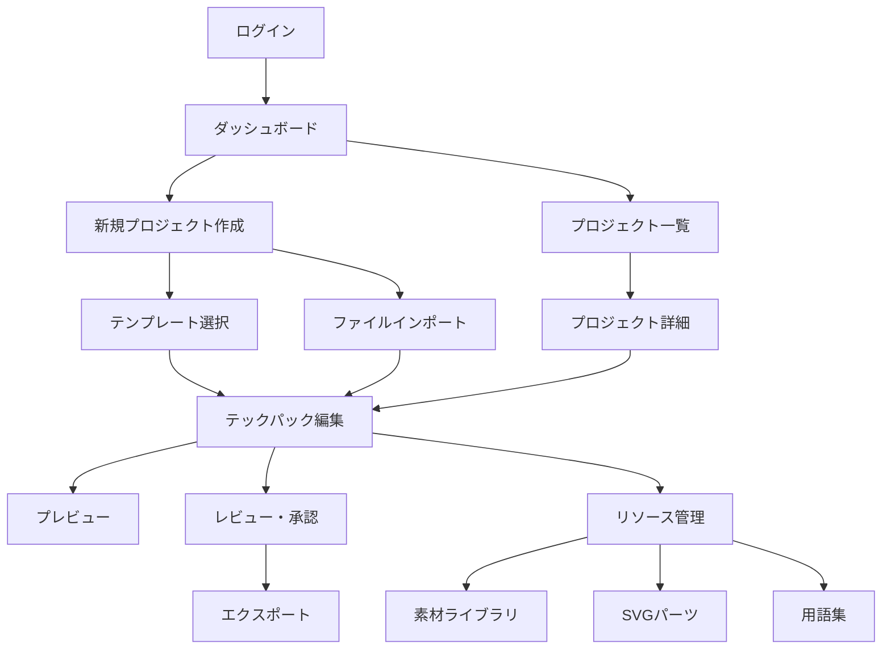

# 画面フロー設計書

## 1. 概要

本ドキュメントは、テックパック生成アプリケーションの主要画面フローと各画面の詳細設計を定義します。

## 2. 全体フロー図



## 3. 主要画面詳細

### 3.1 ログイン画面

#### 画面構成

```
┌─────────────────────────────────────────────────────────┐
│                        ロゴ                          │
│                                                     │
│              ┌───────────────────────┐            │
│              │  メールアドレス         │            │
│              └───────────────────────┘            │
│                                                     │
│              ┌───────────────────────┐            │
│              │  パスワード             │            │
│              └───────────────────────┘            │
│                                                     │
│              □ パスワードを記憶する              │
│                                                     │
│              ┌───────────────────────┐            │
│              │     ログイン          │            │
│              └───────────────────────┘            │
│                                                     │
│              パスワードを忘れた方                  │
│              アカウントを作成                      │
└─────────────────────────────────────────────────────────┘
```

#### 機能要件

- **認証方法**: メールアドレス + パスワード
- **SSO対応**: Google, Microsoft, SAML 2.0
- **2要素認証**: オプション
- **パスワードリセット**: メール送信機能

### 3.2 ダッシュボード

#### 画面構成

```
┌────────────────────────────────────────────────────────────┐
│ ヘッダー                                                      │
├────────────────────────────────────────────────────────────┤
│ ウェルカムメッセージ                                          │
├────────────────────────────────────────────────────────────┤
│ ┌────────────────────┐ ┌──────────────────────────────┐ │
│ │                    │ │                                │ │
│ │  クイック           │ │                                │ │
│ │  アクション         │ │     最近のプロジェクト          │ │
│ │                    │ │                                │ │
│ │  [新規作成]        │ │     ┌──────┐ ┌──────┐ ┌──────┐ │ │
│ │  [テンプレート]    │ │     │      │ │      │ │      │ │ │
│ │  [インポート]      │ │     └──────┘ └──────┘ └──────┘ │ │
│ │                    │ │                                │ │
│ └────────────────────┘ └──────────────────────────────┘ │
│                                                              │
│ ┌────────────────────┐ ┌──────────────────────────────┐ │
│ │                    │ │                                │ │
│ │   統計情報         │ │      アクティビティ              │ │
│ │                    │ │                                │ │
│ └────────────────────┘ └──────────────────────────────┘ │
└────────────────────────────────────────────────────────────┘
```

#### 主要機能

1. **クイックアクション**
   - 新規プロジェクト作成
   - テンプレートから作成
   - ファイルインポート

2. **最近のプロジェクト**
   - 最大6件表示
   - サムネイル付きカード表示
   - クリックで編集画面へ

3. **統計情報**
   - 今月の作成数
   - 完了率
   - 承認待ち数

4. **アクティビティ**
   - チームメンバーの活動
   - 最近の変更履歴
   - コメント・通知

### 3.3 プロジェクト一覧

#### 画面構成

```
┌────────────────────────────────────────────────────────────┐
│ ヘッダー > プロジェクト                                         │
├────────────────────────────────────────────────────────────┤
│ ┌──────────────────────────────────────────────┐ [新規] │
│ │ 🔍 検索...                                          │       │
│ └──────────────────────────────────────────────┘       │
│                                                              │
│ フィルター: [全て] [アクティブ] [ドラフト] [アーカイブ]    │
│ ソート: [更新日順 ▼]                                        │
│                                                              │
│ ┌───────────────────────────────────────────────────────┐ │
│ │ ☐ | 📄 | Style #001 | サマーコレクション | 更新: 2時間前  │ │
│ ├───────────────────────────────────────────────────────┤ │
│ │ ☐ | 📄 | Style #002 | ウィンターライン | 更新: 1日前        │ │
│ ├───────────────────────────────────────────────────────┤ │
│ │ ☐ | 📄 | Style #003 | ベーシックシャツ | 更新: 3日前        │ │
│ └───────────────────────────────────────────────────────┘ │
└────────────────────────────────────────────────────────────┘
```

#### 機能要件

1. **検索・フィルター**
   - キーワード検索
   - ステータスフィルター
   - 日付範囲フィルター
   - タグフィルター

2. **ソート機能**
   - 更新日時
   - 作成日時
   - プロジェクト名
   - ステータス

3. **バッチ操作**
   - 複数選択
   - 一括削除
   - 一括エクスポート
   - 一括ステータス変更

4. **ビュー切り替え**
   - リストビュー
   - グリッドビュー
   - カードビュー

### 3.4 テックパック編集画面

#### 画面構成

```
┌────────────────────────────────────────────────────────────┐
│ [保存] [元に戻す] [やり直し]         [プレビュー] [承認依頼] │
├───────┬─────────────────────────────────┬─────────────────┤
│        │                                  │                 │
│ 01.カバ │                                  │  プロパティ      │
│ 02.前面 │                                  │  パネル         │
│ 03.背面 │      編集キャンバス               │                 │
│ 04.詳細 │                                  ├─────────────────┤
│ 05.BOM  │                                  │                 │
│ 06.色展 │                                  │  ツール         │
│ ...     │                                  │  パレット       │
│ 20.履歴 │                                  │                 │
│        │                                  ├─────────────────┤
│ [追加] │                                  │  レイヤー        │
│        │                                  │  パネル         │
│        │                                  │                 │
├───────┴─────────────────────────────────┴─────────────────┤
│ ステータス: 編集中 | 自動保存: 5分前 | バージョン: 1.2         │
└────────────────────────────────────────────────────────────┘
```

#### セクション別編集インターフェース

1. **01 - カバーページ**
   - フォーム入力
   - 画像アップロード
   - プレビュー

2. **02/03 - テクニカルフラット**
   - SVGエディター
   - パーツライブラリ
   - 寸法ツール
   - レイヤー管理

3. **05 - BOM**
   - スプレッドシートUI
   - 素材データベース連携
   - 自動計算

4. **09/10 - 寸法表**
   - 寸法入力グリッド
   - グレーディング設定
   - ダイアグラム連動

### 3.5 リソース管理画面

#### 画面構成

```
┌────────────────────────────────────────────────────────────┐
│ ヘッダー > リソース管理                                       │
├────────────────────────────────────────────────────────────┤
│ [素材] [SVGパーツ] [用語集] [テンプレート]                │
├────────────────────────────────────────────────────────────┤
│                                                              │
│ ┌─────────────┐ ┌──────────────────────────────────────┐ │
│ │             │ │                                        │ │
│ │ カテゴリー  │ │  SVGパーツ一覧                          │ │
│ │             │ │                                        │ │
│ │ ▶ ボタン     │ │  ┌──────┐ ┌──────┐ ┌──────┐ ┌──────┐ │ │
│ │   ステッチ   │ │  │      │ │      │ │      │ │      │ │ │
│ │   ポケット   │ │  └──────┘ └──────┘ └──────┘ └──────┘ │ │
│ │ ▶ 襟        │ │                                        │ │
│ │   ジッパー   │ │  ┌──────┐ ┌──────┐ ┌──────┐ ┌──────┐ │ │
│ │             │ │  │      │ │      │ │      │ │      │ │ │
│ └─────────────┘ │  └──────┘ └──────┘ └──────┘ └──────┘ │ │
│                   │                                        │ │
│                   └──────────────────────────────────────┘ │
└────────────────────────────────────────────────────────────┘
```

#### タブ別機能

1. **SVGパーツ**
   - カテゴリー別表示
   - ドラッグ&ドロップ対応
   - AI生成機能
   - パラメータ編集

2. **素材ライブラリ**
   - 生地データベース
   - 付属品データベース
   - サプライヤー情報
   - 価格情報

3. **用語集**
   - 多言語対応
   - 検索機能
   - AI自動収集
   - SVGパーツ連携

4. **テンプレート**
   - 業界標準テンプレート
   - カスタムテンプレート
   - 共有テンプレート
   - バージョン管理

## 4. モーダル・ダイアログ

### 4.1 新規プロジェクト作成モーダル

```
┌─────────────────────────────────────────────────────────┐
│ 新規プロジェクト作成                                    [×] │
├─────────────────────────────────────────────────────────┤
│                                                              │
│ 作成方法を選択してください:                             │
│                                                              │
│ ┌─────────────────┐ ┌─────────────────┐ ┌─────────────────┐ │
│ │    📄           │ │    📁           │ │    📥           │ │
│ │                 │ │                 │ │                 │ │
│ │  ゼロから作成   │ │ テンプレートから │ │ ファイルから     │ │
│ │                 │ │                 │ │  インポート     │ │
│ └─────────────────┘ └─────────────────┘ └─────────────────┘ │
│                                                              │
├─────────────────────────────────────────────────────────┤
│                                  [キャンセル] [次へ]        │
└─────────────────────────────────────────────────────────┘
```

### 4.2 SVGパーツ生成モーダル

```
┌─────────────────────────────────────────────────────────┐
│ SVGパーツ生成                                         [×] │
├─────────────────────────────────────────────────────────┤
│                                                              │
│ ┌───────────────────────────────────────────────────────┐ │
│ │                                                          │ │
│ │  画像をドラッグ&ドロップまたはクリックして選択          │ │
│ │                                                          │ │
│ │                     [ファイルを選択]                     │ │
│ │                                                          │ │
│ └───────────────────────────────────────────────────────┘ │
│                                                              │
│ パーツタイプ: [ボタン ▼]                                     │
│                                                              │
│ 詳細設定:                                                  │
│ □ 背景を自動除去                                          │
│ ■ パスを最適化                                            │
│ ■ パラメータを生成                                        │
│                                                              │
├─────────────────────────────────────────────────────────┤
│                                  [キャンセル] [生成]        │
└─────────────────────────────────────────────────────────┘
```

### 4.3 レビュー・承認モーダル

```
┌─────────────────────────────────────────────────────────┐
│ 承認依頼                                              [×] │
├─────────────────────────────────────────────────────────┤
│                                                              │
│ 承認者を選択:                                              │
│ ┌───────────────────────────────────────────────────────┐ │
│ │ 選択してください...                            [+追加] │ │
│ └───────────────────────────────────────────────────────┘ │
│                                                              │
│ 期限:                                                       │
│ ┌───────────────────────────────────────────────────────┐ │
│ │ 2024/03/20                                        [📅] │ │
│ └───────────────────────────────────────────────────────┘ │
│                                                              │
│ コメント:                                                    │
│ ┌───────────────────────────────────────────────────────┐ │
│ │                                                          │ │
│ │ 初回サンプルのレビューをお願いします。               │ │
│ │                                                          │ │
│ └───────────────────────────────────────────────────────┘ │
│                                                              │
│ 通知設定:                                                   │
│ ■ 承認時に通知                                            │
│ ■ 却下時に通知                                            │
│ □ コメント時に通知                                        │
│                                                              │
├─────────────────────────────────────────────────────────┤
│                                  [キャンセル] [送信]        │
└─────────────────────────────────────────────────────────┘
```

## 5. ナビゲーション設計

### 5.1 グローバルナビゲーション

```typescript
interface GlobalNavigation {
  logo: {
    src: string;
    alt: string;
    href: string;
  };
  
  mainMenu: MenuItem[];
  
  search: {
    placeholder: string;
    suggestions: boolean;
    recentSearches: boolean;
  };
  
  userMenu: {
    avatar: string;
    name: string;
    items: UserMenuItem[];
  };
  
  notifications: {
    count: number;
    items: Notification[];
  };
}
```

### 5.2 パンくずリスト

各画面で現在位置を明示:

```
ホーム > プロジェクト > Style #001 > 編集 > 02.前面平面図
```

### 5.3 ショートカットナビゲーション

- `Ctrl/Cmd + S`: 保存
- `Ctrl/Cmd + P`: プレビュー
- `Ctrl/Cmd + /`: 検索
- `Ctrl/Cmd + N`: 新規作成
- `←/→`: セクション間移動

## 6. 状態管理

### 6.1 プロジェクト状態

```typescript
enum ProjectStatus {
  DRAFT = 'draft',           // 下書き
  IN_PROGRESS = 'in_progress', // 作業中
  REVIEW = 'review',          // レビュー中
  APPROVED = 'approved',      // 承認済み
  PRODUCTION = 'production',  // 生産中
  COMPLETED = 'completed',    // 完了
  ARCHIVED = 'archived'       // アーカイブ
}
```

### 6.2 ユーザー状態

```typescript
interface UserState {
  currentProject?: Project;
  recentProjects: Project[];
  preferences: UserPreferences;
  permissions: Permission[];
}
```

## 7. エラーハンドリング

### 7.1 エラー表示パターン

1. **インラインエラー**: フォーム入力
2. **トースト通知**: 一時的なエラー
3. **モーダルエラー**: 重大なエラー
4. **エラーページ**: システムエラー

### 7.2 リカバリー機能

- 自動保存（5分ごと）
- バージョン復元
- オフラインモード
- データ同期リトライ

## 8. パフォーマンス最適化

### 8.1 ページ読み込み

- **初回読み込み**: < 3秒
- **ページ遷移**: < 1秒
- **データ保存**: < 500ms

### 8.2 最適化手法

- 遅延ローディング
- 仮想スクロール
- キャッシュ戦略
- データプリフェッチ