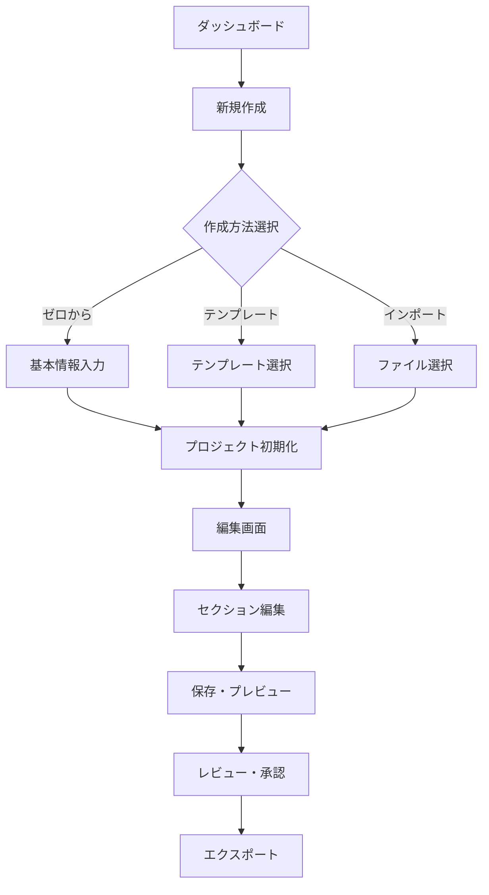

# UI/UXデザイン概要仕様書

## 1. デザインコンセプト

### 1.1 ビジョン

テックパック生成アプリケーションのUI/UXは、アパレル業界のプロフェッショナルが直感的に操作でき、複雑な技術仕様書を効率的に作成できるインターフェースを提供します。

### 1.2 デザイン原則

1. **効率性優先（Efficiency First）**
   - 最小限のクリックで目的を達成
   - キーボードショートカットのサポート
   - 一括操作と自動化

2. **視覚的明確性（Visual Clarity）**
   - 情報の階層構造を明確に表現
   - 適切な余白とコントラスト
   - 統一されたアイコン体系

3. **段階的開示（Progressive Disclosure）**
   - 基本機能を前面に
   - 高度な機能は必要時にアクセス
   - コンテキストに応じた表示

4. **エラー防止（Error Prevention）**
   - リアルタイムバリデーション
   - 確認ダイアログ
   - 取り消し可能な操作

5. **マルチデバイス対応（Multi-device Support）**
   - レスポンシブデザイン
   - タッチ操作の最適化
   - プラットフォーム間の一貫性

## 2. 情報アーキテクチャ

### 2.1 ナビゲーション構造

```
├── ダッシュボード
│   ├── 最近のプロジェクト
│   ├── クイックアクション
│   └── 通知・アラート
│
├── プロジェクト管理
│   ├── プロジェクト一覧
│   ├── 新規作成
│   └── テンプレート管理
│
├── テックパック編集
│   ├── セクションナビゲーター
│   ├── 編集エリア
│   ├── プレビューパネル
│   └── ツールパレット
│
├── リソース管理
│   ├── 素材ライブラリ
│   ├── SVGパーツ
│   ├── 用語集
│   └── テンプレート
│
├── コラボレーション
│   ├── チームメンバー
│   ├── コメント・レビュー
│   └── 変更履歴
│
└── 設定
    ├── アカウント
    ├── 組織設定
    ├── 通知設定
    └── 連携設定
```

### 2.2 ユーザーフロー

#### 新規テックパック作成フロー



## 3. 画面設計

### 3.1 ダッシュボード

#### レイアウト構成

```
┌─────────────────────────────────────────────────────────┐
│ ヘッダー（ロゴ、検索、通知、プロファイル）                    │
├─────────────────────────────────────────────────────────┤
│ ┌─────────────────┐ ┌──────────────────────────────┐ │
│ │                 │ │                                │ │
│ │  クイック       │ │     最近のプロジェクト          │ │
│ │  アクション     │ │                                │ │
│ │                 │ └──────────────────────────────┘ │
│ │                 │ ┌──────────────────────────────┐ │
│ └─────────────────┘ │                                │ │
│                     │     アクティビティフィード       │ │
│ ┌─────────────────┐ │                                │ │
│ │                 │ └──────────────────────────────┘ │
│ │   統計情報      │                                    │
│ │                 │                                    │
│ └─────────────────┘                                   │
└─────────────────────────────────────────────────────────┘
```

#### 主要コンポーネント

1. **プロジェクトカード**
   - サムネイル画像
   - プロジェクト名・番号
   - 最終更新日時
   - ステータスバッジ
   - クイックアクション（編集、複製、削除）

2. **クイックアクションパネル**
   - 新規プロジェクト作成
   - テンプレートから作成
   - ファイルインポート
   - 最近使用したテンプレート

### 3.2 テックパック編集画面

#### レイアウト構成

```
┌─────────────────────────────────────────────────────────┐
│ ツールバー（保存、元に戻す、プレビュー、エクスポート）      │
├──────┬──────────────────────────────────┬───────────────┤
│      │                                  │               │
│ セク │                                  │   プロパティ  │
│ ショ │        編集キャンバス             │   パネル     │
│ ン   │                                  │               │
│ ナビ │                                  ├───────────────┤
│      │                                  │               │
│      │                                  │   レイヤー   │
│      │                                  │   パネル     │
│      │                                  │               │
├──────┴──────────────────────────────────┴───────────────┤
│ ステータスバー（ズーム、グリッド、ガイド、座標）           │
└─────────────────────────────────────────────────────────┘
```

#### セクション別UI要件

1. **01 - カバーページ**
   - フォーム型入力インターフェース
   - リアルタイムプレビュー
   - 画像アップロードエリア

2. **02/03 - テクニカルフラット**
   - ベクター描画ツール
   - パーツライブラリパネル
   - 寸法線自動生成
   - レイヤー管理

3. **05 - BOM（資材表）**
   - スプレッドシート型インターフェース
   - ドラッグ&ドロップ並び替え
   - 自動計算フィールド
   - 一括インポート/エクスポート

## 4. コンポーネント設計

### 4.1 共通コンポーネント

#### ボタン

```typescript
interface ButtonProps {
  variant: 'primary' | 'secondary' | 'tertiary' | 'danger';
  size: 'small' | 'medium' | 'large';
  icon?: IconName;
  loading?: boolean;
  disabled?: boolean;
  fullWidth?: boolean;
}

// 使用例
<Button variant="primary" size="medium" icon="save">
  保存
</Button>
```

#### 入力フィールド

```typescript
interface InputFieldProps {
  type: 'text' | 'number' | 'select' | 'multiselect' | 'date';
  label: string;
  placeholder?: string;
  required?: boolean;
  validation?: ValidationRule[];
  helpText?: string;
  error?: string;
}
```

### 4.2 専用コンポーネント

#### SVGエディター

```typescript
interface SVGEditorProps {
  initialData?: string;
  tools: Tool[];
  gridSize?: number;
  snapToGrid?: boolean;
  onSave: (svgData: string) => void;
  partLibrary?: SVGPart[];
}
```

#### 寸法表エディター

```typescript
interface MeasurementTableProps {
  measurements: Measurement[];
  baseSize: string;
  tolerances: Tolerance[];
  onUpdate: (measurements: Measurement[]) => void;
  enableGrading?: boolean;
}
```

## 5. インタラクションデザイン

### 5.1 ドラッグ&ドロップ

- **対象要素**
  - SVGパーツ（ライブラリ → キャンバス）
  - 画像ファイル（デスクトップ → アップロードエリア）
  - テーブル行（並び替え）
  - セクション（順序変更）

### 5.2 リアルタイムコラボレーション

- **カーソル共有**: 編集中のユーザーカーソル表示
- **ロック機能**: 編集中セクションの自動ロック
- **プレゼンスインジケーター**: オンラインユーザー表示
- **リアルタイム同期**: 変更の即時反映

### 5.3 ショートカット

| 操作 | Windows/Linux | Mac |
|------|---------------|-----|
| 保存 | Ctrl + S | Cmd + S |
| 元に戻す | Ctrl + Z | Cmd + Z |
| やり直し | Ctrl + Y | Cmd + Shift + Z |
| プレビュー | Ctrl + P | Cmd + P |
| 検索 | Ctrl + F | Cmd + F |
| 新規作成 | Ctrl + N | Cmd + N |

## 6. レスポンシブデザイン

### 6.1 ブレークポイント

```scss
$breakpoints: (
  mobile: 375px,
  tablet: 768px,
  desktop: 1024px,
  wide: 1440px
);
```

### 6.2 デバイス別最適化

#### モバイル（375px - 767px）
- シングルカラムレイアウト
- タッチ最適化（44px最小タップ領域）
- スワイプジェスチャー対応
- 簡略化されたツールバー

#### タブレット（768px - 1023px）
- 2カラムレイアウト
- フローティングパネル
- ピンチズーム対応
- コンテキストメニュー

#### デスクトップ（1024px+）
- フル機能インターフェース
- マルチパネルレイアウト
- キーボード操作最適化
- 高度な編集機能

## 7. アクセシビリティ

### 7.1 WCAG 2.1 AA準拠

- **色のコントラスト**: 最小4.5:1（通常テキスト）、3:1（大きいテキスト）
- **キーボードナビゲーション**: 全機能をキーボードで操作可能
- **スクリーンリーダー対応**: 適切なARIA属性
- **フォーカス表示**: 明確なフォーカスインジケーター

### 7.2 多言語対応

```typescript
interface LocalizationConfig {
  defaultLanguage: 'ja';
  supportedLanguages: ['ja', 'en', 'zh'];
  rtlSupport: boolean;
  dateFormat: string;
  numberFormat: string;
}
```

## 8. パフォーマンス最適化

### 8.1 読み込み時間

- **目標**: 初回読み込み3秒以内
- **手法**:
  - コード分割（Code Splitting）
  - 遅延読み込み（Lazy Loading）
  - リソース圧縮
  - CDN活用

### 8.2 レンダリング最適化

- **仮想スクロール**: 大量データの効率的表示
- **デバウンス/スロットル**: 入力イベントの最適化
- **メモ化**: 計算結果のキャッシュ
- **Web Worker**: 重い処理のバックグラウンド実行

## 9. エラーハンドリング

### 9.1 エラー表示

```typescript
interface ErrorDisplay {
  type: 'inline' | 'toast' | 'modal' | 'page';
  severity: 'info' | 'warning' | 'error' | 'critical';
  message: string;
  actions?: ErrorAction[];
  dismissible?: boolean;
}
```

### 9.2 エラー回復

- **自動保存**: 5分ごと + 重要操作後
- **オフライン対応**: ローカルストレージ活用
- **再試行機能**: ネットワークエラー時
- **データ復旧**: クラッシュ後の復元

## 10. スタイルガイド

### 10.1 カラーパレット

```scss
// Primary Colors
$primary-500: #2563EB;  // メインアクション
$primary-600: #1D4ED8;  // ホバー状態
$primary-100: #DBEAFE;  // 背景色

// Neutral Colors
$gray-900: #111827;     // テキスト
$gray-600: #4B5563;     // セカンダリテキスト
$gray-300: #D1D5DB;     // ボーダー
$gray-50: #F9FAFB;      // 背景

// Semantic Colors
$success: #10B981;
$warning: #F59E0B;
$error: #EF4444;
$info: #3B82F6;
```

### 10.2 タイポグラフィ

```scss
// Font Family
$font-sans: 'Noto Sans JP', -apple-system, BlinkMacSystemFont, sans-serif;
$font-mono: 'Fira Code', monospace;

// Font Sizes
$text-xs: 0.75rem;    // 12px
$text-sm: 0.875rem;   // 14px
$text-base: 1rem;     // 16px
$text-lg: 1.125rem;   // 18px
$text-xl: 1.25rem;    // 20px
$text-2xl: 1.5rem;    // 24px
$text-3xl: 1.875rem;  // 30px
```

### 10.3 スペーシング

```scss
$spacing: (
  0: 0,
  1: 0.25rem,   // 4px
  2: 0.5rem,    // 8px
  3: 0.75rem,   // 12px
  4: 1rem,      // 16px
  5: 1.25rem,   // 20px
  6: 1.5rem,    // 24px
  8: 2rem,      // 32px
  10: 2.5rem,   // 40px
  12: 3rem,     // 48px
  16: 4rem,     // 64px
);
```