# AIエージェント アーキテクチャ＆フロー設計書

## 目次

1. [概要](#1-概要)
2. [AIエージェント全体概念図](#2-aiエージェント全体概念図)
   - 2.1 [システム全体像](#21-システム全体像)
   - 2.2 [コンポーネント責務マップ](#22-コンポーネント責務マップ)
3. [各技術の役割と適用範囲](#3-各技術の役割と適用範囲)
   - 3.1 [技術スタック役割マトリクス](#31-技術スタック役割マトリクス)
   - 3.2 [技術適用範囲の詳細](#32-技術適用範囲の詳細)
4. [処理シナリオ別フロー](#4-処理シナリオ別フロー)
   - 4.1 [用語収集シナリオ](#41-用語収集シナリオ)
   - 4.2 [SVG生成シナリオ](#42-svg生成シナリオ)
   - 4.3 [複合タスクシナリオ](#43-複合タスクシナリオ文書処理用語抽出翻訳svg生成)
5. [LLMオーケストレーション](#5-llmオーケストレーション)
   - 5.1 [LLMルーターの意思決定フロー](#51-llmルーターの意思決定フロー)
   - 5.2 [動的LLM選択アルゴリズム](#52-動的llm選択アルゴリズム)
   - 5.3 [フォールバック戦略](#53-フォールバック戦略)
6. [エンドツーエンドフロー](#6-エンドツーエンドフロー)
   - 6.1 [完全なリクエスト処理フロー](#61-完全なリクエスト処理フロー)
   - 6.2 [リアルタイム進捗通知フロー](#62-リアルタイム進捗通知フロー)
7. [パフォーマンス最適化フロー](#7-パフォーマンス最適化フロー)
   - 7.1 [キャッシング戦略](#71-キャッシング戦略)
   - 7.2 [バッチ処理最適化](#72-バッチ処理最適化)
8. [エラーハンドリングとリカバリー](#8-エラーハンドリングとリカバリー)
   - 8.1 [エラー処理フロー](#81-エラー処理フロー)
9. [セキュリティフロー](#9-セキュリティフロー)
   - 9.1 [認証・認可フロー](#91-認証認可フロー)
10. [機械学習モデルの学習フロー](#10-機械学習モデルの学習フロー)
    - 10.1 [データ収集と前処理](#101-データ収集と前処理)
    - 10.2 [モデル学習パイプライン](#102-モデル学習パイプライン)
    - 10.3 [継続的学習と改善](#103-継続的学習と改善)
11. [まとめ](#11-まとめ)

## 1. 概要

本ドキュメントは、テックパック生成アプリケーションのAIエージェント実装における全体アーキテクチャ、技術の役割、適用フロー、およびLLMによるオーケストレーションを体系的に説明します。

## 2. AIエージェント全体概念図

### 2.1 システム全体像

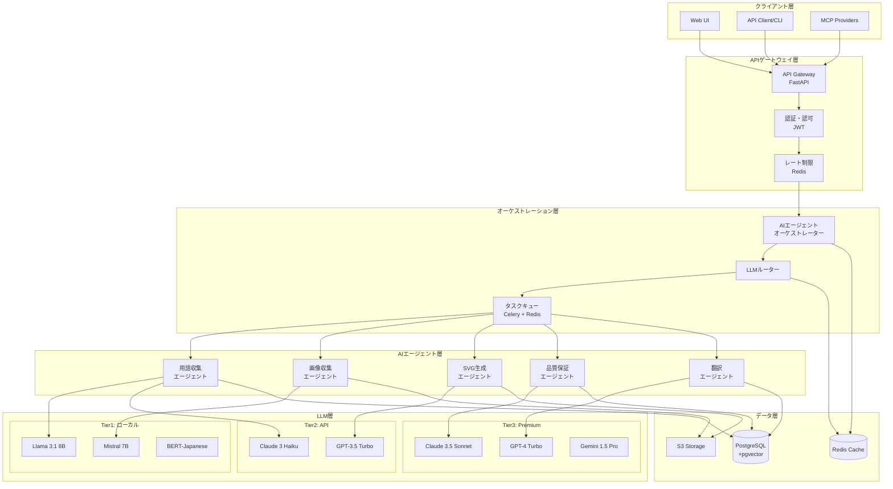
```mermaid
graph TB
    subgraph "クライアント層"
        UI[Web UI]
        API_CLI[API Client/CLI]
        MCP[MCP Providers]
    end
    
    subgraph "APIゲートウェイ層"
        GW[API Gateway<br/>FastAPI]
        AUTH[認証・認可<br/>JWT]
        RL[レート制限<br/>Redis]
    end
    
    subgraph "オーケストレーション層"
        ORC[AIエージェント<br/>オーケストレーター]
        ROUTER[LLMルーター]
        QUEUE[タスクキュー<br/>Celery + Redis]
    end
    
    subgraph "AIエージェント層"
        TC[用語収集<br/>エージェント]
        IC[画像収集<br/>エージェント]
        SG[SVG生成<br/>エージェント]
        QA[品質保証<br/>エージェント]
        TR[翻訳<br/>エージェント]
    end
    
    subgraph "LLM層"
        subgraph "Tier1: ローカル"
            LLAMA8[Llama 3.1 8B]
            MISTRAL[Mistral 7B]
            BERT[BERT-Japanese]
        end
        
        subgraph "Tier2: API"
            CLAUDE_H[Claude 3 Haiku]
            GPT35[GPT-3.5 Turbo]
        end
        
        subgraph "Tier3: Premium"
            CLAUDE_S[Claude 3.5 Sonnet]
            GPT4[GPT-4 Turbo]
            GEMINI[Gemini 1.5 Pro]
        end
    end
    
    subgraph "データ層"
        PG[(PostgreSQL<br/>+pgvector)]
        REDIS[(Redis Cache)]
        S3[S3 Storage]
    end
    
    UI --> GW
    API_CLI --> GW
    MCP --> GW
    
    GW --> AUTH
    AUTH --> RL
    RL --> ORC
    
    ORC --> ROUTER
    ROUTER --> QUEUE
    
    QUEUE --> TC
    QUEUE --> IC
    QUEUE --> SG
    QUEUE --> QA
    QUEUE --> TR
    
    TC --> LLAMA8
    TC --> CLAUDE_H
    IC --> MISTRAL
    SG --> GPT35
    QA --> CLAUDE_S
    TR --> GPT4
    
    TC --> PG
    IC --> S3
    SG --> S3
    QA --> PG
    TR --> PG
    
    ROUTER --> REDIS
    ORC --> REDIS
```

### 2.2 コンポーネント責務マップ

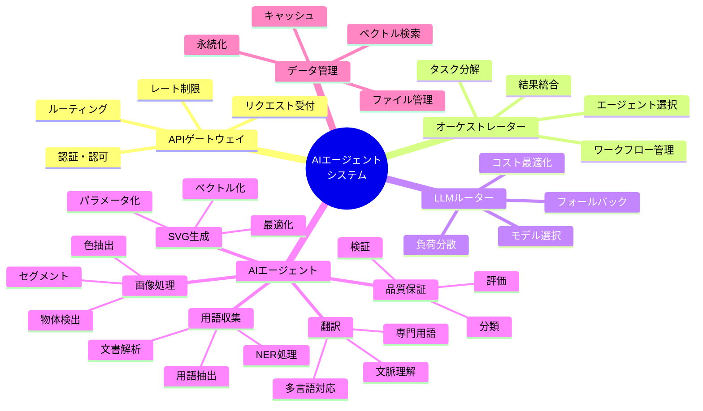
```mermaid
mindmap
  root((AIエージェント<br/>システム))
    APIゲートウェイ
      リクエスト受付
      認証・認可
      レート制限
      ルーティング
    
    オーケストレーター
      タスク分解
      エージェント選択
      ワークフロー管理
      結果統合
    
    LLMルーター
      モデル選択
      コスト最適化
      フォールバック
      負荷分散
    
    AIエージェント
      用語収集
        文書解析
        NER処理
        用語抽出
      画像処理
        物体検出
        色抽出
        セグメント
      SVG生成
        ベクトル化
        パラメータ化
        最適化
      品質保証
        検証
        分類
        評価
      翻訳
        多言語対応
        専門用語
        文脈理解
    
    データ管理
      永続化
      キャッシュ
      ベクトル検索
      ファイル管理
```

## 3. 各技術の役割と適用範囲

### 3.1 技術スタック役割マトリクス

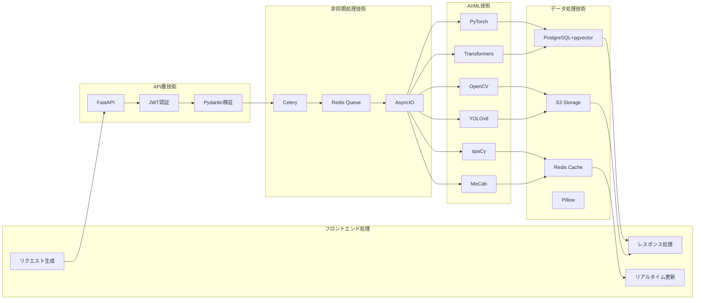
```mermaid
graph LR
    subgraph "フロントエンド処理"
        FE1[リクエスト生成]
        FE2[レスポンス処理]
        FE3[リアルタイム更新]
    end
    
    subgraph "API層技術"
        FAST[FastAPI]
        JWT_AUTH[JWT認証]
        PYDANTIC[Pydantic検証]
    end
    
    subgraph "非同期処理技術"
        CELERY[Celery]
        REDIS_Q[Redis Queue]
        ASYNCIO[AsyncIO]
    end
    
    subgraph "AI/ML技術"
        PYTORCH[PyTorch]
        TRANS[Transformers]
        CV2[OpenCV]
        YOLO[YOLOv8]
        SPACY[spaCy]
        MECAB[MeCab]
    end
    
    subgraph "データ処理技術"
        PG_VEC[PostgreSQL+pgvector]
        REDIS_C[Redis Cache]
        S3_STORE[S3 Storage]
        PILLOW[Pillow]
    end
    
    FE1 --> FAST
    FAST --> JWT_AUTH
    JWT_AUTH --> PYDANTIC
    PYDANTIC --> CELERY
    
    CELERY --> REDIS_Q
    REDIS_Q --> ASYNCIO
    
    ASYNCIO --> PYTORCH
    ASYNCIO --> TRANS
    ASYNCIO --> CV2
    ASYNCIO --> YOLO
    ASYNCIO --> SPACY
    ASYNCIO --> MECAB
    
    PYTORCH --> PG_VEC
    TRANS --> PG_VEC
    CV2 --> S3_STORE
    YOLO --> S3_STORE
    SPACY --> REDIS_C
    MECAB --> REDIS_C
    
    PG_VEC --> FE2
    S3_STORE --> FE2
    REDIS_C --> FE3
```

### 3.2 技術適用範囲の詳細

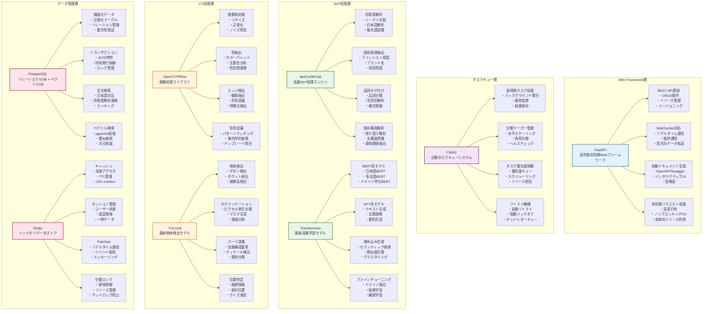
```mermaid
graph TB
    subgraph "Web Framework層"
        A1[FastAPI<br/>高性能非同期Webフレームワーク]
        A1 --> A1_1[REST API実装<br/>・CRUD操作<br/>・リソース管理<br/>・バージョニング]
        A1 --> A1_2[WebSocket対応<br/>・リアルタイム通信<br/>・進捗通知<br/>・双方向データ転送]
        A1 --> A1_3[自動ドキュメント生成<br/>・OpenAPI/Swagger<br/>・インタラクティブUI<br/>・型検証]
        A1 --> A1_4[非同期リクエスト処理<br/>・高並行性<br/>・ノンブロッキングI/O<br/>・効率的リソース利用]
    end
    
    subgraph "タスクキュー層"
        B1[Celery<br/>分散タスクキューシステム]
        B1 --> B1_1[長時間タスク処理<br/>・バックグラウンド実行<br/>・進捗追跡<br/>・結果保存]
        B1 --> B1_2[分散ワーカー管理<br/>・水平スケーリング<br/>・負荷分散<br/>・ヘルスチェック]
        B1 --> B1_3[タスク優先度制御<br/>・優先度キュー<br/>・スケジューリング<br/>・リソース割当]
        B1 --> B1_4[リトライ機構<br/>・自動リトライ<br/>・指数バックオフ<br/>・デッドレターキュー]
    end
    
    subgraph "NLP処理層"
        C1[spaCy/MeCab<br/>高速NLP処理エンジン]
        C1 --> C1_1[形態素解析<br/>・トークン分割<br/>・日本語解析<br/>・複合語認識]
        C1 --> C1_2[固有表現抽出<br/>・ファッション用語<br/>・ブランド名<br/>・技術用語]
        C1 --> C1_3[品詞タグ付け<br/>・品詞分類<br/>・活用形解析<br/>・構文情報]
        C1 --> C1_4[依存構造解析<br/>・係り受け解析<br/>・文構造把握<br/>・意味関係抽出]
        
        C2[Transformers<br/>最新深層学習モデル]
        C2 --> C2_1[BERT系モデル<br/>・日本語BERT<br/>・多言語BERT<br/>・ドメイン特化BERT]
        C2 --> C2_2[GPT系モデル<br/>・テキスト生成<br/>・文脈理解<br/>・要約生成]
        C2 --> C2_3[埋め込み生成<br/>・セマンティック検索<br/>・類似度計算<br/>・クラスタリング]
        C2 --> C2_4[ファインチューニング<br/>・ドメイン適応<br/>・転移学習<br/>・継続学習]
    end
    
    subgraph "CV処理層"
        D1[OpenCV/Pillow<br/>画像処理ライブラリ]
        D1 --> D1_1[画像前処理<br/>・リサイズ<br/>・正規化<br/>・ノイズ除去]
        D1 --> D1_2[色抽出<br/>・カラーパレット<br/>・主要色分析<br/>・色空間変換]
        D1 --> D1_3[エッジ検出<br/>・輪郭抽出<br/>・形状認識<br/>・特徴点検出]
        D1 --> D1_4[形状認識<br/>・パターンマッチング<br/>・幾何学的変換<br/>・テンプレート照合]
        
        D2[YOLOv8<br/>最新物体検出モデル]
        D2 --> D2_1[物体検出<br/>・ボタン検出<br/>・ポケット検出<br/>・装飾品検出]
        D2 --> D2_2[セグメンテーション<br/>・ピクセル単位分類<br/>・マスク生成<br/>・領域分割]
        D2 --> D2_3[パーツ認識<br/>・衣服構成要素<br/>・ディテール検出<br/>・属性分類]
        D2 --> D2_4[位置特定<br/>・座標情報<br/>・相対位置<br/>・サイズ測定]
    end
    
    subgraph "データ管理層"
        E1[PostgreSQL<br/>リレーショナルDB + ベクトルDB]
        E1 --> E1_1[構造化データ<br/>・正規化テーブル<br/>・リレーション管理<br/>・整合性保証]
        E1 --> E1_2[トランザクション<br/>・ACID特性<br/>・同時実行制御<br/>・ロック管理]
        E1 --> E1_3[全文検索<br/>・日本語対応<br/>・形態素解析連携<br/>・ランキング]
        E1 --> E1_4[ベクトル検索<br/>・pgvector拡張<br/>・類似検索<br/>・次元削減]
        
        E2[Redis<br/>インメモリデータストア]
        E2 --> E2_1[キャッシュ<br/>・高速アクセス<br/>・TTL管理<br/>・LRU eviction]
        E2 --> E2_2[セッション管理<br/>・ユーザー状態<br/>・認証情報<br/>・一時データ]
        E2 --> E2_3[Pub/Sub<br/>・リアルタイム通信<br/>・イベント配信<br/>・メッセージング]
        E2 --> E2_4[分散ロック<br/>・排他制御<br/>・リソース管理<br/>・デッドロック防止]
    end
    
    style A1 fill:#e3f2fd,stroke:#1976d2,stroke-width:2px
    style B1 fill:#f3e5f5,stroke:#7b1fa2,stroke-width:2px
    style C1 fill:#e8f5e9,stroke:#388e3c,stroke-width:2px
    style C2 fill:#e8f5e9,stroke:#388e3c,stroke-width:2px
    style D1 fill:#fff3e0,stroke:#f57c00,stroke-width:2px
    style D2 fill:#fff3e0,stroke:#f57c00,stroke-width:2px
    style E1 fill:#fce4ec,stroke:#c2185b,stroke-width:2px
    style E2 fill:#fce4ec,stroke:#c2185b,stroke-width:2px
```

## 4. 処理シナリオ別フロー

### 4.1 用語収集シナリオ

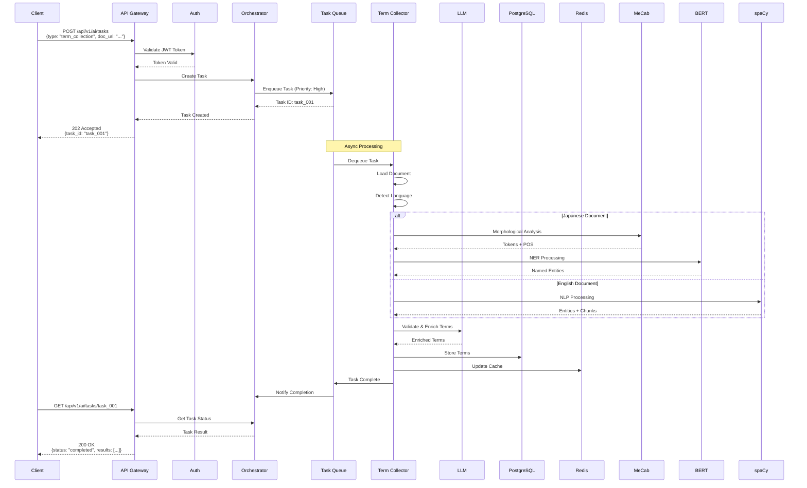
```mermaid
sequenceDiagram
    participant Client
    participant API as API Gateway
    participant Auth
    participant Orchestrator
    participant Queue as Task Queue
    participant TCAgent as Term Collector
    participant LLM
    participant DB as PostgreSQL
    participant Cache as Redis
    
    Client->>API: POST /api/v1/ai/tasks<br/>{type: "term_collection", doc_url: "..."}
    API->>Auth: Validate JWT Token
    Auth-->>API: Token Valid
    
    API->>Orchestrator: Create Task
    Orchestrator->>Queue: Enqueue Task (Priority: High)
    Queue-->>Orchestrator: Task ID: task_001
    Orchestrator-->>API: Task Created
    API-->>Client: 202 Accepted<br/>{task_id: "task_001"}
    
    Note over Queue,TCAgent: Async Processing
    
    Queue->>TCAgent: Dequeue Task
    TCAgent->>TCAgent: Load Document
    TCAgent->>TCAgent: Detect Language
    
    alt Japanese Document
        TCAgent->>MeCab: Morphological Analysis
        MeCab-->>TCAgent: Tokens + POS
        TCAgent->>BERT: NER Processing
        BERT-->>TCAgent: Named Entities
    else English Document
        TCAgent->>spaCy: NLP Processing
        spaCy-->>TCAgent: Entities + Chunks
    end
    
    TCAgent->>LLM: Validate & Enrich Terms
    LLM-->>TCAgent: Enriched Terms
    
    TCAgent->>DB: Store Terms
    TCAgent->>Cache: Update Cache
    
    TCAgent->>Queue: Task Complete
    Queue->>Orchestrator: Notify Completion
    
    Client->>API: GET /api/v1/ai/tasks/task_001
    API->>Orchestrator: Get Task Status
    Orchestrator-->>API: Task Result
    API-->>Client: 200 OK<br/>{status: "completed", results: [...]}
```

### 4.2 SVG生成シナリオ

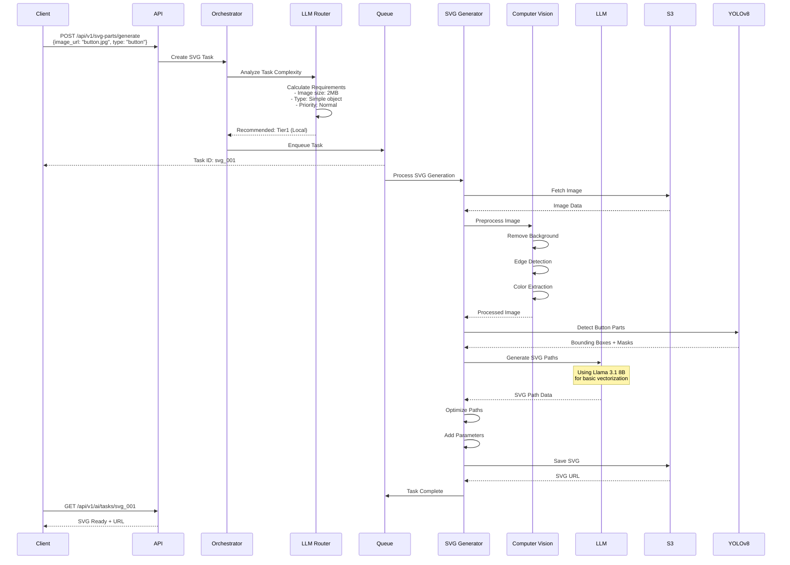
```mermaid
sequenceDiagram
    participant Client
    participant API
    participant Orchestrator
    participant Router as LLM Router
    participant Queue
    participant SGAgent as SVG Generator
    participant CV as Computer Vision
    participant LLM
    participant Storage as S3
    
    Client->>API: POST /api/v1/svg-parts/generate<br/>{image_url: "button.jpg", type: "button"}
    API->>Orchestrator: Create SVG Task
    
    Orchestrator->>Router: Analyze Task Complexity
    Router->>Router: Calculate Requirements<br/>- Image size: 2MB<br/>- Type: Simple object<br/>- Priority: Normal
    Router-->>Orchestrator: Recommended: Tier1 (Local)
    
    Orchestrator->>Queue: Enqueue Task
    Queue-->>Client: Task ID: svg_001
    
    Queue->>SGAgent: Process SVG Generation
    
    SGAgent->>Storage: Fetch Image
    Storage-->>SGAgent: Image Data
    
    SGAgent->>CV: Preprocess Image
    CV->>CV: Remove Background
    CV->>CV: Edge Detection
    CV->>CV: Color Extraction
    CV-->>SGAgent: Processed Image
    
    SGAgent->>YOLOv8: Detect Button Parts
    YOLOv8-->>SGAgent: Bounding Boxes + Masks
    
    SGAgent->>LLM: Generate SVG Paths
    Note over LLM: Using Llama 3.1 8B<br/>for basic vectorization
    LLM-->>SGAgent: SVG Path Data
    
    SGAgent->>SGAgent: Optimize Paths
    SGAgent->>SGAgent: Add Parameters
    
    SGAgent->>Storage: Save SVG
    Storage-->>SGAgent: SVG URL
    
    SGAgent->>Queue: Task Complete
    Client->>API: GET /api/v1/ai/tasks/svg_001
    API-->>Client: SVG Ready + URL
```

### 4.3 複合タスクシナリオ（文書処理→用語抽出→翻訳→SVG生成）

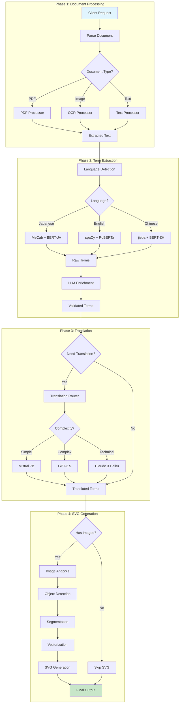
```mermaid
graph TD
    subgraph "Phase 1: Document Processing"
        A1[Client Request] --> A2[Parse Document]
        A2 --> A3{Document Type?}
        A3 -->|PDF| A4[PDF Processor]
        A3 -->|Image| A5[OCR Processor]
        A3 -->|Text| A6[Text Processor]
        A4 --> A7[Extracted Text]
        A5 --> A7
        A6 --> A7
    end
    
    subgraph "Phase 2: Term Extraction"
        A7 --> B1[Language Detection]
        B1 --> B2{Language?}
        B2 -->|Japanese| B3[MeCab + BERT-JA]
        B2 -->|English| B4[spaCy + RoBERTa]
        B2 -->|Chinese| B5[jieba + BERT-ZH]
        B3 --> B6[Raw Terms]
        B4 --> B6
        B5 --> B6
        B6 --> B7[LLM Enrichment]
        B7 --> B8[Validated Terms]
    end
    
    subgraph "Phase 3: Translation"
        B8 --> C1{Need Translation?}
        C1 -->|Yes| C2[Translation Router]
        C2 --> C3{Complexity?}
        C3 -->|Simple| C4[Mistral 7B]
        C3 -->|Complex| C5[GPT-3.5]
        C3 -->|Technical| C6[Claude 3 Haiku]
        C4 --> C7[Translated Terms]
        C5 --> C7
        C6 --> C7
        C1 -->|No| C7
    end
    
    subgraph "Phase 4: SVG Generation"
        C7 --> D1{Has Images?}
        D1 -->|Yes| D2[Image Analysis]
        D2 --> D3[Object Detection]
        D3 --> D4[Segmentation]
        D4 --> D5[Vectorization]
        D5 --> D6[SVG Generation]
        D1 -->|No| D7[Skip SVG]
        D6 --> D8[Final Output]
        D7 --> D8
    end
    
    style A1 fill:#e1f5fe
    style D8 fill:#c8e6c9
```

## 5. LLMオーケストレーション

### 5.1 LLMルーターの意思決定フロー

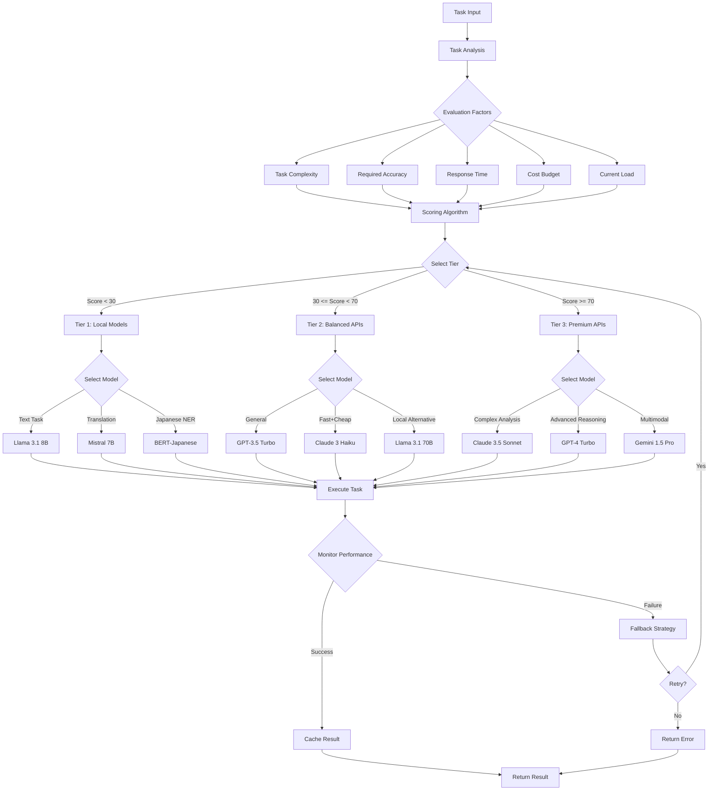
```mermaid
graph TD
    START[Task Input] --> ANALYZE[Task Analysis]
    
    ANALYZE --> FACTORS{Evaluation Factors}
    
    FACTORS --> F1[Task Complexity]
    FACTORS --> F2[Required Accuracy]
    FACTORS --> F3[Response Time]
    FACTORS --> F4[Cost Budget]
    FACTORS --> F5[Current Load]
    
    F1 --> SCORE[Scoring Algorithm]
    F2 --> SCORE
    F3 --> SCORE
    F4 --> SCORE
    F5 --> SCORE
    
    SCORE --> TIER{Select Tier}
    
    TIER -->|Score < 30| T1[Tier 1: Local Models]
    TIER -->|30 <= Score < 70| T2[Tier 2: Balanced APIs]
    TIER -->|Score >= 70| T3[Tier 3: Premium APIs]
    
    T1 --> MODEL1{Select Model}
    MODEL1 -->|Text Task| M1[Llama 3.1 8B]
    MODEL1 -->|Translation| M2[Mistral 7B]
    MODEL1 -->|Japanese NER| M3[BERT-Japanese]
    
    T2 --> MODEL2{Select Model}
    MODEL2 -->|General| M4[GPT-3.5 Turbo]
    MODEL2 -->|Fast+Cheap| M5[Claude 3 Haiku]
    MODEL2 -->|Local Alternative| M6[Llama 3.1 70B]
    
    T3 --> MODEL3{Select Model}
    MODEL3 -->|Complex Analysis| M7[Claude 3.5 Sonnet]
    MODEL3 -->|Advanced Reasoning| M8[GPT-4 Turbo]
    MODEL3 -->|Multimodal| M9[Gemini 1.5 Pro]
    
    M1 --> EXECUTE[Execute Task]
    M2 --> EXECUTE
    M3 --> EXECUTE
    M4 --> EXECUTE
    M5 --> EXECUTE
    M6 --> EXECUTE
    M7 --> EXECUTE
    M8 --> EXECUTE
    M9 --> EXECUTE
    
    EXECUTE --> MONITOR{Monitor Performance}
    
    MONITOR -->|Success| CACHE[Cache Result]
    MONITOR -->|Failure| FALLBACK[Fallback Strategy]
    
    FALLBACK --> RETRY{Retry?}
    RETRY -->|Yes| TIER
    RETRY -->|No| ERROR[Return Error]
    
    CACHE --> RESULT[Return Result]
    ERROR --> RESULT
```

### 5.2 動的LLM選択アルゴリズム

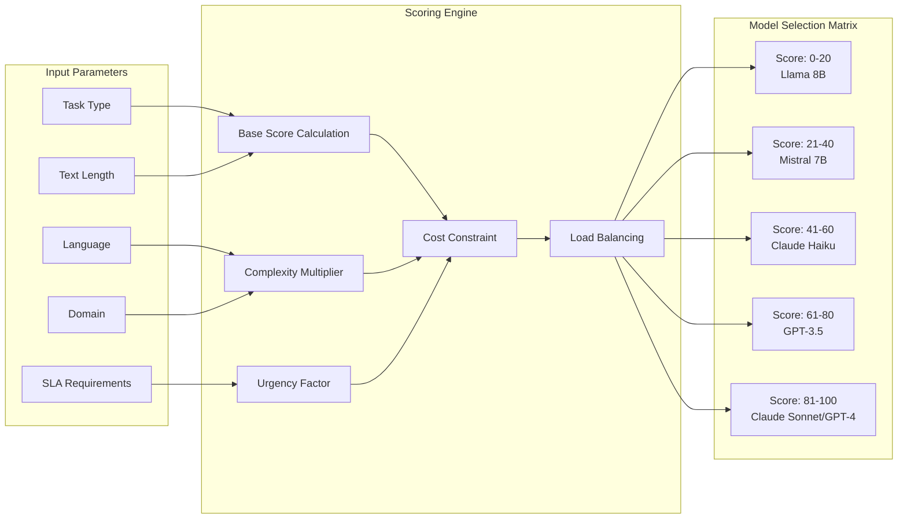
```mermaid
flowchart LR
    subgraph "Input Parameters"
        I1[Task Type]
        I2[Text Length]
        I3[Language]
        I4[Domain]
        I5[SLA Requirements]
    end
    
    subgraph "Scoring Engine"
        SE1[Base Score Calculation]
        SE2[Complexity Multiplier]
        SE3[Urgency Factor]
        SE4[Cost Constraint]
        SE5[Load Balancing]
    end
    
    subgraph "Model Selection Matrix"
        direction TB
        MS1[Score: 0-20<br/>Llama 8B]
        MS2[Score: 21-40<br/>Mistral 7B]
        MS3[Score: 41-60<br/>Claude Haiku]
        MS4[Score: 61-80<br/>GPT-3.5]
        MS5[Score: 81-100<br/>Claude Sonnet/GPT-4]
    end
    
    I1 --> SE1
    I2 --> SE1
    I3 --> SE2
    I4 --> SE2
    I5 --> SE3
    
    SE1 --> SE4
    SE2 --> SE4
    SE3 --> SE4
    SE4 --> SE5
    
    SE5 --> MS1
    SE5 --> MS2
    SE5 --> MS3
    SE5 --> MS4
    SE5 --> MS5
```

### 5.3 フォールバック戦略

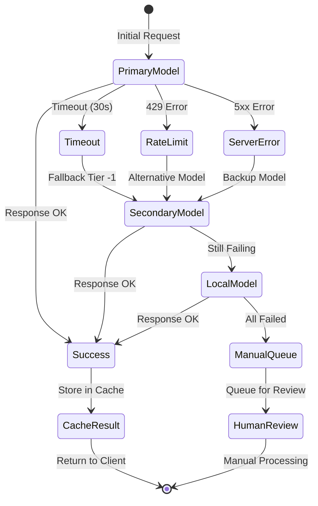
```mermaid
stateDiagram-v2
    [*] --> PrimaryModel: Initial Request
    
    PrimaryModel --> Success: Response OK
    PrimaryModel --> Timeout: Timeout (30s)
    PrimaryModel --> RateLimit: 429 Error
    PrimaryModel --> ServerError: 5xx Error
    
    Timeout --> SecondaryModel: Fallback Tier -1
    RateLimit --> SecondaryModel: Alternative Model
    ServerError --> SecondaryModel: Backup Model
    
    SecondaryModel --> Success: Response OK
    SecondaryModel --> LocalModel: Still Failing
    
    LocalModel --> Success: Response OK
    LocalModel --> ManualQueue: All Failed
    
    Success --> CacheResult: Store in Cache
    CacheResult --> [*]: Return to Client
    
    ManualQueue --> HumanReview: Queue for Review
    HumanReview --> [*]: Manual Processing
```

## 6. エンドツーエンドフロー

### 6.1 完全なリクエスト処理フロー

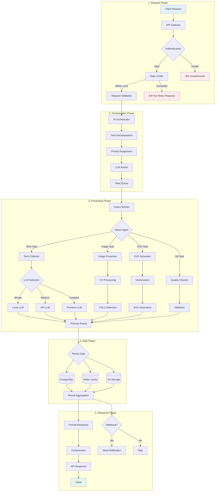
```mermaid
graph TB
    subgraph "1. Request Phase"
        CLIENT[Client Request] --> GATEWAY[API Gateway]
        GATEWAY --> AUTH{Authentication}
        AUTH -->|Valid| RATE[Rate Limiter]
        AUTH -->|Invalid| REJECT1[401 Unauthorized]
        RATE -->|Within Limit| VALIDATE[Request Validation]
        RATE -->|Exceeded| REJECT2[429 Too Many Requests]
    end
    
    subgraph "2. Orchestration Phase"
        VALIDATE --> ORCHESTRATOR[AI Orchestrator]
        ORCHESTRATOR --> DECOMPOSE[Task Decomposition]
        DECOMPOSE --> PRIORITY[Priority Assignment]
        PRIORITY --> ROUTER[LLM Router]
        ROUTER --> QUEUE[Task Queue]
    end
    
    subgraph "3. Processing Phase"
        QUEUE --> WORKER[Celery Worker]
        WORKER --> AGENT{Select Agent}
        
        AGENT -->|Term Task| TERM_AGENT[Term Collector]
        AGENT -->|Image Task| IMAGE_AGENT[Image Processor]
        AGENT -->|SVG Task| SVG_AGENT[SVG Generator]
        AGENT -->|QA Task| QA_AGENT[Quality Checker]
        
        TERM_AGENT --> LLM_TIER{LLM Selection}
        IMAGE_AGENT --> CV_PROC[CV Processing]
        SVG_AGENT --> VECTOR[Vectorization]
        QA_AGENT --> VALIDATE_RESULT[Validation]
        
        LLM_TIER -->|Simple| LOCAL_LLM[Local LLM]
        LLM_TIER -->|Medium| API_LLM[API LLM]
        LLM_TIER -->|Complex| PREMIUM_LLM[Premium LLM]
        
        CV_PROC --> YOLO[YOLO Detection]
        VECTOR --> SVG_GEN[SVG Generation]
        
        LOCAL_LLM --> PROCESS_RESULT[Process Result]
        API_LLM --> PROCESS_RESULT
        PREMIUM_LLM --> PROCESS_RESULT
        YOLO --> PROCESS_RESULT
        SVG_GEN --> PROCESS_RESULT
        VALIDATE_RESULT --> PROCESS_RESULT
    end
    
    subgraph "4. Data Phase"
        PROCESS_RESULT --> PERSIST{Persist Data}
        PERSIST --> DB[(PostgreSQL)]
        PERSIST --> CACHE[(Redis Cache)]
        PERSIST --> STORAGE[(S3 Storage)]
        
        DB --> AGGREGATE[Result Aggregation]
        CACHE --> AGGREGATE
        STORAGE --> AGGREGATE
    end
    
    subgraph "5. Response Phase"
        AGGREGATE --> FORMAT[Format Response]
        FORMAT --> COMPRESS[Compression]
        COMPRESS --> RESPONSE[API Response]
        RESPONSE --> CLIENT2[Client]
        
        AGGREGATE --> WEBHOOK{Webhook?}
        WEBHOOK -->|Yes| NOTIFY[Send Notification]
        WEBHOOK -->|No| SKIP[Skip]
    end
    
    style CLIENT fill:#e3f2fd
    style CLIENT2 fill:#e8f5e9
    style REJECT1 fill:#ffebee
    style REJECT2 fill:#ffebee
```

### 6.2 リアルタイム進捗通知フロー

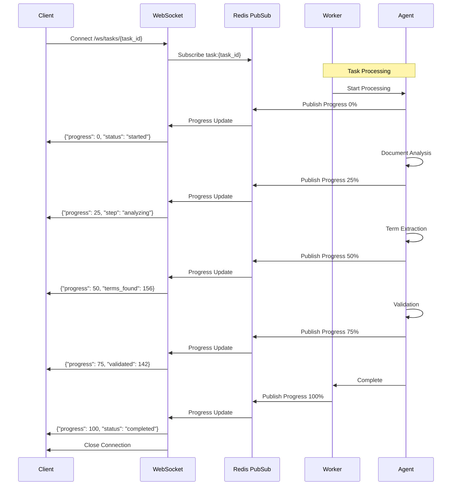
```mermaid
sequenceDiagram
    participant Client
    participant WebSocket
    participant Redis PubSub
    participant Worker
    participant Agent
    
    Client->>WebSocket: Connect /ws/tasks/{task_id}
    WebSocket->>Redis PubSub: Subscribe task:{task_id}
    
    Note over Worker,Agent: Task Processing
    
    Worker->>Agent: Start Processing
    Agent->>Redis PubSub: Publish Progress 0%
    Redis PubSub->>WebSocket: Progress Update
    WebSocket->>Client: {"progress": 0, "status": "started"}
    
    Agent->>Agent: Document Analysis
    Agent->>Redis PubSub: Publish Progress 25%
    Redis PubSub->>WebSocket: Progress Update
    WebSocket->>Client: {"progress": 25, "step": "analyzing"}
    
    Agent->>Agent: Term Extraction
    Agent->>Redis PubSub: Publish Progress 50%
    Redis PubSub->>WebSocket: Progress Update
    WebSocket->>Client: {"progress": 50, "terms_found": 156}
    
    Agent->>Agent: Validation
    Agent->>Redis PubSub: Publish Progress 75%
    Redis PubSub->>WebSocket: Progress Update
    WebSocket->>Client: {"progress": 75, "validated": 142}
    
    Agent->>Worker: Complete
    Worker->>Redis PubSub: Publish Progress 100%
    Redis PubSub->>WebSocket: Progress Update
    WebSocket->>Client: {"progress": 100, "status": "completed"}
    
    WebSocket->>Client: Close Connection
```

## 7. パフォーマンス最適化フロー

### 7.1 キャッシング戦略

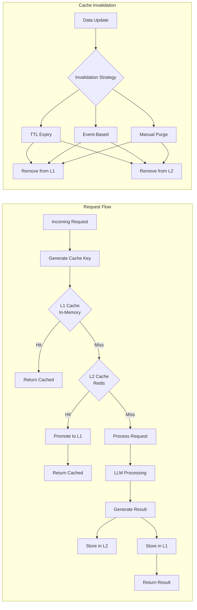
```mermaid
graph LR
    subgraph "Request Flow"
        REQ[Incoming Request] --> HASH[Generate Cache Key]
        HASH --> L1{L1 Cache<br/>In-Memory}
        
        L1 -->|Hit| RETURN1[Return Cached]
        L1 -->|Miss| L2{L2 Cache<br/>Redis}
        
        L2 -->|Hit| PROMOTE[Promote to L1]
        L2 -->|Miss| PROCESS[Process Request]
        
        PROMOTE --> RETURN2[Return Cached]
        
        PROCESS --> LLM[LLM Processing]
        LLM --> RESULT[Generate Result]
        
        RESULT --> STORE_L2[Store in L2]
        RESULT --> STORE_L1[Store in L1]
        
        STORE_L1 --> RETURN3[Return Result]
    end
    
    subgraph "Cache Invalidation"
        UPDATE[Data Update] --> INVALIDATE{Invalidation Strategy}
        
        INVALIDATE --> TTL[TTL Expiry]
        INVALIDATE --> EVENT[Event-Based]
        INVALIDATE --> MANUAL[Manual Purge]
        
        TTL --> REMOVE_L1[Remove from L1]
        EVENT --> REMOVE_L1
        MANUAL --> REMOVE_L1
        
        TTL --> REMOVE_L2[Remove from L2]
        EVENT --> REMOVE_L2
        MANUAL --> REMOVE_L2
    end
```

### 7.2 バッチ処理最適化

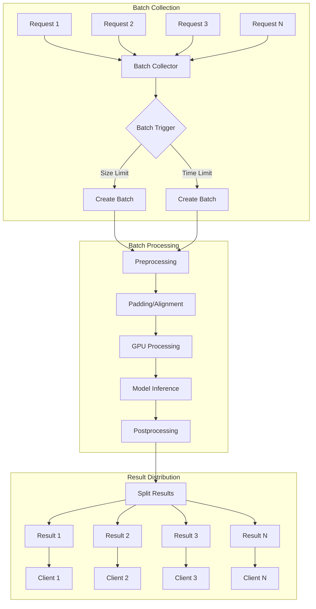
```mermaid
graph TD
    subgraph "Batch Collection"
        R1[Request 1] --> COLLECTOR[Batch Collector]
        R2[Request 2] --> COLLECTOR
        R3[Request 3] --> COLLECTOR
        RN[Request N] --> COLLECTOR
        
        COLLECTOR --> TIMER{Batch Trigger}
        TIMER -->|Size Limit| BATCH1[Create Batch]
        TIMER -->|Time Limit| BATCH2[Create Batch]
    end
    
    subgraph "Batch Processing"
        BATCH1 --> PREPROCESS[Preprocessing]
        BATCH2 --> PREPROCESS
        
        PREPROCESS --> PAD[Padding/Alignment]
        PAD --> GPU[GPU Processing]
        
        GPU --> MODEL[Model Inference]
        MODEL --> POSTPROCESS[Postprocessing]
    end
    
    subgraph "Result Distribution"
        POSTPROCESS --> SPLIT[Split Results]
        
        SPLIT --> RES1[Result 1]
        SPLIT --> RES2[Result 2]
        SPLIT --> RES3[Result 3]
        SPLIT --> RESN[Result N]
        
        RES1 --> CLIENT1[Client 1]
        RES2 --> CLIENT2[Client 2]
        RES3 --> CLIENT3[Client 3]
        RESN --> CLIENTN[Client N]
    end
```

## 8. エラーハンドリングとリカバリー

### 8.1 エラー処理フロー

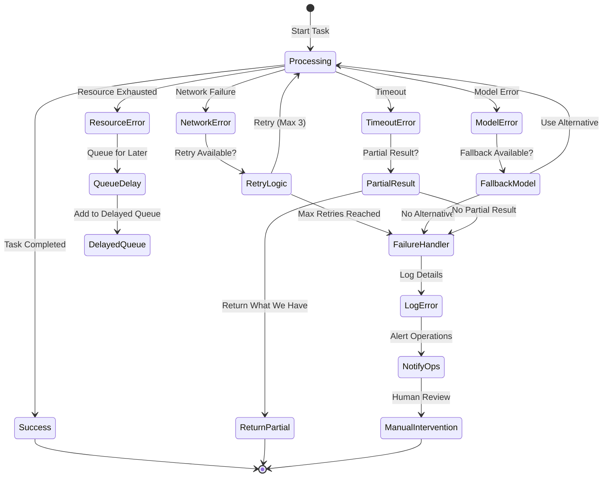
```mermaid
stateDiagram-v2
    [*] --> Processing: Start Task
    
    Processing --> NetworkError: Network Failure
    Processing --> ModelError: Model Error
    Processing --> TimeoutError: Timeout
    Processing --> ResourceError: Resource Exhausted
    
    NetworkError --> RetryLogic: Retry Available?
    ModelError --> FallbackModel: Fallback Available?
    TimeoutError --> PartialResult: Partial Result?
    ResourceError --> QueueDelay: Queue for Later
    
    RetryLogic --> Processing: Retry (Max 3)
    RetryLogic --> FailureHandler: Max Retries Reached
    
    FallbackModel --> Processing: Use Alternative
    FallbackModel --> FailureHandler: No Alternative
    
    PartialResult --> ReturnPartial: Return What We Have
    PartialResult --> FailureHandler: No Partial Result
    
    QueueDelay --> DelayedQueue: Add to Delayed Queue
    
    FailureHandler --> LogError: Log Details
    LogError --> NotifyOps: Alert Operations
    NotifyOps --> ManualIntervention: Human Review
    
    Processing --> Success: Task Completed
    Success --> [*]
    ReturnPartial --> [*]
    ManualIntervention --> [*]
```

## 9. セキュリティフロー

### 9.1 認証・認可フロー（既存認証基盤統合）

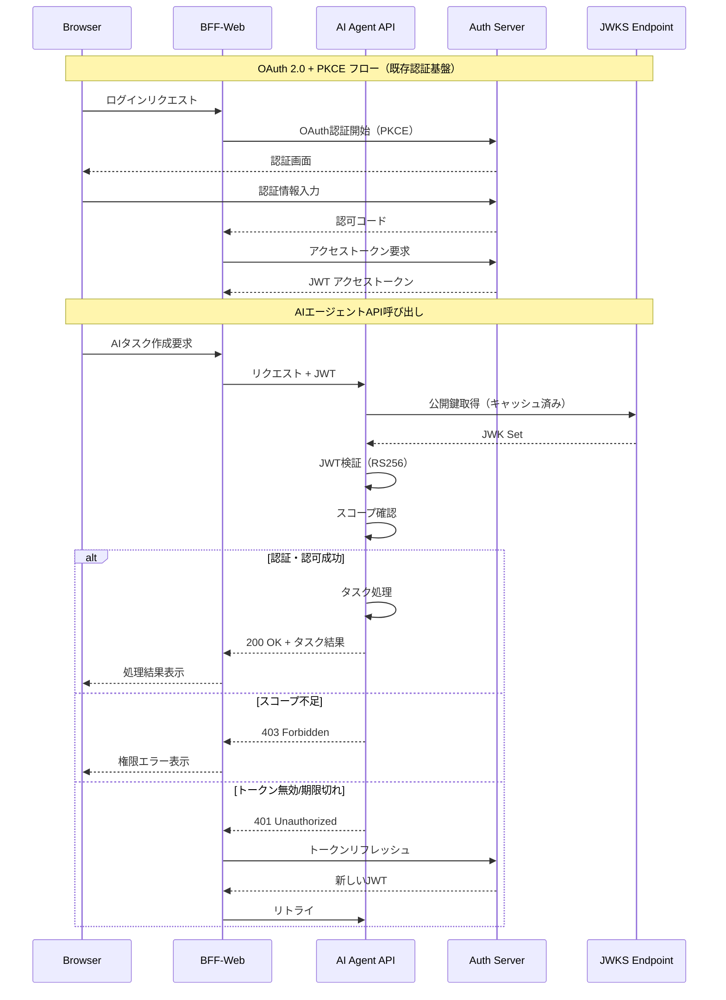
```mermaid
sequenceDiagram
    participant Browser
    participant BFF-Web
    participant AI Agent API
    participant Auth Server
    participant JWKS Endpoint
    
    Note over Browser,JWKS Endpoint: OAuth 2.0 + PKCE フロー（既存認証基盤）
    
    Browser->>BFF-Web: ログインリクエスト
    BFF-Web->>Auth Server: OAuth認証開始（PKCE）
    Auth Server-->>Browser: 認証画面
    Browser->>Auth Server: 認証情報入力
    Auth Server-->>BFF-Web: 認可コード
    BFF-Web->>Auth Server: アクセストークン要求
    Auth Server-->>BFF-Web: JWT アクセストークン
    
    Note over Browser,JWKS Endpoint: AIエージェントAPI呼び出し
    
    Browser->>BFF-Web: AIタスク作成要求
    BFF-Web->>AI Agent API: リクエスト + JWT
    
    AI Agent API->>JWKS Endpoint: 公開鍵取得（キャッシュ済み）
    JWKS Endpoint-->>AI Agent API: JWK Set
    
    AI Agent API->>AI Agent API: JWT検証（RS256）
    AI Agent API->>AI Agent API: スコープ確認
    
    alt 認証・認可成功
        AI Agent API->>AI Agent API: タスク処理
        AI Agent API-->>BFF-Web: 200 OK + タスク結果
        BFF-Web-->>Browser: 処理結果表示
    else スコープ不足
        AI Agent API-->>BFF-Web: 403 Forbidden
        BFF-Web-->>Browser: 権限エラー表示
    else トークン無効/期限切れ
        AI Agent API-->>BFF-Web: 401 Unauthorized
        BFF-Web->>Auth Server: トークンリフレッシュ
        Auth Server-->>BFF-Web: 新しいJWT
        BFF-Web->>AI Agent API: リトライ
    end
```

### 9.2 AIエージェント用スコープ定義

```yaml
# AIエージェントシステム用スコープ
scopes:
  # 基本スコープ
  - agent:read        # エージェント状態・結果の読み取り
  - agent:execute     # エージェントタスクの実行
  
  # テックパック関連
  - techpack:read     # テックパック閲覧
  - techpack:write    # テックパック作成・編集
  - techpack:generate # AI生成機能の使用
  - techpack:approve  # 生成結果の承認
  
  # 専門機能
  - terms:extract     # 用語抽出機能
  - terms:manage      # 用語集管理
  - svg:generate      # SVG生成機能
  - svg:edit          # SVGパラメータ編集
  
  # 管理機能
  - agent:admin       # エージェント管理
  - task:monitor      # タスク監視
```

## 10. 機械学習モデルの学習フロー

### 10.1 データ収集と前処理

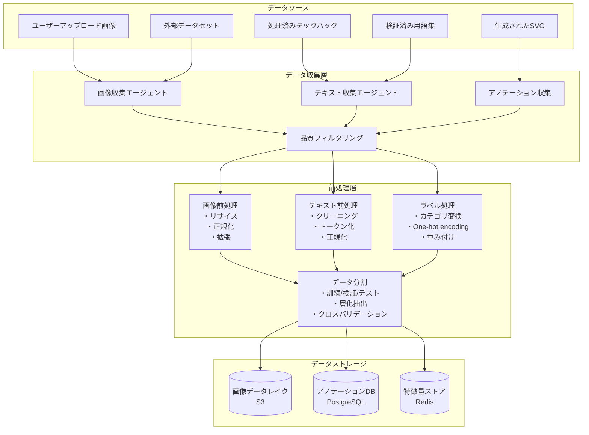
```mermaid
graph TD
    subgraph "データソース"
        DS1[ユーザーアップロード画像]
        DS2[処理済みテックパック]
        DS3[外部データセット]
        DS4[生成されたSVG]
        DS5[検証済み用語集]
    end
    
    subgraph "データ収集層"
        COL1[画像収集エージェント]
        COL2[テキスト収集エージェント]
        COL3[アノテーション収集]
        COL4[品質フィルタリング]
    end
    
    subgraph "前処理層"
        PRE1[画像前処理<br/>・リサイズ<br/>・正規化<br/>・拡張]
        PRE2[テキスト前処理<br/>・クリーニング<br/>・トークン化<br/>・正規化]
        PRE3[ラベル処理<br/>・カテゴリ変換<br/>・One-hot encoding<br/>・重み付け]
        PRE4[データ分割<br/>・訓練/検証/テスト<br/>・層化抽出<br/>・クロスバリデーション]
    end
    
    subgraph "データストレージ"
        ST1[(画像データレイク<br/>S3)]
        ST2[(アノテーションDB<br/>PostgreSQL)]
        ST3[(特徴量ストア<br/>Redis)]
    end
    
    DS1 --> COL1
    DS2 --> COL2
    DS3 --> COL1
    DS4 --> COL3
    DS5 --> COL2
    
    COL1 --> COL4
    COL2 --> COL4
    COL3 --> COL4
    
    COL4 --> PRE1
    COL4 --> PRE2
    COL4 --> PRE3
    
    PRE1 --> PRE4
    PRE2 --> PRE4
    PRE3 --> PRE4
    
    PRE4 --> ST1
    PRE4 --> ST2
    PRE4 --> ST3
```

### 10.2 モデル学習パイプライン

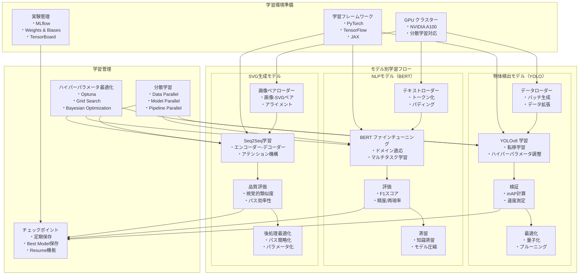
```mermaid
flowchart TB
    subgraph "学習環境準備"
        ENV1[GPU クラスター<br/>・NVIDIA A100<br/>・分散学習対応]
        ENV2[学習フレームワーク<br/>・PyTorch<br/>・TensorFlow<br/>・JAX]
        ENV3[実験管理<br/>・MLflow<br/>・Weights & Biases<br/>・TensorBoard]
    end
    
    subgraph "モデル別学習フロー"
        subgraph "物体検出モデル（YOLO）"
            Y1[データローダー<br/>・バッチ生成<br/>・データ拡張]
            Y2[YOLOv8 学習<br/>・転移学習<br/>・ハイパーパラメータ調整]
            Y3[検証<br/>・mAP計算<br/>・速度測定]
            Y4[最適化<br/>・量子化<br/>・プルーニング]
        end
        
        subgraph "NLPモデル（BERT）"
            B1[テキストローダー<br/>・トークン化<br/>・パディング]
            B2[BERT ファインチューニング<br/>・ドメイン適応<br/>・マルチタスク学習]
            B3[評価<br/>・F1スコア<br/>・精度/再現率]
            B4[蒸留<br/>・知識蒸留<br/>・モデル圧縮]
        end
        
        subgraph "SVG生成モデル"
            S1[画像ペアローダー<br/>・画像-SVGペア<br/>・アライメント]
            S2[Seq2Seq学習<br/>・エンコーダー-デコーダー<br/>・アテンション機構]
            S3[品質評価<br/>・視覚的類似度<br/>・パス効率性]
            S4[後処理最適化<br/>・パス簡略化<br/>・パラメータ化]
        end
    end
    
    subgraph "学習管理"
        MAN1[ハイパーパラメータ最適化<br/>・Optuna<br/>・Grid Search<br/>・Bayesian Optimization]
        MAN2[分散学習<br/>・Data Parallel<br/>・Model Parallel<br/>・Pipeline Parallel]
        MAN3[チェックポイント<br/>・定期保存<br/>・Best Model保存<br/>・Resume機能]
    end
    
    ENV1 --> Y1
    ENV1 --> B1
    ENV1 --> S1
    
    ENV2 --> Y2
    ENV2 --> B2
    ENV2 --> S2
    
    Y1 --> Y2 --> Y3 --> Y4
    B1 --> B2 --> B3 --> B4
    S1 --> S2 --> S3 --> S4
    
    MAN1 --> Y2
    MAN1 --> B2
    MAN1 --> S2
    
    MAN2 --> Y2
    MAN2 --> B2
    MAN2 --> S2
    
    Y3 --> MAN3
    B3 --> MAN3
    S3 --> MAN3
    
    ENV3 --> MAN3
```

### 10.3 継続的学習と改善

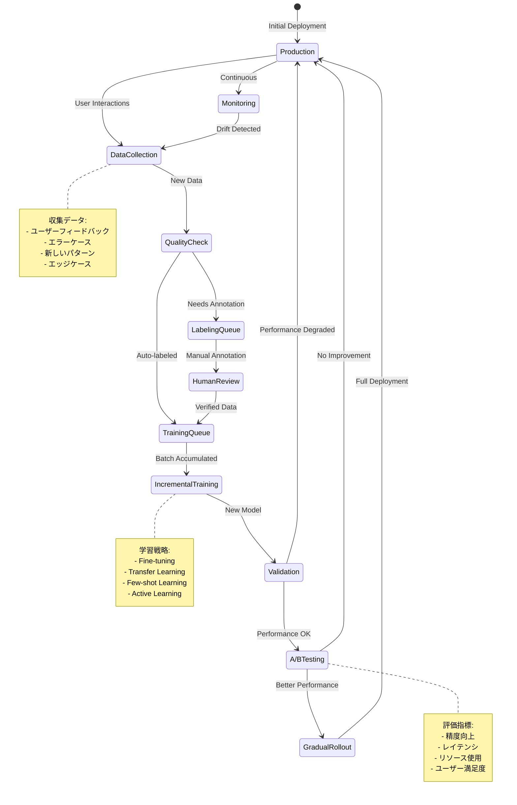
```mermaid
stateDiagram-v2
    [*] --> Production: Initial Deployment
    
    Production --> DataCollection: User Interactions
    DataCollection --> QualityCheck: New Data
    
    QualityCheck --> LabelingQueue: Needs Annotation
    QualityCheck --> TrainingQueue: Auto-labeled
    
    LabelingQueue --> HumanReview: Manual Annotation
    HumanReview --> TrainingQueue: Verified Data
    
    TrainingQueue --> IncrementalTraining: Batch Accumulated
    
    IncrementalTraining --> Validation: New Model
    
    Validation --> A/BTesting: Performance OK
    Validation --> Production: Performance Degraded
    
    A/BTesting --> GradualRollout: Better Performance
    A/BTesting --> Production: No Improvement
    
    GradualRollout --> Production: Full Deployment
    
    Production --> Monitoring: Continuous
    Monitoring --> DataCollection: Drift Detected
    
    note right of DataCollection
        収集データ:
        - ユーザーフィードバック
        - エラーケース
        - 新しいパターン
        - エッジケース
    end note
    
    note right of IncrementalTraining
        学習戦略:
        - Fine-tuning
        - Transfer Learning
        - Few-shot Learning
        - Active Learning
    end note
    
    note right of A/BTesting
        評価指標:
        - 精度向上
        - レイテンシ
        - リソース使用
        - ユーザー満足度
    end note
```

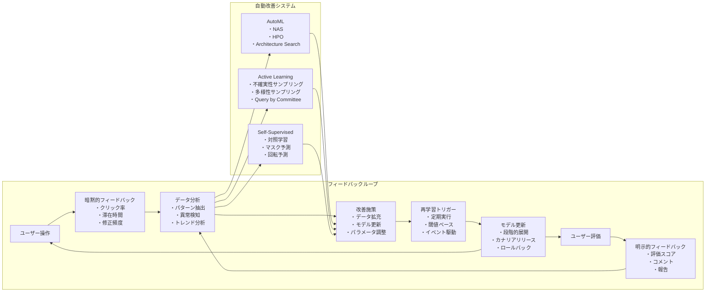
```mermaid
graph LR
    subgraph "フィードバックループ"
        U1[ユーザー操作] --> F1[暗黙的フィードバック<br/>・クリック率<br/>・滞在時間<br/>・修正頻度]
        U2[ユーザー評価] --> F2[明示的フィードバック<br/>・評価スコア<br/>・コメント<br/>・報告]
        
        F1 --> A1[データ分析<br/>・パターン抽出<br/>・異常検知<br/>・トレンド分析]
        F2 --> A1
        
        A1 --> I1[改善施策<br/>・データ拡充<br/>・モデル更新<br/>・パラメータ調整]
        
        I1 --> T1[再学習トリガー<br/>・定期実行<br/>・閾値ベース<br/>・イベント駆動]
        
        T1 --> R1[モデル更新<br/>・段階的展開<br/>・カナリアリリース<br/>・ロールバック]
        
        R1 --> U1
        R1 --> U2
    end
    
    subgraph "自動改善システム"
        AUTO1[AutoML<br/>・NAS<br/>・HPO<br/>・Architecture Search]
        AUTO2[Active Learning<br/>・不確実性サンプリング<br/>・多様性サンプリング<br/>・Query by Committee]
        AUTO3[Self-Supervised<br/>・対照学習<br/>・マスク予測<br/>・回転予測]
        
        A1 --> AUTO1
        A1 --> AUTO2
        A1 --> AUTO3
        
        AUTO1 --> I1
        AUTO2 --> I1
        AUTO3 --> I1
    end
```

## 11. まとめ

本アーキテクチャは以下の特徴を持ちます：

1. **スケーラビリティ**: マイクロサービスアーキテクチャによる水平スケーリング
2. **柔軟性**: LLMルーターによる動的なモデル選択
3. **信頼性**: 多層的なフォールバック戦略
4. **効率性**: インテリジェントなキャッシングとバッチ処理
5. **可観測性**: 詳細なモニタリングとロギング

各コンポーネントは疎結合で設計されており、個別のスケーリングや更新が可能です。LLMオーケストレーションにより、タスクの複雑さとコスト要件に応じて最適なモデルが自動選択されます。