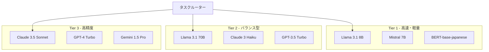

# LLM統合仕様書

## 1. 概要

本ドキュメントは、テックパック生成アプリケーションのAIエージェントで使用するLLM（Large Language Model）の選定、統合方法、および実装仕様を定義します。

## 2. LLM選定基準

### 2.1 要件

```yaml
機能要件:
  多言語対応:
    - 日本語: ネイティブレベル
    - 英語: ネイティブレベル
    - 中国語: ビジネスレベル
  
  タスク対応:
    - テキスト分類
    - 固有表現抽出（NER）
    - 文章生成
    - 翻訳
    - 要約
    - 質問応答
  
  専門性:
    - ファッション用語理解
    - 技術文書解析
    - ビジネス文書処理

性能要件:
  レスポンス時間:
    - 単一クエリ: < 2秒
    - バッチ処理: < 100ms/item
  
  スループット:
    - 同時リクエスト: 100+
    - 日次処理量: 100万トークン+
  
  精度:
    - 用語抽出: > 90%
    - 分類精度: > 95%
    - 翻訳品質: BLEU > 0.8
```

### 2.2 コスト要件

```yaml
予算制約:
  月額上限: $10,000
  
コスト最適化:
  - オンプレミス/クラウドのハイブリッド
  - モデルサイズの使い分け
  - キャッシング戦略
  - バッチ処理の活用
```

## 3. LLMアーキテクチャ

### 3.1 多層LLM戦略



### 3.2 モデル選定マトリクス

| モデル | 用途 | 強み | コスト | レイテンシ |
|--------|------|------|--------|------------|
| **Tier 1: ローカル/エッジ** |
| Llama 3.1 8B | 基本的な分類・抽出 | オープンソース、高速 | 無料（インフラのみ） | < 100ms |
| Mistral 7B | 汎用テキスト処理 | 効率的、多言語対応 | 無料（インフラのみ） | < 100ms |
| BERT-japanese | 日本語NER | 日本語特化 | 無料（インフラのみ） | < 50ms |
| **Tier 2: API（バランス）** |
| Claude 3 Haiku | 中規模タスク | 高速、安価 | $0.25/1M tokens | < 1s |
| GPT-3.5 Turbo | 汎用処理 | 安定、高速 | $0.5/1M tokens | < 1s |
| Llama 3.1 70B | 高度な分析 | オープン、カスタマイズ可 | インフラ依存 | < 2s |
| **Tier 3: API（高精度）** |
| Claude 3.5 Sonnet | 複雑な分析・生成 | 最高精度、長文対応 | $3/1M tokens | 2-5s |
| GPT-4 Turbo | 高度な推論 | 汎用性、ツール使用 | $10/1M tokens | 2-5s |
| Gemini 1.5 Pro | マルチモーダル | 長文脈、画像理解 | $3.5/1M tokens | 2-5s |

## 4. 実装アーキテクチャ

### 4.1 LLMゲートウェイ

```python
from abc import ABC, abstractmethod
from typing import Dict, Any, List, Optional, Union
import asyncio
from enum import Enum
import httpx
import torch
from transformers import AutoTokenizer, AutoModelForSequenceClassification

class ModelTier(Enum):
    TIER1_LOCAL = "tier1_local"
    TIER2_BALANCED = "tier2_balanced"
    TIER3_PREMIUM = "tier3_premium"

class LLMProvider(ABC):
    """LLMプロバイダーの基底クラス"""
    
    @abstractmethod
    async def generate(
        self, 
        prompt: str, 
        **kwargs
    ) -> Dict[str, Any]:
        pass
    
    @abstractmethod
    async def embed(
        self, 
        texts: List[str]
    ) -> List[List[float]]:
        pass
    
    @abstractmethod
    def estimate_cost(
        self, 
        input_tokens: int, 
        output_tokens: int
    ) -> float:
        pass

class LocalLlamaProvider(LLMProvider):
    """ローカルLlama実装"""
    
    def __init__(self, model_path: str):
        self.model = self._load_model(model_path)
        self.tokenizer = AutoTokenizer.from_pretrained(model_path)
        
    async def generate(self, prompt: str, **kwargs) -> Dict[str, Any]:
        # vLLMまたはllama.cppを使用した高速推論
        max_tokens = kwargs.get('max_tokens', 512)
        temperature = kwargs.get('temperature', 0.7)
        
        inputs = self.tokenizer(prompt, return_tensors="pt")
        with torch.no_grad():
            outputs = self.model.generate(
                **inputs,
                max_new_tokens=max_tokens,
                temperature=temperature,
                do_sample=True
            )
        
        response = self.tokenizer.decode(outputs[0], skip_special_tokens=True)
        
        return {
            'text': response,
            'model': 'llama-3.1-8b',
            'usage': {
                'input_tokens': len(inputs['input_ids'][0]),
                'output_tokens': len(outputs[0]) - len(inputs['input_ids'][0])
            }
        }
    
    def estimate_cost(self, input_tokens: int, output_tokens: int) -> float:
        # ローカルモデルはインフラコストのみ
        return 0.0

class ClaudeProvider(LLMProvider):
    """Anthropic Claude API実装"""
    
    def __init__(self, api_key: str, model: str = "claude-3-haiku-20240307"):
        self.api_key = api_key
        self.model = model
        self.client = httpx.AsyncClient(
            base_url="https://api.anthropic.com/v1",
            headers={
                "x-api-key": api_key,
                "anthropic-version": "2023-06-01"
            }
        )
    
    async def generate(self, prompt: str, **kwargs) -> Dict[str, Any]:
        response = await self.client.post(
            "/messages",
            json={
                "model": self.model,
                "messages": [{"role": "user", "content": prompt}],
                "max_tokens": kwargs.get('max_tokens', 1024),
                "temperature": kwargs.get('temperature', 0.7)
            }
        )
        
        data = response.json()
        return {
            'text': data['content'][0]['text'],
            'model': self.model,
            'usage': data['usage']
        }
    
    def estimate_cost(self, input_tokens: int, output_tokens: int) -> float:
        # Claude 3 Haiku pricing
        if 'haiku' in self.model:
            return (input_tokens * 0.25 + output_tokens * 1.25) / 1_000_000
        # Claude 3.5 Sonnet pricing
        elif 'sonnet' in self.model:
            return (input_tokens * 3 + output_tokens * 15) / 1_000_000
        else:
            return 0.0

class OpenAIProvider(LLMProvider):
    """OpenAI API実装"""
    
    def __init__(self, api_key: str, model: str = "gpt-3.5-turbo"):
        self.api_key = api_key
        self.model = model
        self.client = httpx.AsyncClient(
            base_url="https://api.openai.com/v1",
            headers={"Authorization": f"Bearer {api_key}"}
        )
    
    async def generate(self, prompt: str, **kwargs) -> Dict[str, Any]:
        response = await self.client.post(
            "/chat/completions",
            json={
                "model": self.model,
                "messages": [{"role": "user", "content": prompt}],
                "max_tokens": kwargs.get('max_tokens', 1024),
                "temperature": kwargs.get('temperature', 0.7)
            }
        )
        
        data = response.json()
        return {
            'text': data['choices'][0]['message']['content'],
            'model': self.model,
            'usage': data['usage']
        }
    
    def estimate_cost(self, input_tokens: int, output_tokens: int) -> float:
        # GPT-3.5 Turbo pricing
        if '3.5' in self.model:
            return (input_tokens * 0.5 + output_tokens * 1.5) / 1_000_000
        # GPT-4 Turbo pricing
        elif '4' in self.model:
            return (input_tokens * 10 + output_tokens * 30) / 1_000_000
        else:
            return 0.0
```

### 4.2 インテリジェントルーター

```python
class LLMRouter:
    """タスクに応じて最適なLLMを選択するルーター"""
    
    def __init__(self, config: Dict[str, Any]):
        self.providers = self._initialize_providers(config)
        self.routing_rules = self._load_routing_rules()
        self.cost_tracker = CostTracker()
        self.performance_monitor = PerformanceMonitor()
    
    async def route_request(
        self,
        task_type: str,
        input_data: Dict[str, Any],
        constraints: Optional[Dict[str, Any]] = None
    ) -> Dict[str, Any]:
        """リクエストを適切なLLMにルーティング"""
        
        # タスク分析
        complexity = self._analyze_complexity(task_type, input_data)
        urgency = constraints.get('urgency', 'normal') if constraints else 'normal'
        budget = constraints.get('budget', float('inf')) if constraints else float('inf')
        
        # モデル選択
        selected_model = self._select_model(
            task_type=task_type,
            complexity=complexity,
            urgency=urgency,
            budget=budget
        )
        
        # フォールバック戦略
        fallback_chain = self._get_fallback_chain(selected_model)
        
        # 実行
        for model in [selected_model] + fallback_chain:
            try:
                provider = self.providers[model]
                
                # プロンプト最適化
                optimized_prompt = self._optimize_prompt(
                    task_type, 
                    input_data, 
                    model
                )
                
                # 実行とモニタリング
                start_time = asyncio.get_event_loop().time()
                result = await provider.generate(optimized_prompt)
                latency = asyncio.get_event_loop().time() - start_time
                
                # コストとパフォーマンスの記録
                cost = provider.estimate_cost(
                    result['usage']['input_tokens'],
                    result['usage']['output_tokens']
                )
                
                self.cost_tracker.record(model, cost)
                self.performance_monitor.record(model, latency, True)
                
                # 後処理
                processed_result = self._postprocess(result, task_type)
                
                return {
                    'result': processed_result,
                    'model_used': model,
                    'cost': cost,
                    'latency': latency,
                    'usage': result['usage']
                }
                
            except Exception as e:
                self.performance_monitor.record(model, 0, False)
                logger.warning(f"Model {model} failed: {e}")
                continue
        
        raise Exception("All models failed")
    
    def _analyze_complexity(
        self, 
        task_type: str, 
        input_data: Dict[str, Any]
    ) -> str:
        """タスクの複雑度を分析"""
        
        complexity_scores = {
            'text_length': len(input_data.get('text', '')),
            'language_diversity': len(input_data.get('languages', [])),
            'domain_specificity': self._calculate_domain_score(input_data),
            'required_accuracy': input_data.get('accuracy_requirement', 0.8)
        }
        
        # 重み付けスコア計算
        weighted_score = (
            complexity_scores['text_length'] / 1000 * 0.2 +
            complexity_scores['language_diversity'] * 0.3 +
            complexity_scores['domain_specificity'] * 0.3 +
            complexity_scores['required_accuracy'] * 0.2
        )
        
        if weighted_score < 0.3:
            return 'low'
        elif weighted_score < 0.7:
            return 'medium'
        else:
            return 'high'
    
    def _select_model(
        self,
        task_type: str,
        complexity: str,
        urgency: str,
        budget: float
    ) -> str:
        """最適なモデルを選択"""
        
        # ルールベース選択
        rules = {
            ('term_extraction', 'low', 'high'): 'llama-3.1-8b',
            ('term_extraction', 'medium', 'normal'): 'claude-3-haiku',
            ('term_extraction', 'high', 'normal'): 'claude-3.5-sonnet',
            ('translation', 'low', 'high'): 'mistral-7b',
            ('translation', 'medium', 'normal'): 'gpt-3.5-turbo',
            ('translation', 'high', 'low'): 'gpt-4-turbo',
            ('document_analysis', 'high', 'normal'): 'gemini-1.5-pro',
        }
        
        key = (task_type, complexity, urgency)
        if key in rules:
            selected = rules[key]
            # 予算チェック
            if self._check_budget_constraint(selected, budget):
                return selected
        
        # デフォルトフォールバック
        if complexity == 'low':
            return 'llama-3.1-8b'
        elif complexity == 'medium':
            return 'claude-3-haiku'
        else:
            return 'claude-3.5-sonnet'
```

### 4.3 プロンプトエンジニアリング

```python
class PromptOptimizer:
    """モデル別のプロンプト最適化"""
    
    def __init__(self):
        self.templates = self._load_templates()
        self.few_shot_examples = self._load_examples()
    
    def optimize_for_model(
        self,
        task_type: str,
        input_data: Dict[str, Any],
        model: str
    ) -> str:
        """モデルに最適化されたプロンプトを生成"""
        
        base_template = self.templates[task_type]
        
        # モデル固有の最適化
        if 'claude' in model:
            return self._optimize_for_claude(base_template, input_data)
        elif 'gpt' in model:
            return self._optimize_for_openai(base_template, input_data)
        elif 'llama' in model:
            return self._optimize_for_llama(base_template, input_data)
        elif 'gemini' in model:
            return self._optimize_for_gemini(base_template, input_data)
        else:
            return self._default_optimization(base_template, input_data)
    
    def _optimize_for_claude(
        self, 
        template: str, 
        input_data: Dict[str, Any]
    ) -> str:
        """Claude向け最適化"""
        
        # Claudeは構造化された指示を好む
        prompt = f"""Human: {template}

Task Details:
- Type: {input_data.get('task_type')}
- Language: {input_data.get('language', 'ja')}
- Domain: Fashion/Apparel Technical Documentation

Input Text:
{input_data.get('text', '')}

Please provide a structured response with:
1. Extracted terms with confidence scores
2. Categorization of each term
3. Suggested translations where applicable