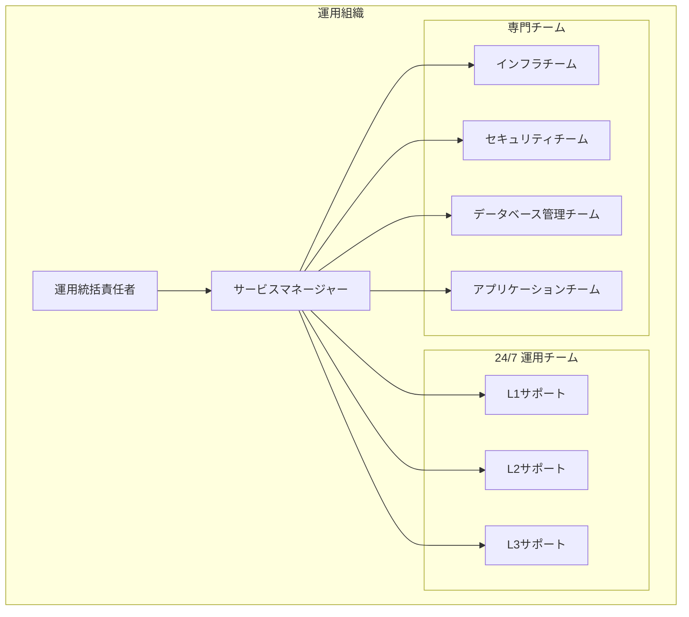
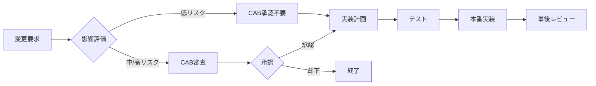

# 運用要件仕様書

## 1. 概要

本ドキュメントは、テックパック生成アプリケーションの運用に関する要件を定義します。システムの安定稼働、保守性、運用効率を確保するための仕様を規定します。

## 2. 運用体制

### 2.1 組織構造



### 2.2 役割と責任

```yaml
L1サポート（初期対応）:
  対応時間: 24/7
  責任範囲:
    - 初期問い合わせ対応
    - 既知の問題解決
    - エスカレーション判断
    - 基本的な操作サポート
  必要スキル:
    - カスタマーサポート経験
    - 基本的なIT知識
    - 日本語・英語対応

L2サポート（技術対応）:
  対応時間: 24/7（シフト制）
  責任範囲:
    - 技術的な問題解決
    - システム監視・対応
    - インシデント管理
    - 軽微な設定変更
  必要スキル:
    - Linux/Windows管理
    - 基本的なプログラミング
    - トラブルシューティング

L3サポート（高度技術対応）:
  対応時間: 平日9-18時（オンコール有）
  責任範囲:
    - 複雑な問題解決
    - システム最適化
    - アーキテクチャ改善
    - 根本原因分析
  必要スキル:
    - 深いシステム知識
    - プログラミング能力
    - パフォーマンスチューニング

インフラチーム:
  責任範囲:
    - インフラ設計・構築
    - 容量計画
    - 災害復旧計画
    - コスト最適化
  
セキュリティチーム:
  責任範囲:
    - セキュリティ監視
    - 脆弱性管理
    - インシデント対応
    - コンプライアンス確保
```

## 3. サービスレベル管理

### 3.1 SLA定義

```yaml
可用性SLA:
  Tier 1（本番環境）:
    目標: 99.9%（月間43.2分のダウンタイム許容）
    測定: 5分間隔のヘルスチェック
    除外事項:
      - 計画メンテナンス（事前通知あり）
      - 不可抗力（天災等）
      - ユーザー起因の問題
  
  Tier 2（ステージング）:
    目標: 99.5%
    測定: 15分間隔
  
  Tier 3（開発）:
    目標: 95%
    測定: 1時間間隔

パフォーマンスSLA:
  API応答時間:
    p50: < 200ms
    p95: < 500ms
    p99: < 1000ms
  
  ページロード時間:
    目標: < 3秒（初回）
    測定: 主要ページ対象
  
  バッチ処理:
    日次バッチ: 6時間以内完了
    PDF生成: 5分以内/ドキュメント

サポートSLA:
  初回応答時間:
    緊急（P1）: 15分以内
    高（P2）: 1時間以内
    中（P3）: 4時間以内
    低（P4）: 1営業日以内
  
  解決時間:
    P1: 4時間以内
    P2: 8時間以内
    P3: 2営業日以内
    P4: 5営業日以内
```

### 3.2 サービスレベル監視

```typescript
// SLA監視実装
class SLAMonitor {
  private metrics: Map<string, SLAMetric> = new Map();
  
  async checkAvailability(): Promise<void> {
    const endpoints = [
      { url: '/health', critical: true },
      { url: '/api/v1/health', critical: true },
      { url: '/api/v1/projects', critical: false }
    ];
    
    for (const endpoint of endpoints) {
      try {
        const start = Date.now();
        const response = await fetch(endpoint.url);
        const duration = Date.now() - start;
        
        this.recordMetric('availability', {
          success: response.ok,
          duration,
          endpoint: endpoint.url,
          critical: endpoint.critical
        });
        
        if (!response.ok && endpoint.critical) {
          await this.alertOncall('Service unavailable', endpoint);
        }
      } catch (error) {
        this.recordMetric('availability', {
          success: false,
          error: error.message,
          endpoint: endpoint.url,
          critical: endpoint.critical
        });
        
        if (endpoint.critical) {
          await this.alertOncall('Service unreachable', endpoint);
        }
      }
    }
  }
  
  calculateSLA(period: string): SLAReport {
    const metrics = this.getMetricsForPeriod(period);
    
    return {
      availability: this.calculateAvailability(metrics),
      performance: this.calculatePerformance(metrics),
      support: this.calculateSupportMetrics(metrics),
      violations: this.identifyViolations(metrics)
    };
  }
}
```

## 4. 監視とアラート

### 4.1 監視項目

```yaml
インフラストラクチャ監視:
  サーバー:
    - CPU使用率
    - メモリ使用率
    - ディスク使用率/I/O
    - ネットワークI/O
    - プロセス状態
  
  ネットワーク:
    - レイテンシ
    - パケットロス
    - 帯域使用率
    - コネクション数
  
  ストレージ:
    - 容量使用率
    - IOPS
    - レイテンシ
    - エラー率

アプリケーション監視:
  パフォーマンス:
    - リクエスト/秒
    - レスポンスタイム
    - エラー率
    - アクティブユーザー数
  
  ビジネスメトリクス:
    - ログイン成功/失敗
    - プロジェクト作成数
    - API使用状況
    - 機能利用統計
  
  リソース:
    - コネクションプール
    - スレッドプール
    - キャッシュヒット率
    - キュー長

セキュリティ監視:
  アクセス:
    - 不正アクセス試行
    - 認証失敗
    - 権限エラー
    - 異常なアクセスパターン
  
  システム:
    - ファイル改ざん
    - 設定変更
    - 特権コマンド実行
    - ネットワーク異常
```

### 4.2 アラート設定

```yaml
アラートレベル:
  Critical（緊急）:
    条件:
      - サービス完全停止
      - データ損失リスク
      - セキュリティ侵害
      - 主要機能の障害
    通知:
      - 即時電話連絡
      - SMS
      - Slack #alerts-critical
      - PagerDuty
    対応: 即時対応必須
  
  Warning（警告）:
    条件:
      - パフォーマンス劣化
      - リソース枯渇リスク
      - エラー率上昇
      - SLA違反リスク
    通知:
      - Email
      - Slack #alerts-warning
    対応: 1時間以内確認
  
  Info（情報）:
    条件:
      - 定期メンテナンス
      - 計画的変更
      - 統計情報
    通知:
      - Slack #alerts-info
      - ダッシュボード
    対応: 定期確認

アラートルール例:
  CPU高負荷:
    condition: "avg(cpu_usage) > 80 for 5m"
    level: Warning
    escalation:
      - 10m: Critical
      - 30m: Page on-call
  
  ディスク容量:
    condition: "disk_usage > 85"
    level: Warning
    auto_action: "cleanup_old_logs"
  
  API遅延:
    condition: "p95(response_time) > 1000ms for 5m"
    level: Warning
    notification: ["api-team", "sre-team"]
```

## 5. バックアップとリカバリ

### 5.1 バックアップ戦略

```yaml
バックアップポリシー:
  データベース:
    種類:
      - フルバックアップ: 週次（日曜日 2:00）
      - 差分バックアップ: 日次（2:00）
      - トランザクションログ: 15分毎
    保持期間:
      - フル: 3ヶ月
      - 差分: 30日
      - ログ: 7日
    保存先:
      - プライマリ: 同一リージョン別AZ
      - セカンダリ: 別リージョン
      - アーカイブ: Glacier（30日以降）
  
  ファイルストレージ:
    種類:
      - スナップショット: 日次
      - レプリケーション: リアルタイム
    保持期間:
      - スナップショット: 30日
      - 削除ファイル: 90日（ソフトデリート）
  
  アプリケーション設定:
    種類:
      - 設定ファイル: Git管理
      - シークレット: 暗号化バックアップ
      - インフラ定義: IaC（Terraform）
    バージョン管理: 全変更履歴保持

バックアップ検証:
  自動テスト:
    - 日次: バックアップ完了確認
    - 週次: サンプルリストア
    - 月次: フルリストアテスト
  
  手動テスト:
    - 四半期: DR訓練
    - 年次: 全体復旧訓練
```

### 5.2 災害復旧計画

```yaml
RTO/RPO目標:
  全体システム:
    RTO: 4時間
    RPO: 1時間
  
  コンポーネント別:
    Webアプリケーション:
      RTO: 30分（別リージョン切替）
      RPO: 0（ステートレス）
    
    データベース:
      RTO: 2時間
      RPO: 15分
    
    ファイルストレージ:
      RTO: 1時間
      RPO: 1時間

復旧手順:
  レベル1（単一コンポーネント障害）:
    1. 自動フェイルオーバー
    2. 手動確認と検証
    3. 根本原因調査
    4. 修復と切り戻し
  
  レベル2（複数コンポーネント障害）:
    1. 緊急対策本部設置
    2. 影響範囲評価
    3. 優先順位付け
    4. 段階的復旧
    5. サービス正常性確認
  
  レベル3（全面障害）:
    1. DR宣言
    2. DRサイト起動
    3. DNS切り替え
    4. データ同期確認
    5. サービス再開通知

訓練計画:
  机上訓練: 四半期
  部分訓練: 半期
  全体訓練: 年次
```

## 6. 変更管理

### 6.1 変更管理プロセス



### 6.2 変更カテゴリ

```yaml
標準変更:
  定義: 事前承認済み、低リスク、手順確立
  例:
    - パッチ適用
    - 設定値調整
    - ユーザー追加
  承認: 不要（記録のみ）
  実施: 随時可能

通常変更:
  定義: 一般的な変更、中程度のリスク
  例:
    - 機能追加
    - インフラ変更
    - 大規模設定変更
  承認: CAB必須
  実施: 計画的実施

緊急変更:
  定義: 即時対応必要、サービス影響大
  例:
    - セキュリティパッチ
    - 重大バグ修正
    - サービス復旧
  承認: ECAB（緊急CAB）
  実施: 即時（事後承認可）

変更影響評価:
  評価項目:
    - サービス影響度
    - ユーザー影響数
    - ダウンタイム
    - ロールバック可能性
    - 依存関係
  
  リスクマトリクス:
    影響度 × 発生確率 = リスクレベル
    - 低（1-3）: 標準手順
    - 中（4-6）: 追加レビュー
    - 高（7-9）: 特別承認
```

## 7. インシデント管理

### 7.1 インシデント対応フロー

```typescript
// インシデント管理システム
class IncidentManager {
  async handleIncident(alert: Alert): Promise<void> {
    // 1. インシデント作成
    const incident = await this.createIncident({
      title: alert.title,
      severity: this.calculateSeverity(alert),
      affectedServices: alert.services,
      startTime: new Date()
    });
    
    // 2. 初期対応
    await this.notifyOncall(incident);
    await this.createWarRoom(incident);
    
    // 3. 影響評価
    const impact = await this.assessImpact(incident);
    if (impact.userCount > 1000 || impact.revenue > 10000) {
      incident.severity = 'P1';
      await this.escalateToManagement(incident);
    }
    
    // 4. 対応追跡
    await this.trackResolution(incident);
    
    // 5. 事後処理
    await this.conductPostmortem(incident);
  }
  
  private calculateSeverity(alert: Alert): Severity {
    const rules = [
      { condition: (a) => a.type === 'service_down', severity: 'P1' },
      { condition: (a) => a.errorRate > 10, severity: 'P2' },
      { condition: (a) => a.responseTime > 5000, severity: 'P3' },
      { condition: (a) => true, severity: 'P4' }
    ];
    
    for (const rule of rules) {
      if (rule.condition(alert)) {
        return rule.severity;
      }
    }
  }
}
```

### 7.2 エスカレーション

```yaml
エスカレーションマトリクス:
  P1（緊急）:
    L1 → L2: 即時
    L2 → L3: 15分
    L3 → 管理者: 30分
    管理者 → 役員: 1時間
    通知:
      - 電話
      - SMS
      - Slack
      - Email
  
  P2（高）:
    L1 → L2: 30分
    L2 → L3: 1時間
    L3 → 管理者: 2時間
    通知:
      - Slack
      - Email
  
  P3（中）:
    L1 → L2: 2時間
    L2 → L3: 4時間
    通知:
      - Slack
      - Email
  
  P4（低）:
    L1 → L2: 1営業日
    通知:
      - チケットシステム

オンコール体制:
  ローテーション:
    - 週次交代
    - 2名体制（主・副）
    - 地理的分散
  
  補償:
    - 待機手当
    - 対応手当
    - 代休取得
  
  ツール:
    - PagerDuty
    - オンコール電話
    - VPNアクセス
    - 緊急対応手順書
```

## 8. 容量管理

### 8.1 容量計画

```yaml
監視対象:
  コンピューティング:
    - CPU使用率トレンド
    - メモリ使用量予測
    - インスタンス数
  
  ストレージ:
    - ディスク使用量成長率
    - IOPS要求
    - バックアップ容量
  
  ネットワーク:
    - 帯域使用率
    - 接続数
    - レイテンシ
  
  データベース:
    - テーブルサイズ
    - インデックスサイズ
    - コネクション数

予測モデル:
  線形回帰:
    - 日次成長率
    - 週次トレンド
    - 月次予測
  
  季節性考慮:
    - 曜日パターン
    - 月次パターン
    - 年次イベント
  
  閾値設定:
    警告: 70%
    アラート: 85%
    緊急: 90%

容量最適化:
  自動スケーリング:
    - CPU > 70%: スケールアウト
    - CPU < 30%: スケールイン
    - 最小: 3インスタンス
    - 最大: 50インスタンス
  
  リソース最適化:
    - 未使用リソース削除
    - 古いバックアップアーカイブ
    - ログローテーション
```

### 8.2 パフォーマンス管理

```typescript
// パフォーマンス管理
class PerformanceManager {
  async analyzePerformance(): Promise<PerformanceReport> {
    const metrics = await this.collectMetrics();
    
    return {
      summary: this.calculateSummary(metrics),
      bottlenecks: this.identifyBottlenecks(metrics),
      recommendations: this.generateRecommendations(metrics),
      trends: this.analyzeTrends(metrics)
    };
  }
  
  private identifyBottlenecks(metrics: Metrics): Bottleneck[] {
    const bottlenecks = [];
    
    // CPU ボトルネック
    if (metrics.cpu.usage > 80 && metrics.cpu.waitTime > 10) {
      bottlenecks.push({
        type: 'CPU',
        severity: 'High',
        recommendation: 'インスタンスタイプのアップグレード'
      });
    }
    
    // メモリボトルネック
    if (metrics.memory.usage > 85 || metrics.memory.swapUsage > 0) {
      bottlenecks.push({
        type: 'Memory',
        severity: 'High',
        recommendation: 'メモリ増設またはアプリケーション最適化'
      });
    }
    
    // I/Oボトルネック
    if (metrics.disk.await > 20 || metrics.disk.util > 80) {
      bottlenecks.push({
        type: 'Disk I/O',
        severity: 'Medium',
        recommendation: 'SSD移行またはIOPS増加'
      });
    }
    
    return bottlenecks;
  }
}
```

## 9. ログ管理

### 9.1 ログ収集と保管

```yaml
ログ種別:
  アプリケーションログ:
    形式: JSON構造化ログ
    レベル: DEBUG, INFO, WARN, ERROR, FATAL
    保持期間: 90日（ホット）、1年（コールド）
    
  アクセスログ:
    形式: Common Log Format拡張
    内容: IP, User, Timestamp, Request, Response, Duration
    保持期間: 180日
    
  監査ログ:
    形式: 構造化JSON
    内容: Who, What, When, Where, Result
    保持期間: 7年
    改ざん防止: ハッシュチェーン
    
  セキュリティログ:
    形式: CEF (Common Event Format)
    保持期間: 1年
    暗号化: 必須

ログパイプライン:
  収集:
    - Fluentd/Fluent Bit
    - Syslog
    - CloudWatch Logs
    
  処理:
    - フィルタリング
    - 正規化
    - エンリッチメント
    - 集約
    
  保存:
    - Elasticsearch（検索用）
    - S3（長期保管）
    - Glacier（アーカイブ）
    
  分析:
    - Kibana（可視化）
    - Grafana（メトリクス）
    - カスタムダッシュボード
```

### 9.2 ログ分析

```javascript
// ログ分析パイプライン
const logAnalysisPipeline = {
  // リアルタイム異常検出
  anomalyDetection: {
    input: 'log-stream',
    processors: [
      {
        type: 'pattern-recognition',
        patterns: [
          /ERROR.*OutOfMemory/,
          /FATAL.*Database.*connection/,
          /Security.*unauthorized.*access/
        ]
      },
      {
        type: 'statistical-analysis',
        baseline: 'rolling-7d',
        threshold: 3.0  // 3σ
      }
    ],
    output: 'alert-queue'
  },
  
  // ログ相関分析
  correlationAnalysis: {
    timeWindow: '5m',
    correlate: [
      'application-logs',
      'access-logs',
      'system-logs'
    ],
    rules: [
      {
        name: 'DDoS Detection',
        condition: 'access_log.count > 1000 AND system_log.cpu > 90'
      },
      {
        name: 'Memory Leak',
        condition: 'app_log.gc_time increasing AND system_log.memory increasing'
      }
    ]
  }
};
```

## 10. コスト管理

### 10.1 コスト最適化

```yaml
コスト監視:
  ツール:
    - AWS Cost Explorer
    - Azure Cost Management
    - カスタムダッシュボード
    
  アラート:
    - 日次予算超過
    - 異常な使用量
    - 未使用リソース
    
  レポート:
    - 週次: チーム別使用量
    - 月次: サービス別コスト
    - 四半期: 最適化提案

最適化施策:
  インスタンス:
    - リザーブドインスタンス活用
    - スポットインスタンス利用
    - 自動停止/起動
    - ライトサイジング
    
  ストレージ:
    - ライフサイクルポリシー
    - 圧縮/重複排除
    - 不要データ削除
    - コールドストレージ活用
    
  ネットワーク:
    - CDN活用
    - データ転送最適化
    - エンドポイント配置
    
  ライセンス:
    - 使用状況監査
    - 統合/集約
    - オープンソース活用

予算管理:
  配分:
    - インフラ: 40%
    - 開発/テスト: 20%
    - バックアップ: 15%
    - セキュリティ: 10%
    - 予備: 15%
    
  承認プロセス:
    - < $1,000: チームリーダー
    - < $10,000: 部門長
    - >= $10,000: CFO
```

## 11. ドキュメント管理

### 11.1 ドキュメント体系

```yaml
運用ドキュメント:
  必須ドキュメント:
    - システム構成図
    - 運用手順書
    - 障害対応手順書
    - 連絡先一覧
    - パスワード管理簿
    
  定期更新:
    - 月次: 手順書レビュー
    - 四半期: 構成図更新
    - 年次: 全体見直し
    
  アクセス管理:
    - 閲覧権限: 運用チーム全員
    - 編集権限: 承認者のみ
    - 暗号化: 機密情報

ナレッジベース:
  カテゴリ:
    - FAQ
    - トラブルシューティング
    - ベストプラクティス
    - 過去事例
    
  管理:
    - Wiki形式
    - 検索可能
    - バージョン管理
    - レビュープロセス
```

## 12. 継続的改善

### 12.1 改善プロセス

```yaml
PDCAサイクル:
  Plan（計画）:
    - KPI設定
    - 改善目標
    - 実施計画
    
  Do（実行）:
    - 施策実施
    - 進捗管理
    - 課題記録
    
  Check（評価）:
    - 効果測定
    - 目標達成度
    - 問題分析
    
  Act（改善）:
    - 標準化
    - 横展開
    - 次期計画

定期レビュー:
  日次:
    - 前日の問題確認
    - 当日の作業確認
    - リスク評価
    
  週次:
    - インシデントレビュー
    - SLA達成状況
    - 改善提案
    
  月次:
    - KPIレビュー
    - 容量レビュー
    - コストレビュー
    
  四半期:
    - 戦略レビュー
    - スキル評価
    - プロセス改善
```