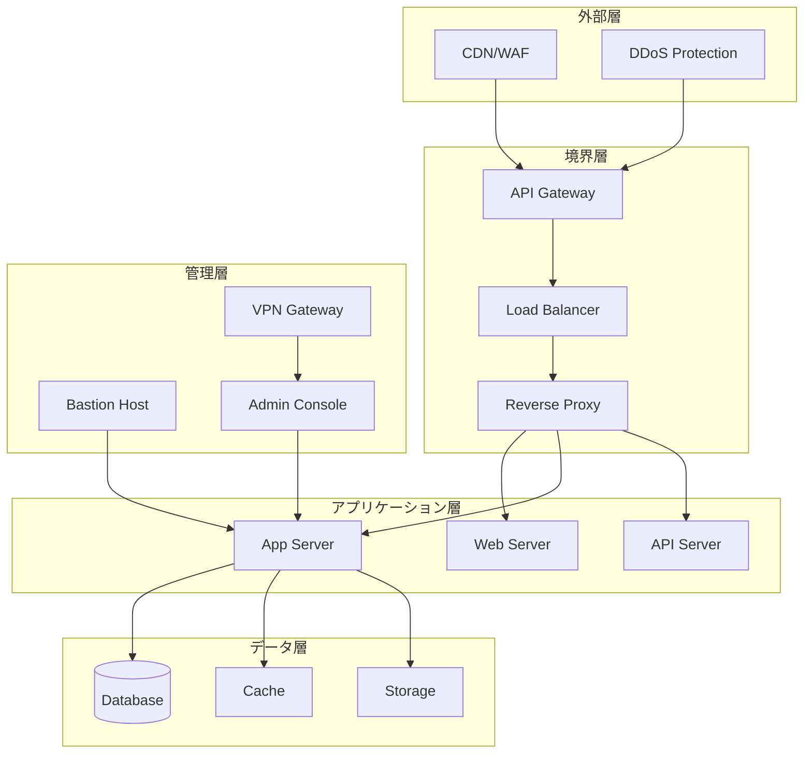

# セキュリティ要件詳細仕様書

## 1. 概要

本ドキュメントは、テックパック生成アプリケーションのセキュリティ要件を詳細に定義します。OWASP Top 10、NIST Cybersecurity Framework、ISO 27001/27002に準拠したセキュリティ対策を規定します。

## 2. セキュリティアーキテクチャ

### 2.1 多層防御アーキテクチャ



### 2.2 ゼロトラストモデル

```yaml
原則:
  - Never Trust, Always Verify
  - 最小権限の原則
  - 継続的な検証
  - 文脈に基づくアクセス制御

実装:
  デバイス信頼性:
    - デバイス登録必須
    - 証明書ベース認証
    - コンプライアンスチェック
  
  ユーザー検証:
    - 多要素認証
    - リスクベース認証
    - 行動分析
  
  マイクロセグメンテーション:
    - サービス間認証
    - 暗号化通信
    - アクセス制御リスト
```

## 3. 認証システム

### 3.1 認証フロー

```typescript
// 認証フローの実装例
interface AuthenticationFlow {
  // 1. 初期認証
  primaryAuth: {
    method: 'password' | 'biometric' | 'certificate';
    requirements: {
      passwordPolicy: {
        minLength: 12;
        requireUppercase: true;
        requireLowercase: true;
        requireNumbers: true;
        requireSpecialChars: true;
        maxRepeatingChars: 3;
        prohibitedPatterns: string[];
        dictionaryCheck: true;
      };
    };
  };
  
  // 2. 多要素認証
  mfa: {
    required: boolean;
    methods: ('totp' | 'sms' | 'email' | 'push' | 'u2f')[];
    gracePeriod: number; // seconds
    rememberDevice: boolean;
    backupCodes: {
      count: 10;
      length: 8;
      algorithm: 'secure-random';
    };
  };
  
  // 3. リスクベース認証
  riskAssessment: {
    factors: {
      location: { weight: 0.3 };
      device: { weight: 0.2 };
      behavior: { weight: 0.3 };
      time: { weight: 0.2 };
    };
    thresholds: {
      low: 0.3;
      medium: 0.6;
      high: 0.8;
    };
    actions: {
      low: 'allow';
      medium: 'additional_verification';
      high: 'block_and_notify';
    };
  };
}
```

### 3.2 セッション管理

```yaml
セッション設定:
  生成:
    アルゴリズム: "crypto.randomBytes(32)"
    エントロピー: 256ビット
    更新: ログイン成功時
  
  保存:
    方式: Redis（暗号化）
    暗号化: AES-256-GCM
    署名: HMAC-SHA256
  
  有効期限:
    アイドルタイムアウト: 30分
    絶対タイムアウト: 8時間
    更新: アクティビティごと
  
  同時セッション:
    最大数: 3
    競合処理: 古いセッション無効化
    デバイス追跡: 実装

Cookie設定:
  属性:
    - Secure: true
    - HttpOnly: true
    - SameSite: Strict
    - Path: /
    - Domain: 明示的指定
  
  CSRF対策:
    - Double Submit Cookie
    - Synchronizer Token
    - Origin/Refererチェック
```

## 4. 認可システム

### 4.1 RBAC実装

```typescript
// ロールベースアクセス制御
interface RBACSystem {
  roles: {
    superAdmin: {
      permissions: ['*'];
      restrictions: ['delete_system'];
    };
    organizationAdmin: {
      permissions: [
        'project.*',
        'user.read',
        'user.create',
        'user.update',
        'resource.*'
      ];
      dataScope: 'organization';
    };
    designer: {
      permissions: [
        'project.read',
        'project.create',
        'project.update',
        'section.edit',
        'resource.read'
      ];
      dataScope: 'assigned_projects';
    };
    viewer: {
      permissions: [
        'project.read',
        'resource.read'
      ];
      dataScope: 'assigned_projects';
    };
  };
  
  attributeBasedControl: {
    rules: [
      {
        resource: 'project',
        action: 'edit',
        condition: 'user.id === resource.owner_id || user.role === "admin"'
      }
    ];
  };
}
```

### 4.2 権限管理

```yaml
権限階層:
  システム権限:
    - system.admin
    - system.audit
    - system.config
  
  組織権限:
    - org.admin
    - org.user_manage
    - org.billing
  
  プロジェクト権限:
    - project.create
    - project.read
    - project.update
    - project.delete
    - project.export
    - project.share
  
  リソース権限:
    - resource.create
    - resource.read
    - resource.update
    - resource.delete

権限の継承:
  - 上位ロールは下位ロールの権限を継承
  - 明示的な拒否は許可を上書き
  - 一時的な権限昇格機能

権限の委譲:
  - 管理者による一時的な権限付与
  - 承認ワークフロー
  - 自動失効
```

## 5. データ保護

### 5.1 暗号化実装

```yaml
転送中のデータ:
  TLS設定:
    バージョン: "1.3"
    暗号スイート:
      - TLS_AES_256_GCM_SHA384
      - TLS_CHACHA20_POLY1305_SHA256
      - TLS_AES_128_GCM_SHA256
    証明書:
      種類: EV SSL
      鍵長: RSA 4096 / ECDSA P-384
      更新: 自動（Let's Encrypt）
    HSTS:
      max-age: 31536000
      includeSubDomains: true
      preload: true

保存データ:
  データベース:
    暗号化: Transparent Data Encryption
    アルゴリズム: AES-256
    鍵管理: AWS KMS / Azure Key Vault
    
  ファイルストレージ:
    暗号化: Server-Side Encryption
    アルゴリズム: AES-256-GCM
    鍵ローテーション: 年次
    
  バックアップ:
    暗号化: 必須
    鍵管理: 分離環境
    アクセス: 2人制御
```

### 5.2 データ分類とハンドリング

```yaml
データ分類:
  極秘（Confidential）:
    - パスワード
    - APIキー
    - 暗号化キー
    - 決済情報
    処理:
      - 常時暗号化
      - アクセスログ記録
      - 限定的アクセス
  
  機密（Sensitive）:
    - 個人情報
    - 顧客データ
    - 事業計画
    処理:
      - 暗号化推奨
      - アクセス制御
      - 監査ログ
  
  内部（Internal）:
    - プロジェクトデータ
    - 設計情報
    処理:
      - 標準的保護
      - ロールベースアクセス
  
  公開（Public）:
    - マーケティング資料
    - 公開API仕様
    処理:
      - 基本的保護
      - 改ざん防止

データライフサイクル:
  作成:
    - 分類タグ付け
    - 暗号化適用
    - アクセス権設定
  
  使用:
    - アクセスログ
    - 使用追跡
    - 異常検知
  
  共有:
    - 承認フロー
    - 暗号化転送
    - 期限設定
  
  保管:
    - 暗号化保存
    - アクセス制限
    - 定期監査
  
  削除:
    - 完全削除
    - 削除証明
    - 監査記録
```

## 6. アプリケーションセキュリティ

### 6.1 セキュアコーディング

```typescript
// 入力検証の実装例
class InputValidator {
  // SQLインジェクション対策
  validateSQLInput(input: string): boolean {
    const sqlPattern = /(\b(SELECT|INSERT|UPDATE|DELETE|DROP|UNION|ALTER)\b|--|\/\*|\*\/|;)/gi;
    return !sqlPattern.test(input);
  }
  
  // XSS対策
  sanitizeHTML(input: string): string {
    const map: Record<string, string> = {
      '&': '&amp;',
      '<': '&lt;',
      '>': '&gt;',
      '"': '&quot;',
      "'": '&#x27;',
      '/': '&#x2F;'
    };
    return input.replace(/[&<>"'/]/g, (char) => map[char]);
  }
  
  // パストラバーサル対策
  validateFilePath(path: string): boolean {
    const invalidPatterns = [
      /\.\./,           // 親ディレクトリ参照
      /^\//, 	        // 絶対パス
      /^[A-Za-z]:\\/,   // Windowsドライブ
      /[<>"|?*]/        // 無効な文字
    ];
    return !invalidPatterns.some(pattern => pattern.test(path));
  }
  
  // コマンドインジェクション対策
  sanitizeCommand(input: string): string {
    const dangerousChars = /[;&|`$()<>]/g;
    return input.replace(dangerousChars, '');
  }
}

// CSRFトークン管理
class CSRFProtection {
  generateToken(): string {
    return crypto.randomBytes(32).toString('hex');
  }
  
  validateToken(token: string, sessionToken: string): boolean {
    return crypto.timingSafeEqual(
      Buffer.from(token),
      Buffer.from(sessionToken)
    );
  }
}
```

### 6.2 セキュリティヘッダー

```yaml
HTTPセキュリティヘッダー:
  Content-Security-Policy:
    default-src: "'self'"
    script-src: "'self' 'nonce-{random}'"
    style-src: "'self' 'unsafe-inline'"
    img-src: "'self' data: https:"
    font-src: "'self'"
    connect-src: "'self' wss://api.example.com"
    frame-ancestors: "'none'"
    base-uri: "'self'"
    form-action: "'self'"
    upgrade-insecure-requests: true
  
  その他のヘッダー:
    X-Frame-Options: "DENY"
    X-Content-Type-Options: "nosniff"
    X-XSS-Protection: "0"  # CSPを使用するため
    Referrer-Policy: "strict-origin-when-cross-origin"
    Permissions-Policy: "geolocation=(), microphone=(), camera=()"
    Cross-Origin-Embedder-Policy: "require-corp"
    Cross-Origin-Opener-Policy: "same-origin"
    Cross-Origin-Resource-Policy: "same-origin"
```

## 7. インフラストラクチャセキュリティ

### 7.1 ネットワークセキュリティ

```yaml
ネットワーク分離:
  VPC設計:
    Public Subnet:
      - Load Balancer
      - NAT Gateway
      CIDR: 10.0.1.0/24
    
    Private Subnet (App):
      - Application Servers
      - API Servers
      CIDR: 10.0.2.0/24
    
    Private Subnet (Data):
      - Database
      - Cache
      CIDR: 10.0.3.0/24
    
    Management Subnet:
      - Bastion Host
      - Monitoring
      CIDR: 10.0.4.0/24

セキュリティグループ:
  Web層:
    Inbound:
      - 443/tcp from 0.0.0.0/0
      - 80/tcp from 0.0.0.0/0 (redirect)
    Outbound:
      - App層への必要ポートのみ
  
  App層:
    Inbound:
      - Web層からのみ
    Outbound:
      - Data層への必要ポートのみ
      - 外部APIへのHTTPS
  
  Data層:
    Inbound:
      - App層からのみ
    Outbound:
      - なし（更新用を除く）

ファイアウォール規則:
  WAF:
    - OWASP Core Rule Set
    - レート制限
    - 地理的制限
    - カスタムルール
  
  IDS/IPS:
    - 異常トラフィック検知
    - 既知の攻撃パターン
    - 自動遮断
```

### 7.2 ホストセキュリティ

```yaml
OS硬化:
  不要サービス:
    - 無効化または削除
    - 最小インストール
  
  パッチ管理:
    - 自動更新（検証環境）
    - 承認後更新（本番環境）
    - 緊急パッチ24時間以内
  
  アクセス制御:
    - SSHキー認証のみ
    - root無効化
    - sudo監査
  
  ファイル整合性:
    - Tripwire/AIDE
    - 定期スキャン
    - 変更アラート

コンテナセキュリティ:
  イメージ:
    - 公式ベースイメージ
    - 脆弱性スキャン
    - 署名検証
  
  ランタイム:
    - 非root実行
    - 読み取り専用ファイルシステム
    - リソース制限
  
  レジストリ:
    - プライベートレジストリ
    - アクセス制御
    - イメージスキャン
```

## 8. 監査とコンプライアンス

### 8.1 監査ログ

```yaml
ログ収集対象:
  認証イベント:
    - ログイン成功/失敗
    - パスワード変更
    - MFA設定変更
    - セッション作成/破棄
  
  認可イベント:
    - アクセス許可/拒否
    - 権限変更
    - ロール割り当て
  
  データアクセス:
    - 読み取り（機密データ）
    - 作成/更新/削除
    - エクスポート/インポート
  
  システムイベント:
    - 設定変更
    - サービス起動/停止
    - エラー/異常
  
  セキュリティイベント:
    - 攻撃検知
    - ポリシー違反
    - 異常な振る舞い

ログ形式:
  フィールド:
    - timestamp: ISO 8601
    - event_id: UUID
    - event_type: 分類
    - user_id: 実行者
    - ip_address: 送信元
    - user_agent: クライアント
    - resource: 対象リソース
    - action: 実行アクション
    - result: 成功/失敗
    - details: 詳細情報
  
  保護:
    - 改ざん防止（ハッシュチェーン）
    - 暗号化保存
    - アクセス制限
```

### 8.2 コンプライアンス管理

```yaml
規制対応:
  GDPR:
    - データマッピング
    - プライバシー影響評価
    - 同意管理
    - データポータビリティ
    - 忘れられる権利
  
  PCI DSS:
    - ネットワーク分離
    - 暗号化
    - アクセス制御
    - 定期的テスト
    - ログ管理
  
  SOC 2:
    - セキュリティ
    - 可用性
    - 処理の完全性
    - 機密性
    - プライバシー

定期評価:
  脆弱性評価:
    頻度: 四半期
    範囲: 全システム
    ツール: Nessus/Qualys
  
  ペネトレーションテスト:
    頻度: 年次
    種類: ブラックボックス
    実施者: 第三者機関
  
  コード監査:
    頻度: リリースごと
    ツール: SonarQube
    基準: OWASP
```

## 9. インシデント対応

### 9.1 インシデント対応計画

```yaml
インシデント分類:
  レベル1（情報）:
    - 単一の失敗ログイン
    - 軽微な設定ミス
    対応: モニタリング継続
  
  レベル2（低）:
    - 複数の失敗ログイン
    - 非機密データへの不正アクセス試行
    対応: 調査開始
  
  レベル3（中）:
    - ブルートフォース攻撃
    - サービス妨害試行
    対応: 即時対応、影響評価
  
  レベル4（高）:
    - データ漏洩疑い
    - システム侵害
    対応: 緊急対応、経営層報告
  
  レベル5（重大）:
    - 大規模データ漏洩
    - ランサムウェア
    対応: 危機管理体制発動

対応手順:
  1. 検知:
     - 自動アラート
     - 手動報告
     - 定期レビュー
  
  2. 分析:
     - 影響範囲特定
     - 原因調査
     - 証拠保全
  
  3. 封じ込め:
     - 即時対策
     - 被害拡大防止
     - システム隔離
  
  4. 根絶:
     - 脆弱性修正
     - マルウェア除去
     - アクセス権見直し
  
  5. 復旧:
     - システム復旧
     - データ復元
     - 監視強化
  
  6. 事後対応:
     - 報告書作成
     - 再発防止策
     - 教訓の共有

連絡体制:
  社内:
    - セキュリティチーム: 即時
    - IT管理者: 5分以内
    - 経営層: 30分以内（レベル4以上）
  
  社外:
    - 当局: 72時間以内（個人情報漏洩時）
    - 顧客: 速やかに
    - メディア: 広報経由
```

## 10. セキュリティ教育

### 10.1 教育プログラム

```yaml
全従業員向け:
  頻度: 年2回
  内容:
    - セキュリティ基礎
    - フィッシング対策
    - パスワード管理
    - ソーシャルエンジニアリング
    - インシデント報告
  
  テスト:
    - 理解度確認テスト
    - フィッシングシミュレーション
    - 合格基準: 80%以上

開発者向け:
  頻度: 四半期
  内容:
    - セキュアコーディング
    - OWASP Top 10
    - 脆弱性事例
    - セキュリティツール使用法
    - コードレビュー手法

管理者向け:
  頻度: 半期
  内容:
    - リスク管理
    - コンプライアンス
    - インシデント対応
    - 監査対応
    - セキュリティガバナンス
```