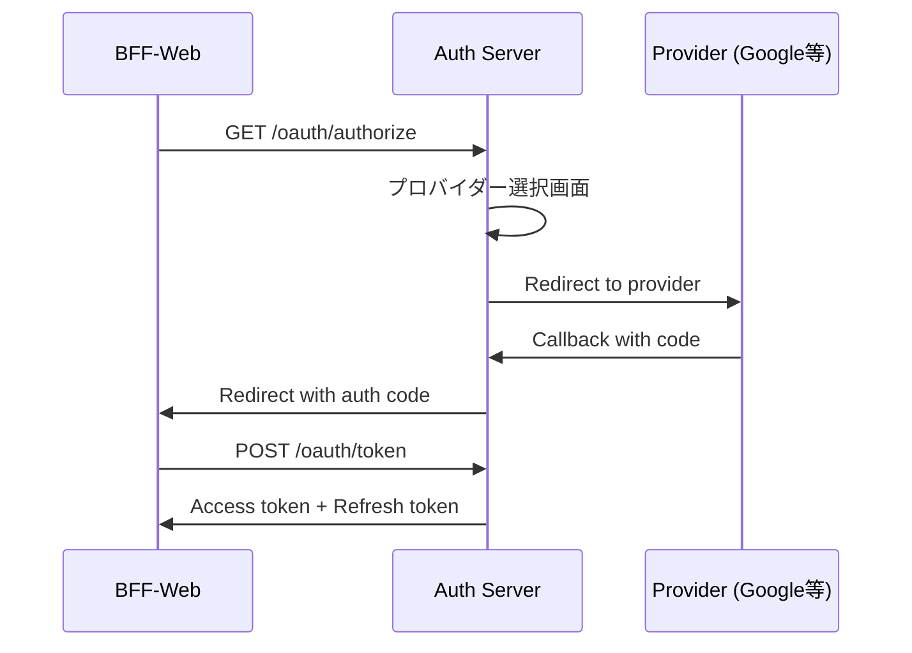
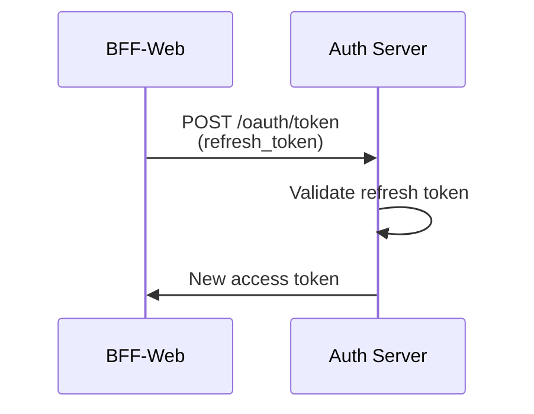

# 認証サーバー API仕様書 v1.0

## 概要

この仕様書は、BFF-Webと認証サーバー間のAPI通信仕様を定義します。

## 基本情報

- **ベースURL**: Django認証サーバー
  - 内部通信: `http://host.docker.internal:8080` (Docker環境)
  - 外部アクセス: `http://localhost:8080` (開発)
- **プロトコル**: HTTPS (本番環境では必須)
- **認証方式**: OAuth 2.0 + PKCE
- **データ形式**: JSON / application/x-www-form-urlencoded（トークン交換）

## API エンドポイント

### 1. 認可エンドポイント

#### `GET /oauth/authorize`

OAuth 2.0認可フローの開始点。ユーザーを認証画面にリダイレクトします。

**リクエストパラメータ**

| パラメータ | 必須 | 型 | 説明 | 例 |
|-----------|------|-----|------|-----|
| response_type | ✓ | string | 認可タイプ。`code`固定 | `code` |
| client_id | ✓ | string | クライアント識別子 | `bff-web-client` |
| redirect_uri | ✓ | string | コールバックURI | `http://localhost:3000/api/auth/callback` |
| state | ✓ | string | CSRF対策用ランダム文字列 | `abc123xyz` |
| code_challenge | ✓ | string | PKCE用チャレンジ（Base64URL） | `E9Melhoa2OwvFrEMTJguCHaoeK1t8URWbuGJSstw-cM` |
| code_challenge_method | ✓ | string | チャレンジ生成方式。`S256`固定 | `S256` |
| scope | ✓ | string | 要求スコープ（スペース区切り） | `openid profile email` |
| provider_hint | ✗ | string | 認証プロバイダーのヒント | `google`, `line`, `github`, `email` |
| login_hint | ✗ | string | ログインヒント（メールアドレス等） | `user@example.com` |
| prompt | ✗ | string | 認証画面の表示制御 | `none`, `login`, `consent`, `select_account` |

**レスポンス**

成功時: プロバイダー選択画面またはプロバイダー認証画面へリダイレクト

エラー時: リダイレクトURIにエラーパラメータを付加
```
{REDIRECT_URI}?error=invalid_request&error_description=Missing+required+parameter&state={STATE}
```

**エラーコード**

| コード | 説明 |
|--------|------|
| invalid_request | 必須パラメータ不足または不正な値 |
| unauthorized_client | クライアントが認可されていない |
| access_denied | ユーザーが認可を拒否 |
| unsupported_response_type | response_typeが非対応 |
| invalid_scope | 要求スコープが無効 |
| server_error | サーバー内部エラー |
| temporarily_unavailable | 一時的に利用不可 |

### 2. トークンエンドポイント

#### `POST /oauth/token/`

認可コードをアクセストークンに交換、またはトークンをリフレッシュします。

**リクエストヘッダー**
```
Content-Type: application/x-www-form-urlencoded
Accept: application/json
```

**リクエストボディ（認可コード交換）**
```
grant_type=authorization_code&
code=SplxlOBeZQQYbYS6WxSbIA&
redirect_uri=http%3A//localhost%3A3000/api/auth/callback&
client_id=bff-web-client&
client_secret=your-client-secret&
code_verifier=dBjftJeZ4CVP-mB92K27uhbUJU1p1r_wW1gFWFOEjXk
```

**リクエストボディ（トークンリフレッシュ）**
```
grant_type=refresh_token&
refresh_token=8xLOxBtZp8&
client_id=bff-web-client&
client_secret=your-client-secret
```

**成功レスポンス (200 OK)**
```json
{
  "access_token": "eyJhbGciOiJSUzI1NiIsInR5cCI6IkpXVCJ9...",
  "token_type": "Bearer",
  "expires_in": 3600,
  "refresh_token": "8xLOxBtZp8",
  "scope": "openid profile email"
}
```

**注意**: Djangoサーバーからは上記のトークン情報のみが返される。ユーザー情報はJWTアクセストークンのペイロードから抽出する必要がある。

**JWTペイロード例**:
```json
{
  "sub": "123456",
  "email": "user@example.com",
  "username": "山田太郎",
  "provider": "google",
  "iat": 1641024000,
  "exp": 1641027600
}
```

**エラーレスポンス (400 Bad Request)**
```json
{
  "error": "invalid_grant",
  "error_description": "The provided authorization code is invalid or has expired"
}
```

**エラーコード**

| コード | 説明 |
|--------|------|
| invalid_request | リクエスト形式が不正 |
| invalid_client | クライアント認証失敗 |
| invalid_grant | 認可コードまたはリフレッシュトークンが無効 |
| unauthorized_client | クライアントがこのgrant_typeを使用不可 |
| unsupported_grant_type | grant_typeが非対応 |
| invalid_scope | 要求スコープが無効 |

### 3. トークン無効化エンドポイント

#### `POST /oauth/api/tokens/revoke/`

アクセストークンまたはリフレッシュトークンを無効化します。

**リクエストヘッダー**
```
Content-Type: application/x-www-form-urlencoded
```

**リクエストボディ**
```
token=45ghiukldjahdnhzdauz&
token_type_hint=refresh_token&
client_id=bff-web-client&
client_secret=your-client-secret
```

**レスポンス (200 OK)**
```json
{}
```

※ RFC 7009準拠: トークンが見つからない場合も200を返す

### 4. JWKS エンドポイント

#### `GET /.well-known/jwks.json`

JWT検証用の公開鍵を取得します。

**レスポンス (200 OK)**
```json
{
  "keys": [
    {
      "kty": "RSA",
      "use": "sig",
      "kid": "2024-01-001",
      "alg": "RS256",
      "n": "xjlnRy3Ybn...",
      "e": "AQAB"
    }
  ]
}
```

### 5. OpenID Connect Discovery

#### `GET /.well-known/openid-configuration`

OpenID Connect設定情報を取得します。

**レスポンス (200 OK)**
```json
{
  "issuer": "https://auth.example.com",
  "authorization_endpoint": "https://auth.example.com/oauth/authorize",
  "token_endpoint": "https://auth.example.com/oauth/token",
  "userinfo_endpoint": "https://auth.example.com/oauth/userinfo",
  "jwks_uri": "https://auth.example.com/.well-known/jwks.json",
  "response_types_supported": ["code"],
  "subject_types_supported": ["public"],
  "id_token_signing_alg_values_supported": ["RS256"],
  "scopes_supported": ["openid", "profile", "email"],
  "token_endpoint_auth_methods_supported": ["client_secret_basic", "client_secret_post"],
  "claims_supported": ["sub", "name", "email", "email_verified", "picture"],
  "code_challenge_methods_supported": ["S256"]
}
```

## 認証フロー詳細

### 1. 新規ログインフロー



### 2. トークンリフレッシュフロー



## セキュリティ要件

### 1. HTTPS必須
- 本番環境では全通信をHTTPSで行う
- 開発環境でもできる限りHTTPSを使用

### 2. クライアント認証
- Confidential Client: client_secret必須
- Public Client: PKCE必須

### 3. トークン有効期限
- アクセストークン: 1時間
- リフレッシュトークン: 7日間（設定可能）
- 認可コード: 10分間

### 4. レート制限
- `/oauth/token`: 1分間に10リクエスト/IP
- `/oauth/authorize`: 1分間に20リクエスト/IP

## エラーハンドリング

### エラーレスポンス形式

```json
{
  "error": "error_code",
  "error_description": "Human-readable error description",
  "error_uri": "https://docs.example.com/errors/error_code"
}
```

### HTTPステータスコード

| コード | 説明 | 使用場面 |
|--------|------|----------|
| 200 | 成功 | トークン発行成功 |
| 302 | リダイレクト | 認可フロー |
| 400 | Bad Request | パラメータエラー |
| 401 | Unauthorized | 認証失敗 |
| 403 | Forbidden | アクセス権限なし |
| 429 | Too Many Requests | レート制限超過 |
| 500 | Internal Server Error | サーバーエラー |
| 503 | Service Unavailable | メンテナンス中 |

## 実装の注意点

### 1. state パラメータ
- 最低16バイトのランダム文字列
- 使い回し禁止（毎回新規生成）
- 有効期限10分

### 2. PKCE
- code_verifier: 43-128文字のランダム文字列
- code_challenge: SHA256(code_verifier)のBase64URL
- Publicクライアントは必須

### 3. スコープ
- 最小権限の原則に従う
- 不要なスコープは要求しない
- ユーザーに分かりやすく表示

### 4. エラー時の情報開示
- 詳細なエラー情報は開発環境のみ
- 本番環境では最小限の情報のみ返す
- ログには詳細を記録

## テスト用エンドポイント（開発環境のみ）

### `GET /oauth/test/client-info`
現在のクライアント設定を確認

### `POST /oauth/test/generate-tokens`
テスト用トークンを生成

### `GET /oauth/test/validate-token`
トークンの検証結果を確認

## 変更履歴

| バージョン | 日付 | 変更内容 |
|-----------|------|----------|
| 1.0 | 2024-01-10 | 初版作成 |

## 付録

### A. JWT クレーム

**アクセストークン**
```json
{
  "iss": "https://auth.example.com",
  "sub": "123456",
  "aud": "bff-web-client",
  "exp": 1704931200,
  "iat": 1704927600,
  "jti": "unique-token-id",
  "scope": "openid profile email",
  "provider": "google"
}
```

**IDトークン（OpenID Connect）**
```json
{
  "iss": "https://auth.example.com",
  "sub": "123456",
  "aud": "bff-web-client",
  "exp": 1704931200,
  "iat": 1704927600,
  "auth_time": 1704927500,
  "nonce": "n-0S6_WzA2Mj",
  "email": "user@example.com",
  "email_verified": true,
  "name": "山田太郎",
  "picture": "https://example.com/avatar.jpg"
}
```

### B. サンプルコード

**PKCE生成（TypeScript）**
```typescript
import crypto from 'crypto';

function generatePKCE() {
  const verifier = crypto.randomBytes(32).toString('base64url');
  const challenge = crypto
    .createHash('sha256')
    .update(verifier)
    .digest('base64url');
  
  return { verifier, challenge };
}
```

**state生成（TypeScript）**
```typescript
function generateState(): string {
  return crypto.randomBytes(16).toString('base64url');
}
```