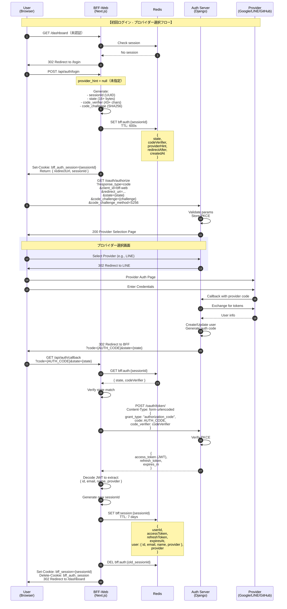
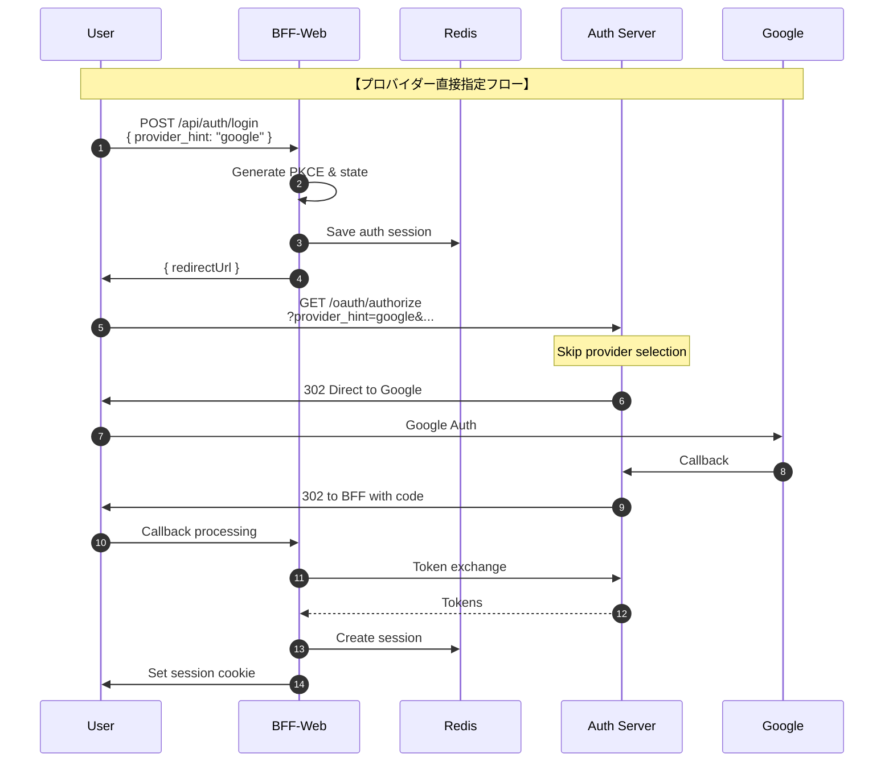
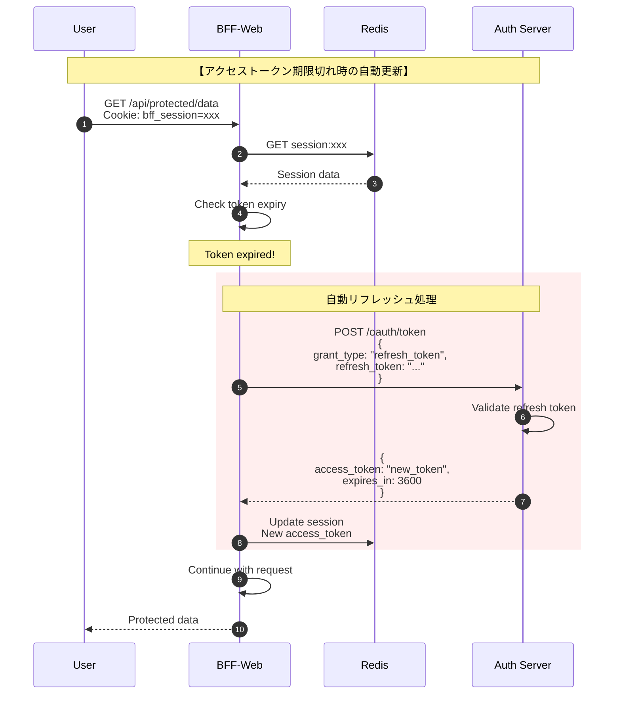
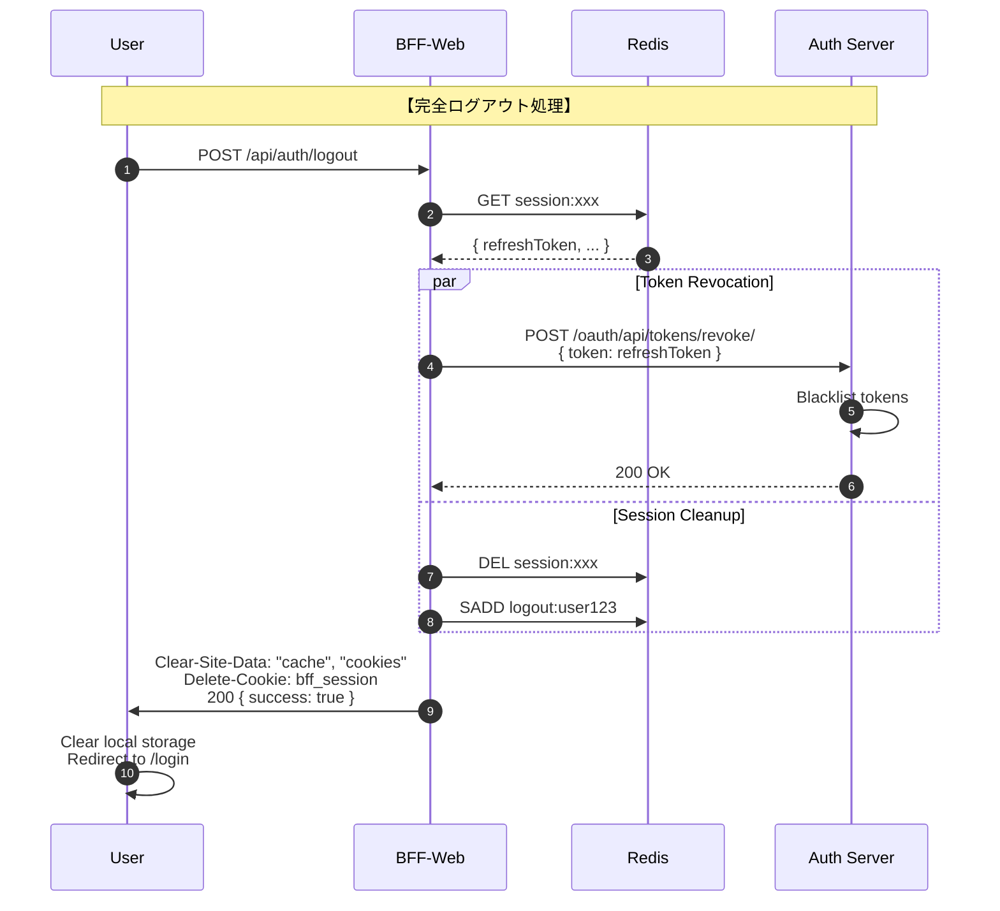
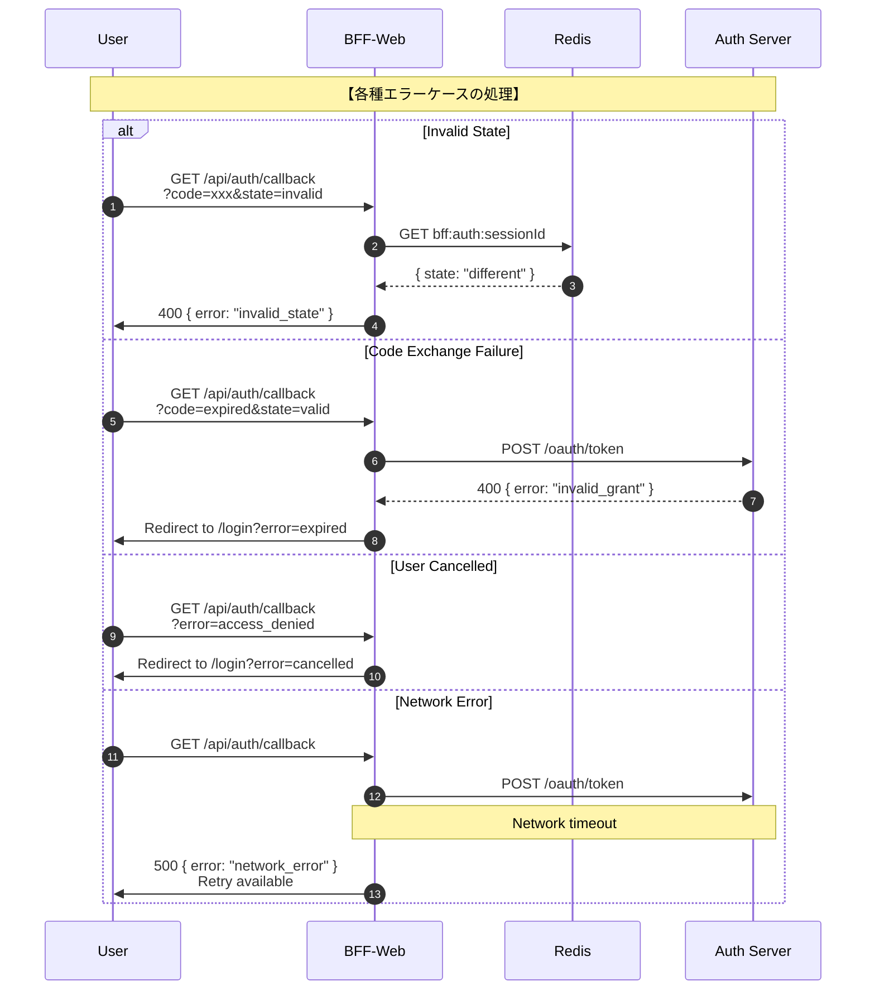
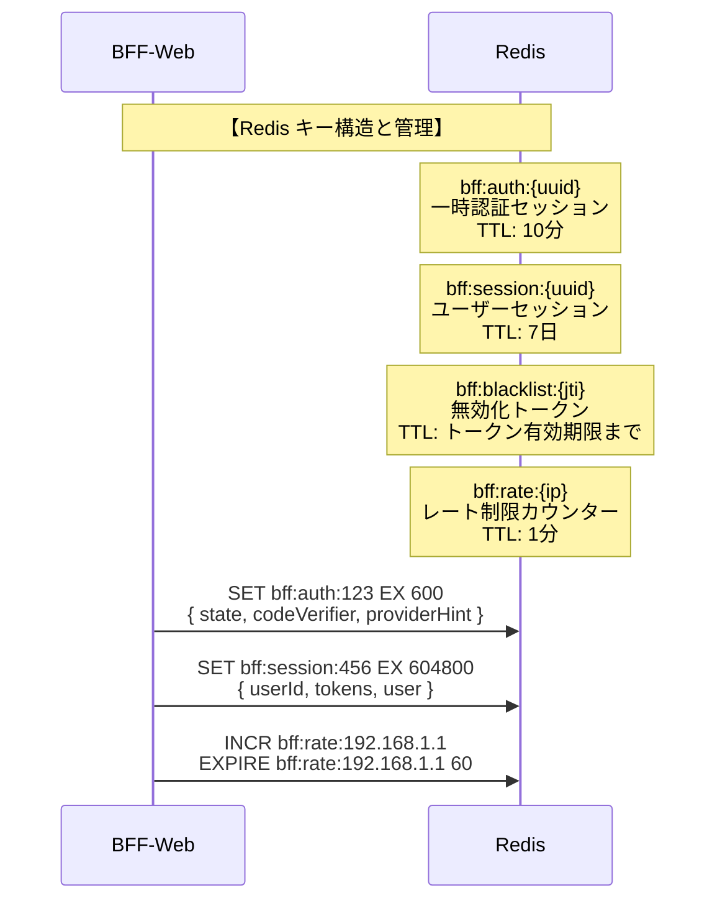
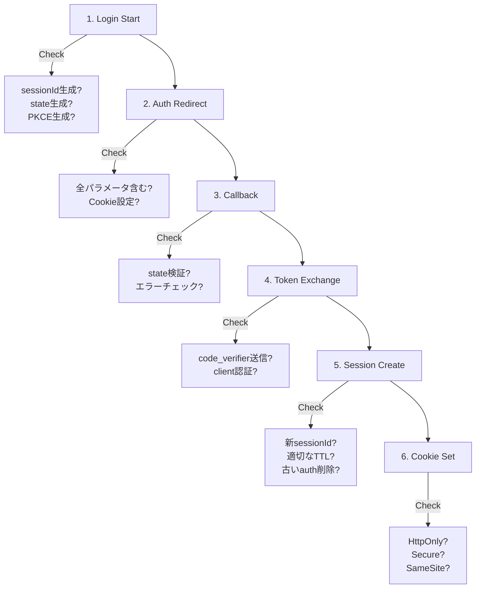

# BFF-Web 実装者向けシーケンス図集

## 概要

このドキュメントは、BFF-Web実装者が認証フローを視覚的に理解するためのシーケンス図集です。

## 1. 基本認証フロー（プロバイダー選択あり）



## 2. 直接プロバイダー指定フロー（高速ログイン）



## 3. トークンリフレッシュフロー



## 4. ログアウトフロー



## 5. エラーハンドリングフロー



## 6. セッション管理詳細



## 7. 実装チェックポイント

### 各ステップでの確認事項



## 実装の重要ポイント

### 1. PKCE 実装の詳細

```typescript
// 正しい実装
const verifier = crypto.randomBytes(32).toString('base64url'); // 43文字以上
const challenge = crypto
  .createHash('sha256')
  .update(verifier)
  .digest('base64url'); // パディング除去

// よくある間違い
// ❌ base64（パディングあり）
// ❌ 短すぎるverifier（32文字未満）
// ❌ verifierの使い回し
```

### 2. State 管理

```typescript
// セッションごとにユニーク
const state = crypto.randomBytes(16).toString('base64url');

// Redis保存時は有効期限必須
await redis.setex(`bff:auth:${sessionId}`, 600, JSON.stringify({
  state,
  codeVerifier,
  providerHint,
  redirectAfter,
  createdAt: new Date().toISOString()
}));
```

### 3. エラー時のクリーンアップ

```typescript
// エラー発生時も必ずクリーンアップ
try {
  // 認証処理
} catch (error) {
  // 一時セッション削除
  await redis.del(`bff:auth:${sessionId}`);
  // エラーレスポンス
} finally {
  // 一時Cookieは必ず削除
  response.cookies.delete('bff_auth_session');
}
```

## まとめ

これらのシーケンス図は、BFF-Web実装の各フェーズで参照してください：

1. **設計フェーズ**: 全体フローの理解
2. **実装フェーズ**: 各ステップの詳細確認
3. **テストフェーズ**: エラーケースの網羅
4. **レビューフェーズ**: セキュリティチェック

特に重要なのは：
- **状態管理**: Redis キーの適切な管理
- **エラー処理**: 全エラーケースの考慮
- **セキュリティ**: PKCE、state、Cookie設定の正確な実装