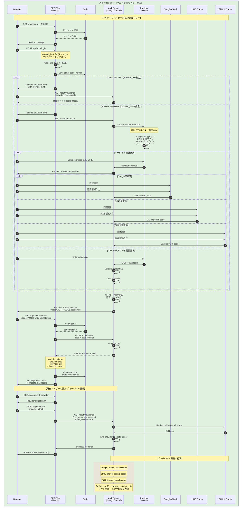

# マルチプロバイダー対応の認証フロー

```mermaid
sequenceDiagram
    autonumber
    box rgba(200, 255, 200, 0.3) 改善された設計（マルチプロバイダー対応）
    participant B as Browser
    participant BFF as BFF-Web<br/>(Next.js)
    participant Redis as Redis
    participant AS as Auth Server<br/>(Django OAuth2)
    participant PS as Provider<br/>Selector
    participant Google as Google OAuth
    participant LINE as LINE OAuth
    participant GitHub as GitHub OAuth
    end
    
    Note over B,GitHub: 【マルチプロバイダー対応の認証フロー】
    
    %% 初回アクセス
    B->>BFF: GET /dashboard（未認証）
    BFF->>Redis: セッション確認
    Redis-->>BFF: セッションなし
    BFF->>B: Redirect to /login
    
    %% ログイン開始
    B->>BFF: POST /api/auth/login
    Note over BFF: provider_hint（オプション）<br/>login_hint（オプション）
    BFF->>BFF: Generate state + PKCE
    BFF->>Redis: Save state, code_verifier
    
    alt Direct Provider（provider_hint指定）
        BFF->>B: Redirect to Auth Server<br/>with provider_hint
        B->>AS: GET /oauth/authorize<br/>?provider_hint=google
        AS->>B: Redirect to Google directly
    else Provider Selection（provider_hint未指定）
        BFF->>B: Redirect to Auth Server
        B->>AS: GET /oauth/authorize
        AS->>PS: Show Provider Selection
        
        Note over PS: 認証プロバイダー選択画面
        PS->>PS: ・Google でログイン<br/>・LINE でログイン<br/>・GitHub でログイン<br/>・メール/パスワード
        
        alt ソーシャル認証選択
            B->>PS: Select Provider (e.g., LINE)
            PS->>AS: Provider selected
            AS->>B: Redirect to selected provider
            
            alt Google選択時
                B->>Google: 認証画面
                B->>Google: 認証情報入力
                Google->>AS: Callback with code
            else LINE選択時
                B->>LINE: 認証画面
                B->>LINE: 認証情報入力
                LINE->>AS: Callback with code
            else GitHub選択時
                B->>GitHub: 認証画面
                B->>GitHub: 認証情報入力
                GitHub->>AS: Callback with code
            end
            
        else メール/パスワード認証選択
            B->>PS: Enter credentials
            PS->>AS: POST /oauth/login
            AS->>AS: Validate credentials
            AS->>AS: Create session
        end
    end
    
    %% 認証後の共通処理
    AS->>AS: ユーザー作成/更新<br/>認可コード生成
    AS->>B: Redirect to BFF callback<br/>?code=AUTH_CODE&state=xxx
    
    B->>BFF: GET /api/auth/callback<br/>?code=AUTH_CODE&state=xxx
    BFF->>Redis: Verify state
    Redis-->>BFF: state match ✓
    BFF->>AS: POST /oauth/token<br/>code + code_verifier
    AS->>AS: Verify PKCE
    AS-->>BFF: JWT tokens + user info
    
    Note over BFF: user info includes:<br/>- provider type<br/>- provider uid<br/>- linked accounts
    
    BFF->>Redis: Create session<br/>Store JWT tokens
    BFF->>B: Set HttpOnly Cookie<br/>Redirect to /dashboard
    
    %% アカウントリンク機能（オプション）
    Note over B,AS: 【既存ユーザーの追加プロバイダー連携】
    B->>BFF: GET /account/link-provider
    BFF->>B: Provider selection UI
    B->>BFF: POST /api/auth/link<br/>provider=github
    BFF->>AS: GET /oauth/authorize<br/>?prompt=select_account<br/>&link_account=true
    AS->>GitHub: Redirect with special scope
    GitHub->>AS: Callback
    AS->>AS: Link provider to existing user
    AS->>BFF: Success response
    BFF->>B: Provider linked successfully

    %% プロバイダー別の特殊処理
    Note over AS,GitHub: 【プロバイダー固有の処理】
    
    rect rgba(255, 200, 200, 0.3)
        Note over AS: Google: email, profile scope
        Note over AS: LINE: profile, openid scope
        Note over AS: GitHub: user, email scope
        Note over AS: 各プロバイダーのAPIエンドポイント<br/>レート制限、エラー処理も考慮
    end
```