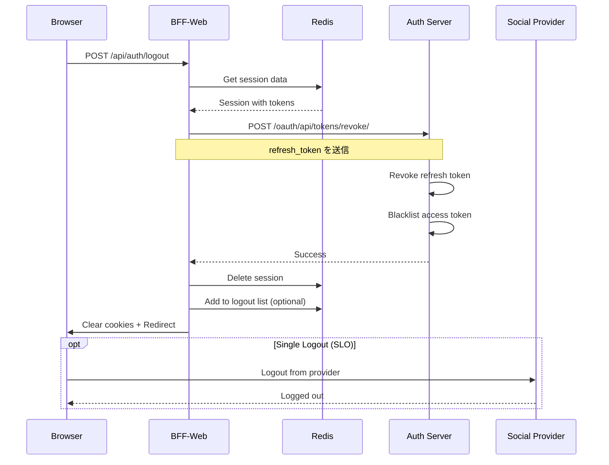

# 完全なログアウトフローの設計と実装

## 現在の実装の問題点

現在のログアウト処理は以下のみ：
1. Redisからセッション削除
2. Cookieの削除
3. ログインページへリダイレクト

**欠けている重要な処理：**
- 認証サーバーへの通知
- リフレッシュトークンの無効化
- ソーシャルプロバイダーからのログアウト（オプション）
- 他のデバイス/セッションの考慮

## 完全なログアウトフロー

### 1. シーケンス図



### 2. BFF-Web 実装の改善

```typescript
// app/api/auth/logout/route.ts
import { NextRequest, NextResponse } from 'next/server';
import { getSession, deleteSession } from '@/lib/redis';

export async function POST(request: NextRequest) {
  try {
    const sessionId = request.cookies.get(process.env.SESSION_COOKIE_NAME!)?.value;
    
    if (sessionId) {
      // セッションデータを取得
      const session = await getSession(`session:${sessionId}`);
      
      if (session && session.refreshToken) {
        // 認証サーバーでトークンを無効化
        try {
          await revokeTokens(session.refreshToken);
        } catch (error) {
          console.error('Token revocation failed:', error);
          // エラーでもログアウト処理は続行
        }
      }
      
      // Redisからセッション削除
      await deleteSession(`session:${sessionId}`);
      
      // オプション: ログアウト履歴を記録
      await recordLogout(session?.user?.id, sessionId);
    }
    
    // レスポンス作成
    const response = NextResponse.json({ 
      success: true,
      message: 'Logged out successfully'
    });
    
    // すべてのauth関連Cookieを削除
    response.cookies.delete(process.env.SESSION_COOKIE_NAME!);
    response.cookies.delete('auth_session_id'); // 一時認証Cookie
    
    // セキュリティヘッダー追加
    response.headers.set('Clear-Site-Data', '"cache", "cookies", "storage"');
    
    return response;
  } catch (error) {
    console.error('Logout error:', error);
    // エラーでもCookieは削除
    const response = NextResponse.json({ error: 'Logout failed' }, { status: 500 });
    response.cookies.delete(process.env.SESSION_COOKIE_NAME!);
    return response;
  }
}

// トークン無効化関数
async function revokeTokens(refreshToken: string): Promise<void> {
  const response = await fetch(`${process.env.AUTH_SERVER_URL}/oauth/api/tokens/revoke/`, {
    method: 'POST',
    headers: {
      'Content-Type': 'application/x-www-form-urlencoded',
    },
    body: new URLSearchParams({
      token: refreshToken,
      token_type_hint: 'refresh_token',
      client_id: process.env.AUTH_CLIENT_ID,
      client_secret: process.env.AUTH_CLIENT_SECRET,
    }),
  });
  
  if (!response.ok) {
    throw new Error('Token revocation failed');
  }
}

// ログアウト履歴記録（監査用）
async function recordLogout(userId: string, sessionId: string): Promise<void> {
  const logoutRecord = {
    userId,
    sessionId,
    timestamp: new Date().toISOString(),
    ip: request.headers.get('x-forwarded-for') || 'unknown',
    userAgent: request.headers.get('user-agent') || 'unknown',
  };
  
  // Redisに一定期間保存（例：30日）
  await redis.setex(
    `logout:${userId}:${Date.now()}`,
    30 * 24 * 3600,
    JSON.stringify(logoutRecord)
  );
}
```

### 3. 認証サーバー側の実装

```python
# oauth/views.py に追加
class TokenRevocationView(View):
    """RFC 7009 - OAuth 2.0 Token Revocation"""
    
    @method_decorator(csrf_exempt)
    def dispatch(self, *args, **kwargs):
        return super().dispatch(*args, **kwargs)
    
    def post(self, request):
        # クライアント認証
        client_id = request.POST.get('client_id')
        client_secret = request.POST.get('client_secret')
        
        try:
            client = OAuthClient.objects.get(client_id=client_id)
            if client.client_secret != client_secret:
                return JsonResponse({'error': 'invalid_client'}, status=401)
        except OAuthClient.DoesNotExist:
            return JsonResponse({'error': 'invalid_client'}, status=401)
        
        # トークン取得
        token = request.POST.get('token')
        token_type_hint = request.POST.get('token_type_hint', 'access_token')
        
        if not token:
            return JsonResponse({'error': 'invalid_request'}, status=400)
        
        # トークン無効化
        if token_type_hint == 'refresh_token':
            self._revoke_refresh_token(token, client)
        else:
            self._revoke_access_token(token)
        
        # 成功時は常に200を返す（RFC 7009準拠）
        return JsonResponse({})
    
    def _revoke_refresh_token(self, token, client):
        """リフレッシュトークンの無効化"""
        try:
            refresh_token = RefreshToken.objects.get(
                token=token,
                client=client
            )
            # 関連するアクセストークンも無効化
            BlacklistedToken.objects.create(
                user=refresh_token.user,
                token_type='refresh',
                jti=token,
                expires_at=refresh_token.expires_at
            )
            refresh_token.delete()
        except RefreshToken.DoesNotExist:
            # トークンが見つからなくても成功として扱う
            pass
    
    def _revoke_access_token(self, token):
        """アクセストークンの無効化（JWTの場合はブラックリスト登録）"""
        try:
            # JWTをデコードしてjtiを取得
            jwt_manager = JWTManager()
            payload = jwt_manager.decode_token(token)
            
            BlacklistedToken.objects.create(
                user_id=payload.get('user_id'),
                token_type='access',
                jti=payload.get('jti'),
                expires_at=datetime.fromtimestamp(payload.get('exp'))
            )
        except Exception:
            # デコードエラーでも成功として扱う
            pass


# ブラックリストモデル
class BlacklistedToken(models.Model):
    """無効化されたトークンのブラックリスト"""
    user = models.ForeignKey(User, on_delete=models.CASCADE)
    token_type = models.CharField(max_length=20)
    jti = models.CharField(max_length=255, unique=True)
    expires_at = models.DateTimeField()
    revoked_at = models.DateTimeField(auto_now_add=True)
    
    class Meta:
        indexes = [
            models.Index(fields=['jti']),
            models.Index(fields=['expires_at']),
        ]
    
    def is_expired(self):
        return timezone.now() > self.expires_at
```

### 4. 全デバイスログアウト機能

```typescript
// app/api/auth/logout-all/route.ts
export async function POST(request: NextRequest) {
  const sessionId = request.cookies.get(process.env.SESSION_COOKIE_NAME!)?.value;
  
  if (!sessionId) {
    return NextResponse.json({ error: 'Unauthorized' }, { status: 401 });
  }
  
  const session = await getSession(`session:${sessionId}`);
  if (!session || !session.user) {
    return NextResponse.json({ error: 'Invalid session' }, { status: 401 });
  }
  
  // すべてのセッションを取得して削除
  const userSessions = await redis.keys(`session:*`);
  const deletePromises = [];
  
  for (const key of userSessions) {
    const sessionData = await redis.get(key);
    if (sessionData) {
      const parsed = JSON.parse(sessionData);
      if (parsed.user?.id === session.user.id) {
        deletePromises.push(redis.del(key));
      }
    }
  }
  
  await Promise.all(deletePromises);
  
  // 認証サーバーに全トークン無効化を要求
  await fetch(`${process.env.AUTH_SERVER_URL}/oauth/api/tokens/revoke-all/`, {
    method: 'POST',
    headers: {
      'Content-Type': 'application/json',
      'Authorization': `Bearer ${session.accessToken}`,
    },
    body: JSON.stringify({
      user_id: session.user.id,
    }),
  });
  
  return NextResponse.json({ success: true });
}
```

### 5. フロントエンド実装

```typescript
// components/LogoutButton.tsx
'use client';

import { useState } from 'react';
import { useRouter } from 'next/navigation';

export function LogoutButton({ logoutAll = false }) {
  const [isLoading, setIsLoading] = useState(false);
  const router = useRouter();
  
  const handleLogout = async () => {
    setIsLoading(true);
    
    try {
      const endpoint = logoutAll ? '/api/auth/logout-all' : '/api/auth/logout';
      const response = await fetch(endpoint, {
        method: 'POST',
        credentials: 'include',
      });
      
      if (response.ok) {
        // Clear any client-side state
        localStorage.clear();
        sessionStorage.clear();
        
        // Redirect to login
        router.push('/login');
      } else {
        console.error('Logout failed');
      }
    } catch (error) {
      console.error('Logout error:', error);
    } finally {
      setIsLoading(false);
    }
  };
  
  return (
    <button
      onClick={handleLogout}
      disabled={isLoading}
      className="logout-button"
    >
      {isLoading ? 'ログアウト中...' : logoutAll ? 'すべてのデバイスからログアウト' : 'ログアウト'}
    </button>
  );
}
```

### 6. シングルログアウト（SLO）対応

```typescript
// app/api/auth/slo/route.ts
export async function GET(request: NextRequest) {
  // プロバイダーからのログアウト通知を処理
  const searchParams = request.nextUrl.searchParams;
  const sid = searchParams.get('sid'); // Session ID from provider
  
  if (sid) {
    // プロバイダーのセッションIDに紐づくローカルセッションを検索
    const sessions = await findSessionsByProviderSid(sid);
    
    for (const session of sessions) {
      await deleteSession(session.id);
    }
  }
  
  return NextResponse.json({ success: true });
}
```

## セキュリティ考慮事項

1. **トークン無効化の確実性**
   - ブラックリスト方式でJWTを無効化
   - 定期的な期限切れトークンのクリーンアップ

2. **ログアウト後の処理**
   - Clear-Site-Dataヘッダーでブラウザキャッシュもクリア
   - クライアント側のストレージもクリア

3. **監査ログ**
   - ログアウトイベントの記録
   - 異常なログアウトパターンの検知

4. **エラーハンドリング**
   - 部分的な失敗でもログアウト処理を継続
   - ユーザーには常に成功を返す

## まとめ

完全なログアウト実装には以下が必要：
1. **BFF**: セッション削除、Cookie削除、認証サーバー通知
2. **認証サーバー**: トークン無効化、ブラックリスト管理
3. **オプション**: 全デバイスログアウト、SLO対応
4. **セキュリティ**: 監査ログ、確実なクリーンアップ