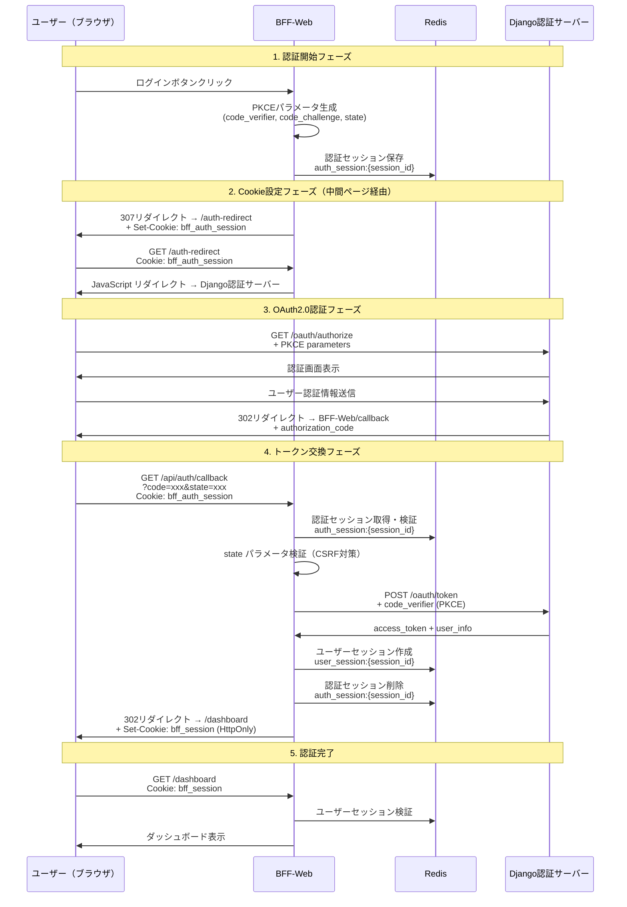

# OAuth2.0+PKCE BFF認証システム - Cookie実装ガイド

## 概要

このドキュメントは、Next.js 15 BFF（Backend For Frontend）アーキテクチャにおけるOAuth2.0+PKCE認証システムの実装について、特にCookie設定とDocker環境での課題と解決策を記録したものです。

## 実装アーキテクチャ

### システム構成
- **BFF-Web**: Next.js 15アプリケーション（Docker環境）
- **Django認証サーバー**: OAuth2.0+PKCE対応認証サーバー（Docker環境）
- **Redis**: セッション管理
- **ブラウザ**: エンドユーザーのWebブラウザ

### 認証フロー概要
1. ユーザーがBFF-Webでログインボタンをクリック
2. BFF-WebでPKCEパラメータ生成
3. 認証セッションをRedisに保存
4. 中間ページ経由でCookie設定
5. Django認証サーバーへリダイレクト
6. ユーザー認証後、BFF-Webのコールバックエンドポイントへリダイレクト
7. トークン交換とユーザーセッション作成

## Cookie設定における課題と解決策

### 課題1: JavaScript リダイレクトでのCookie設定失敗

**問題**:
- JavaScript の `window.location.href` によるリダイレクトではSet-Cookieヘッダーが無視される
- レスポンスが200 OKでもCookieが設定されない

**原因**:
```javascript
// ❌ 失敗パターン
return NextResponse.json({
  redirectUrl: authorizationUrl.toString()
}, {
  headers: {
    'Set-Cookie': cookieOptions  // このCookieは設定されない
  }
});
```

**解決策**:
中間ページ経由でのサーバーサイドリダイレクトを採用

```javascript
// ✅ 成功パターン
const intermediateUrl = new URL('/auth-redirect', request.url);
intermediateUrl.searchParams.set('redirect_url', authorizationUrl.toString());
intermediateUrl.searchParams.set('session_id', authSessionId);

const response = NextResponse.redirect(intermediateUrl.toString());
response.cookies.set('bff_auth_session', authSessionId, {
  httpOnly: true,
  secure: process.env.NODE_ENV === 'production',
  sameSite: 'lax',
  path: '/',
  maxAge: 600
});
```

### 課題2: Docker環境でのネットワーク接続

**問題**:
- BFF-Web（Docker内部）からDjango認証サーバーへの内部通信
- ブラウザ（外部）からDjango認証サーバーへの外部アクセス
- Puppeteer（Docker内部）からのテストアクセス

**解決策**:
デュアルURL戦略の採用

```javascript
// 内部通信用URL（BFF-Web → Django）
const authServerUrl = process.env.AUTH_SERVER_URL; // http://host.docker.internal:8080

// 外部アクセス用URL（ブラウザリダイレクト → Django）
const authServerPublicUrl = process.env.AUTH_SERVER_PUBLIC_URL; // http://host.docker.internal:8080
```

**重要なポイント**:
- Puppeteerもdocker内部で動作するため、`localhost:8080` ではなく `host.docker.internal:8080` を使用
- VS Codeのポートフォワーディングは外部ブラウザアクセス用

### 課題3: Django ALLOWED_HOSTS設定

**問題**:
```
DisallowedHost: Invalid HTTP_HOST header: 'host.docker.internal:8080'
```

**解決策**:
Django の `settings.py` に以下を追加:
```python
ALLOWED_HOSTS = [
    'localhost',
    '127.0.0.1',
    'host.docker.internal',  # Docker container communication用
    # ... other hosts
]
```

## 実装詳細

### 認証セッション管理

**RedisキーStore**:
```javascript
// 認証プロセス用一時セッション（10分）
const authSessionKey = `auth_session:${sessionId}`;
const authSessionData = {
  state: pkceParams.state,
  codeVerifier: pkceParams.codeVerifier,
  providerHint: body.provider_hint,
  loginHint: body.login_hint,
  redirectAfter: body.redirect_after,
};

// ユーザーセッション（7日間）
const userSessionKey = `user_session:${sessionId}`;
const userSessionData = {
  userId: tokenData.user.id,
  accessToken: tokenData.access_token,
  refreshToken: tokenData.refresh_token,
  expiresAt: Date.now() + (tokenData.expires_in * 1000),
  user: tokenData.user,
  provider: tokenData.user.provider,
};
```

### Cookie設定仕様

```javascript
const cookieOptions = {
  httpOnly: true,                    // XSS攻撃対策
  secure: NODE_ENV === 'production', // HTTPS環境でのみSecure
  sameSite: 'lax',                   // CSRF攻撃対策
  path: '/',                         // サイト全体で有効
  maxAge: 600                        // 10分（認証プロセス用）
};
```

## シーケンス図



## 環境設定

### .env.local 設定例
```env
# 認証サーバー設定（Django）
AUTH_SERVER_URL=http://host.docker.internal:8080
AUTH_SERVER_PUBLIC_URL=http://host.docker.internal:8080
AUTH_CLIENT_ID=bff-web-client
AUTH_CLIENT_SECRET=your_client_secret
AUTH_REDIRECT_URI=http://localhost:3000/api/auth/callback

# Redis設定
REDIS_URL=redis://localhost:6379
REDIS_HOST=localhost
REDIS_PORT=6379
REDIS_DB=0

# セッション設定
SESSION_SECRET=your_session_secret
SESSION_COOKIE_NAME=bff_session
SESSION_EXPIRY=604800  # 7日間
AUTH_SESSION_EXPIRY=600  # 10分

# Cookie設定
COOKIE_SECURE=false  # 開発環境では false
COOKIE_SAME_SITE=lax
```

## テスト環境

### Puppeteerテストの注意事項
- PuppeteerもDocker内部で動作するため、`localhost:8080` ではアクセス不可
- `host.docker.internal:8080` を使用する必要がある
- VS Codeのポートフォワーディングは外部ブラウザ用

### テスト実行コマンド
```bash
# 完全認証フローテスト
node test-complete-auth-flow.js

# Cookie設定検証テスト
node test-cookie-success-verification.js
```

## トラブルシューティング

### よくある問題

1. **Cookieが設定されない**
   - JavaScript リダイレクトを使用していないか確認
   - 中間ページ経由のサーバーサイドリダイレクトを使用

2. **認証サーバーに接続できない**
   - Docker環境では `host.docker.internal:8080` を使用
   - Django の ALLOWED_HOSTS 設定を確認

3. **state parameter mismatch**
   - Redisが正常に動作しているか確認
   - セッションの有効期限を確認

4. **VS Codeポートフォワーディング問題**
   - ポートの可視性を「パブリック」に設定
   - Django サーバーが実際に起動しているか確認

## セキュリティ考慮事項

### 実装済みセキュリティ対策
- **PKCE**: Authorization Code Flow + PKCE による認証
- **HttpOnly Cookie**: XSS攻撃対策
- **SameSite=Lax**: CSRF攻撃対策
- **State Parameter**: CSRF攻撃対策
- **セッション有効期限**: 認証セッション10分、ユーザーセッション7日間
- **暗号化**: セッションデータの暗号化

### 本番環境での追加考慮事項
- HTTPS強制（Secure Cookie）
- Rate Limiting の強化
- ログ監視とアラート
- トークンリフレッシュ機能
- セキュリティヘッダーの追加

## 今後の拡張予定

1. **マルチプロバイダー対応**
   - GitHub, Microsoft Azure AD等
   
2. **トークンリフレッシュ機能**
   - アクセストークンの自動更新
   
3. **ログアウト機能**
   - セッション無効化とCookie削除
   
4. **監査ログ**
   - 認証イベントの記録

---

**作成日**: 2025-06-06  
**更新日**: 2025-06-06  
**作成者**: Claude Code Assistant  
**プロジェクト**: blead-stamp BFF Authentication System