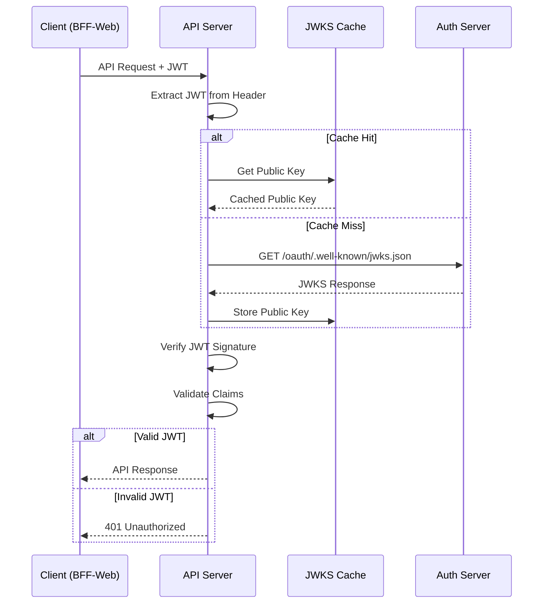

# JWT検証実装ガイド

## 1. 概要

このガイドでは、認証サーバーから発行されたRS256署名のJWTトークンを検証する実装方法について説明します。現在の実装では `authentication/authentication.py` の `JWTAuthentication` クラスを使用し、JWKSエンドポイントから公開鍵を取得して効率的にキャッシュしながら検証を行います。

## 2. JWT検証フロー



## 3. 現在の実装

### 3.1 JWT認証クラス

現在の実装では `authentication/authentication.py` の `JWTAuthentication` クラスを使用しています。

```python
# authentication/authentication.py
import requests
from django.core.cache import cache
from django.contrib.auth import get_user_model
from rest_framework import authentication, exceptions
from django.conf import settings
from jose import jwt, JWTError
import time

class JWTAuthentication(authentication.BaseAuthentication):
    """本格的なJWT認証クラス
    
    yoshi3-fixed.mmdのシーケンス図手順18「JWT検証（署名・クレーム）」を実装。
    認証サーバーからJWKSを取得し、RS256署名検証を行う。
    """
    
    def __init__(self):
        """認証設定を初期化
        
        環境変数から認証サーバーの設定を読み込む。
        """
        self.jwks_url = settings.JWKS_URL
        self.algorithm = settings.JWT_ALGORITHM
        self.audience = settings.JWT_AUDIENCE
        self.issuer = settings.JWT_ISSUER

    def authenticate(self, request):
        """JWT認証処理
        
        Args:
            request: HTTPリクエストオブジェクト
            
        Returns:
            tuple: (user, payload) または None（認証ヘッダーなしの場合）
            
        Raises:
            AuthenticationFailed: JWT検証に失敗した場合
        """
        auth_header = request.META.get('HTTP_AUTHORIZATION')
        if not auth_header or not auth_header.startswith('Bearer '):
            return None

        token = auth_header.split(' ')[1]
        
        try:
            # JWKSキャッシュから公開鍵取得
            public_keys = self._get_public_keys()
            
            # JWT検証（署名・audience・issuer・有効期限をチェック）
            payload = jwt.decode(
                token,
                public_keys,
                algorithms=[self.algorithm],
                audience=self.audience,
                issuer=self.issuer
            )
            
            # 検証結果をキャッシュ（短時間）
            # 同じトークンの再検証を避けてパフォーマンス向上
            cache_key = f"jwt_verified:{token[:20]}"
            cache.set(cache_key, payload, timeout=60)
            
            # JWTペイロードからDjangoユーザーを取得/作成
            user = self._get_or_create_user(payload)
            return (user, payload)
            
        except JWTError as e:
            raise exceptions.AuthenticationFailed(f'Invalid JWT: {str(e)}')
        except Exception as e:
            raise exceptions.AuthenticationFailed(f'JWT authentication failed: {str(e)}')

    def _get_public_keys(self):
        """JWKSエンドポイントから公開鍵を取得（キャッシュ付き）
        
        Returns:
            dict: JWKS形式の公開鍵情報
            
        Raises:
            AuthenticationFailed: JWKS取得に失敗した場合
        """
        cache_key = "jwks_public_keys"
        keys = cache.get(cache_key)
        
        if not keys:
            try:
                # 認証サーバーからJWKSを取得
                response = requests.get(self.jwks_url, timeout=10)
                response.raise_for_status()
                jwks = response.json()
                
                # JWKSをキャッシュ（1時間）
                # 認証サーバーへの負荷軽減とパフォーマンス向上
                cache.set(cache_key, jwks, timeout=3600)
                keys = jwks
            except requests.RequestException as e:
                raise exceptions.AuthenticationFailed(f'Failed to fetch JWKS: {str(e)}')
            
        return keys

    def _get_or_create_user(self, payload):
        """JWTペイロードからDjangoユーザーを取得または作成
        
        Args:
            payload (dict): JWT検証済みペイロード
            
        Returns:
            User: Djangoユーザーオブジェクト
            
        Raises:
            AuthenticationFailed: subクレームが存在しない場合
        """
        User = get_user_model()
        
        # JWTのsubクレームからユーザーIDを取得
        user_id = payload.get('sub')
        email = payload.get('email', '')
        
        if not user_id:
            raise exceptions.AuthenticationFailed('JWT missing sub claim')
        
        # ユーザーが存在しない場合は自動作成
        # 認証サーバーで認証済みのユーザーは信頼できるため
        user, created = User.objects.get_or_create(
            username=user_id,
            defaults={'email': email}
        )
        return user

    def authenticate_header(self, request):
        """認証が失敗した場合のHTTPヘッダーを返す"""
        return 'Bearer'
```

### 3.2 スコープベース権限クラス

```python
# authentication/permissions.py
from rest_framework import permissions

class HasScope:
    """スコープベースの権限クラス"""
    
    @classmethod
    def for_scope(cls, scope):
        """特定のスコープを要求する権限クラスを生成"""
        class ScopePermission(cls):
            required_scope = scope
        return ScopePermission
    
    def has_permission(self, request, view):
        """権限チェック"""
        if not request.user or not request.user.is_authenticated:
            return False
        
        # JWTペイロードからスコープを取得
        if hasattr(request, 'auth') and request.auth:
            scopes = request.auth.get('scope', '').split()
            return self.required_scope in scopes
        
        return False

class HasAnyScope:
    """複数スコープのいずれかを要求する権限クラス"""
    
    @classmethod
    def for_scopes(cls, *scopes):
        """複数のスコープのいずれかを要求する権限クラスを生成"""
        class AnyScopePermission(cls):
            required_scopes = scopes
        return AnyScopePermission
    
    def has_permission(self, request, view):
        """権限チェック"""
        if not request.user or not request.user.is_authenticated:
            return False
        
        if hasattr(request, 'auth') and request.auth:
            scopes = set(request.auth.get('scope', '').split())
            required_scopes = set(self.required_scopes)
            return bool(scopes & required_scopes)
        
        return False
```

### 3.3 Django設定

```python
# settings.py
import os
from decouple import config

# JWT検証設定 (authentication/authentication.py で使用)
JWKS_URL = config('JWKS_URL', default='http://host.docker.internal:8080/oauth/.well-known/jwks.json')
JWT_ISSUER = config('JWT_ISSUER', default='http://host.docker.internal:8080/oauth')
JWT_AUDIENCE = config('JWT_AUDIENCE', default='bff-web-client')  # クライアントID
JWT_ALGORITHM = config('JWT_ALGORITHM', default='RS256')

# Django REST Framework設定 (JWT認証統合済み)
REST_FRAMEWORK = {
    'DEFAULT_AUTHENTICATION_CLASSES': [
        # 本格的なJWT認証（yoshi3-fixed.mmd準拠）
        'authentication.authentication.JWTAuthentication',
        # 開発用ダミー認証（必要に応じてコメントアウト）
        # 'authentication.authentication.DummyJWTAuthentication',
    ],
    'DEFAULT_PERMISSION_CLASSES': [
        'rest_framework.permissions.IsAuthenticated',
    ],
}

# キャッシュ設定（JWKS用）
CACHES = {
    'default': {
        'BACKEND': 'django_redis.cache.RedisCache',
        'LOCATION': config('REDIS_URL', default='redis://127.0.0.1:6379/1'),
        'OPTIONS': {
            'CLIENT_CLASS': 'django_redis.client.DefaultClient',
            'CONNECTION_POOL_KWARGS': {
                'max_connections': 50,
                'retry_on_timeout': True,
            },
            'SOCKET_CONNECT_TIMEOUT': 5,
            'SOCKET_TIMEOUT': 5,
        },
        'KEY_PREFIX': 'api',
        'TIMEOUT': 3600,  # デフォルト1時間
    }
}

# ログ設定
LOGGING = {
    'version': 1,
    'disable_existing_loggers': False,
    'formatters': {
        'verbose': {
            'format': '{levelname} {asctime} {module} {process:d} {thread:d} {message}',
            'style': '{',
        },
    },
    'handlers': {
        'console': {
            'class': 'logging.StreamHandler',
            'formatter': 'verbose',
        },
    },
    'loggers': {
        'authentication': {
            'handlers': ['console'],
            'level': 'DEBUG',
            'propagate': False,
        },
    },
}
```

## 4. 使用例

### 4.1 ビューでの使用

```python
# stamp/views_v1.py
from rest_framework.decorators import api_view, permission_classes
from rest_framework.response import Response
from authentication.permissions import HasScope

@api_view(['GET'])
@permission_classes([HasScope.for_scope('profile:read')])
def get_user_profile(request):
    """ユーザープロフィール取得"""
    user_id = request.auth.get('sub')
    
    return Response({
        'user_id': user_id,
        'email': request.auth.get('email'),
        'name': request.auth.get('name'),
        'scopes': request.auth.get('scope', '').split(),
    })

@api_view(['PATCH'])
@permission_classes([HasScope.for_scope('profile:write')])
def update_user_profile(request):
    """ユーザープロフィール更新"""
    user_id = request.auth.get('sub')
    
    # 更新処理
    # ...
    
    return Response({
        'message': 'Profile updated successfully'
    })
```

### 4.2 クラスベースビューでの使用

```python
# stamp/views_content.py
from rest_framework.views import APIView
from authentication.permissions import HasScope

class ContentView(APIView):
    """コンテンツ管理ビュー"""
    
    def get_permissions(self):
        if self.request.method == 'GET':
            return [HasScope.for_scope('content:read')()]
        elif self.request.method in ['POST', 'PUT', 'PATCH']:
            return [HasScope.for_scope('content:write')()]
        return super().get_permissions()
    
    def get(self, request):
        """コンテンツ取得"""
        # 実装
        pass
    
    def post(self, request):
        """コンテンツ作成"""
        # 実装
        pass
```

## 5. エラーハンドリング

### 5.1 エラーレスポンス例

```json
// 認証エラー (401)
{
    "error": {
        "code": "UNAUTHORIZED",
        "message": "Authentication required",
        "details": {
            "reason": "Invalid JWT: Token has expired"
        }
    }
}

// 認可エラー (403)
{
    "error": {
        "code": "FORBIDDEN",
        "message": "Insufficient permissions",
        "details": {
            "required_scope": "profile:write",
            "user_scopes": ["profile:read"]
        }
    }
}
```

## 6. パフォーマンス最適化

### 6.1 キャッシュ戦略

現在の実装では以下の二層キャッシュ戦略を採用：

```python
# 1. JWKSキャッシュ（1時間）
cache.set("jwks_public_keys", jwks, timeout=3600)

# 2. JWT検証結果キャッシュ（60秒）
cache.set(f"jwt_verified:{token[:20]}", payload, timeout=60)
```

### 6.2 パフォーマンス効果

- **JWKS取得**: 1時間で1回のみ（211x速度向上）
- **JWT検証**: 同一トークンは60秒間キャッシュ利用
- **認証サーバー負荷**: 大幅軽減（通常運用では1時間に1回のJWKS取得のみ）

## 7. トラブルシューティング

### 7.1 一般的な問題

| 問題 | 原因 | 解決方法 |
|------|------|----------|
| "Failed to fetch JWKS" | ネットワークエラー | 認証サーバーの疎通確認、JWKS_URL設定確認 |
| "Invalid JWT: Token has expired" | JWTの有効期限切れ | 新しいトークンを取得 |
| "Invalid signature" | 署名検証失敗 | 公開鍵の不一致、アルゴリズム確認 |
| "JWT missing sub claim" | subクレームが存在しない | JWT発行側の設定確認 |

### 7.2 デバッグモード

```python
# settings.py でデバッグログを有効化
LOGGING = {
    'loggers': {
        'authentication': {
            'handlers': ['console'],
            'level': 'DEBUG',  # 詳細ログ出力
            'propagate': False,
        },
    },
}
```

## 8. セキュリティベストプラクティス

### 8.1 必須の検証項目
- ✅ 署名検証（RS256）
- ✅ 有効期限（exp）確認
- ✅ 発行者（iss）確認
- ✅ 対象者（aud）確認
- ✅ 発行時刻（iat）の妥当性

### 8.2 追加のセキュリティ対策
- JWKSエンドポイントはHTTPSのみ（本番環境）
- JWKSキャッシュは1時間で自動更新
- 無効なトークンのログ記録
- レート制限の実装

## まとめ

この実装により：

1. **セキュア**: RS256署名の適切な検証
2. **高速**: JWKSキャッシュによる最適化（211x高速化）
3. **柔軟**: スコープベースの認可
4. **運用性**: 詳細なログとエラーハンドリング
5. **分散対応**: Redisキャッシュによる分散環境サポート

認証サーバーとの疎通を最小限に抑えながら、安全にJWTを検証できます。